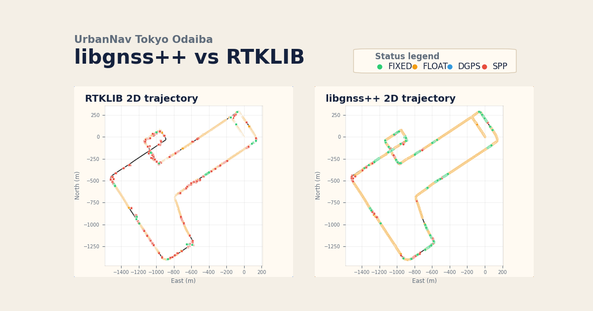
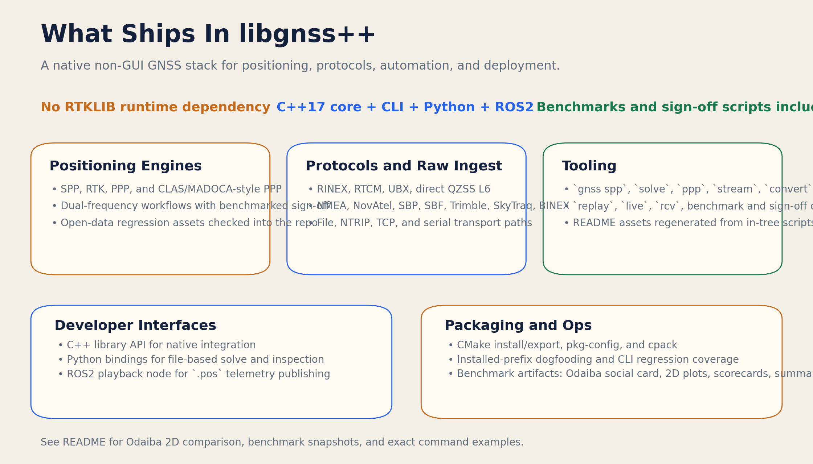
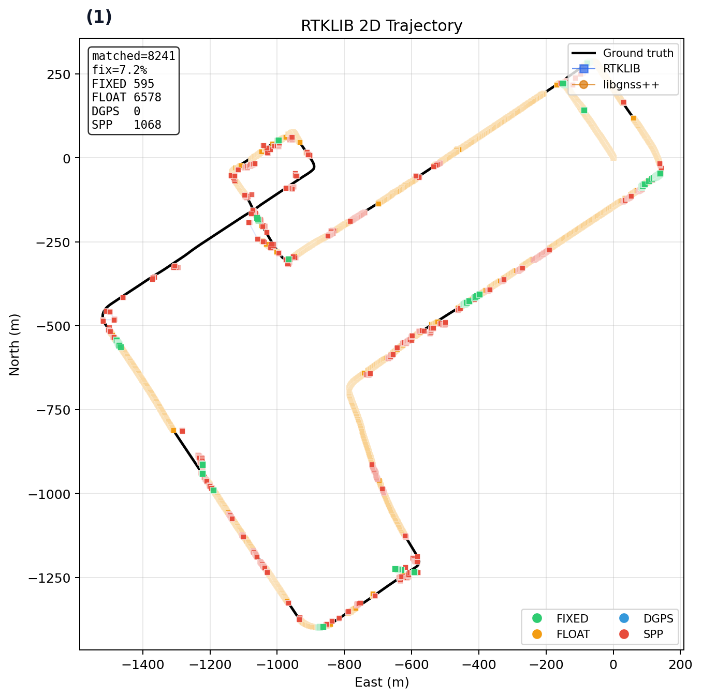
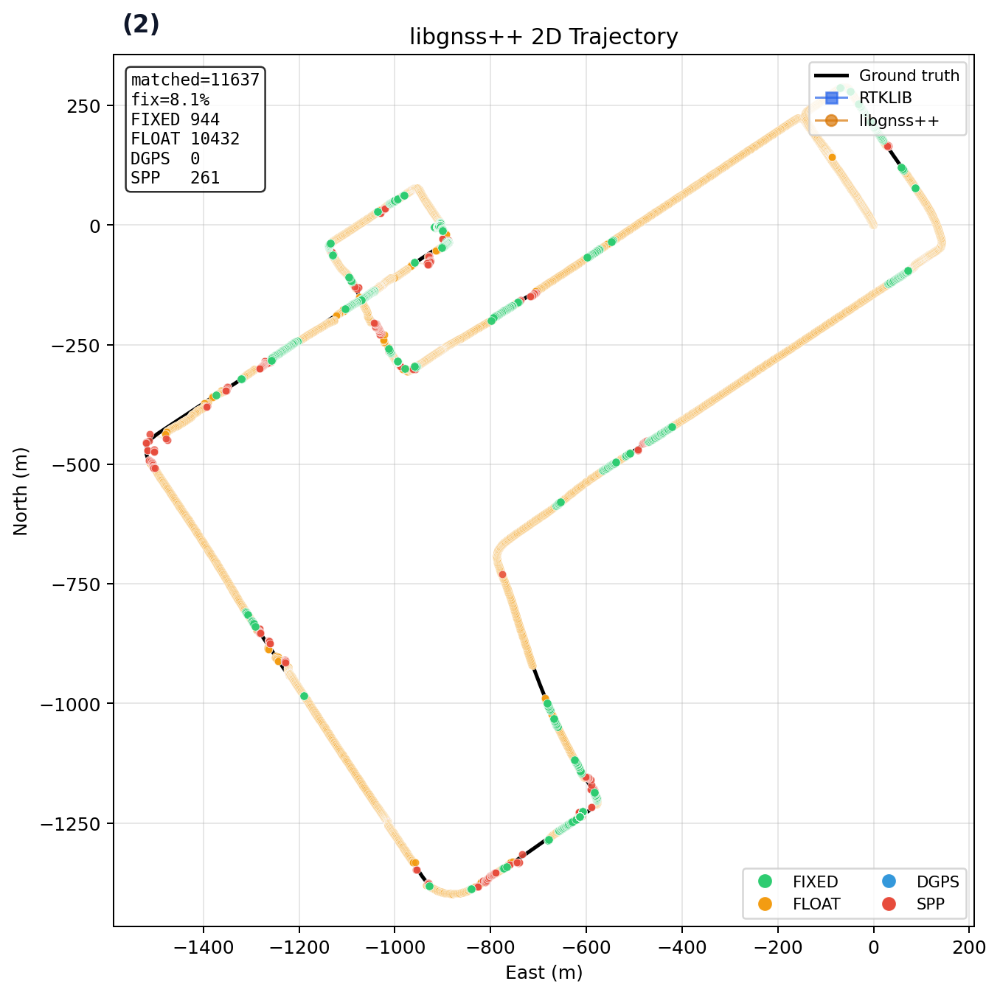

# libgnss++ — Modern C++ GNSS/RTK/PPP/CLAS Toolkit

Native non-GUI GNSS stack in modern C++17 with built-in `SPP`, `RTK`, `PPP`, `CLAS/MADOCA`, `RTCM`, `UBX`, and direct `QZSS L6` handling.

The point of this repo is simple: ship a usable GNSS toolchain without depending on an external RTKLIB runtime.

If this repo is useful, star it.



Contribution and PR workflow: [CONTRIBUTING.md](CONTRIBUTING.md)
Architecture notes: [docs/architecture.md](docs/architecture.md)
Documentation index: [docs/index.md](docs/index.md)

## Docs

- Public site: <https://rsasaki0109.github.io/gnssplusplus-library/>
- [Documentation index](docs/index.md)
- [Architecture notes](docs/architecture.md)
- [Reference analyses](docs/references/index.md)
- [Contribution workflow](CONTRIBUTING.md)

Local docs site:

```bash
python3 -m pip install -r requirements-docs.txt
python3 -m mkdocs serve
```

## Docker

Build the runtime image:

```bash
docker build -t libgnsspp:latest .
```

Pull the published image:

```bash
docker pull ghcr.io/rsasaki0109/gnssplusplus-library:develop
```

Run the CLI against a mounted workspace or dataset directory:

```bash
docker run --rm -it \
  -v "$PWD:/workspace" \
  libgnsspp:latest \
  solve --rover /workspace/data/rover_kinematic.obs \
  --base /workspace/data/base_kinematic.obs \
  --nav /workspace/data/navigation_kinematic.nav \
  --out /workspace/output/docker_rtk.pos
```

Serve the local web UI from inside the container:

```bash
docker run --rm -it \
  -p 8085:8085 \
  -v "$PWD:/workspace" \
  libgnsspp:latest \
  web --host 0.0.0.0 --port 8085 --root /workspace
```

The image installs the `gnss` dispatcher, Python helpers, and `libgnsspp` Python package, but it does not embed the repo sample datasets. Mount your source tree or your own dataset directory.

Run the web UI with Compose:

```bash
docker compose up gnss-web
```

Override the image if you want a local or tagged build:

```bash
LIBGNSSPP_IMAGE=ghcr.io/rsasaki0109/gnssplusplus-library:v0.1.0 docker compose up gnss-web
```

## What You Get

- Native solvers: `SPP`, `RTK`, `PPP`, `CLAS-style PPP`
- Native protocols: `RINEX`, `RTCM`, `UBX`, direct `QZSS L6`
- Raw/log tooling: `NMEA`, `NovAtel`, `SBP`, `SBF`, `Trimble`, `SkyTraq`, `BINEX`
- Product tooling: `fetch-products`, `ionex-info`, `dcb-info`
- Analysis tooling: `visibility`, `visibility-plot`, and `moving-base-plot` for az/el/SNR exports plus moving-base/visibility PNG quick-looks
- Moving-base tooling: `moving-base-prepare` plus `moving-base-signoff` for real bag/replay/live validation
- One CLI entrypoint: `gnss spp`, `solve`, `ppp`, `visibility`, `stream`, `convert`, `live`, `rcv`
- Local web UI: `gnss web` for benchmark snapshots, live/moving-base/PPP-product sign-offs, 2D trajectories, visibility views, artifact bundles, receiver status, and artifact links
- Built-in sign-off scripts and checked-in benchmark artifacts
- CMake install/export, Python bindings, and ROS2 playback node



## Quick Start

### Build

```bash
cmake -S . -B build -DCMAKE_BUILD_TYPE=Release
cmake --build build -j
```

### First solutions

```bash
python3 apps/gnss.py spp \
  --obs data/rover_static.obs \
  --nav data/navigation_static.nav \
  --out output/spp_solution.pos

python3 apps/gnss.py solve \
  --rover data/short_baseline/TSK200JPN_R_20240010000_01D_30S_MO.rnx \
  --base data/short_baseline/TSKB00JPN_R_20240010000_01D_30S_MO.rnx \
  --nav data/short_baseline/BRDC00IGS_R_20240010000_01D_MN.rnx \
  --mode static \
  --out output/rtk_solution.pos

python3 apps/gnss.py ppp \
  --static \
  --obs data/rover_static.obs \
  --nav data/navigation_static.nav \
  --out output/ppp_solution.pos

python3 apps/gnss.py visibility \
  --obs data/rover_static.obs \
  --nav data/navigation_static.nav \
  --csv output/visibility.csv \
  --summary-json output/visibility_summary.json \
  --max-epochs 60

python3 apps/gnss.py replay \
  --rover-rinex data/rover_kinematic.obs \
  --base-rinex data/base_kinematic.obs \
  --nav-rinex data/navigation_kinematic.nav \
  --mode moving-base \
  --out output/moving_base_replay.pos \
  --max-epochs 20
```

### Inspect receiver logs

```bash
python3 apps/gnss.py ubx-info \
  --input logs/session.ubx \
  --decode-observations

python3 apps/gnss.py sbf-info \
  --input logs/session.sbf \
  --decode-pvt \
  --decode-lband \
  --decode-p2pp
```

### Useful commands

| Command | Purpose |
|---|---|
| `gnss spp` | Batch SPP from rover/nav RINEX |
| `gnss solve` | Batch RTK from rover/base/nav RINEX |
| `gnss ppp` | Batch PPP from rover RINEX plus nav or precise products |
| `gnss visibility` | Export azimuth/elevation/SNR visibility rows and summary JSON from rover/nav RINEX |
| `gnss visibility-plot` | Render a visibility CSV into a polar/elevation PNG quick-look |
| `gnss moving-base-plot` | Render a moving-base solution/reference pair into a baseline/heading PNG quick-look |
| `gnss fetch-products` | Fetch and cache `SP3`/`CLK`/`IONEX`/`DCB` files from local or remote sources |
| `gnss moving-base-prepare` | Extract rover/base UBX plus reference CSV from a ROS2 moving-base bag |
| `gnss scorpion-moving-base-signoff` | Prepare and validate the public SCORPION moving-base ROS2 bag through replay |
| `gnss stream` | Inspect and relay RTCM over file, NTRIP, TCP, or serial |
| `gnss convert` | Convert RTCM or UBX into simple RINEX outputs |
| `gnss ubx-info` | Inspect `NAV-PVT`, `RAWX`, `SFRBX` from file or serial |
| `gnss sbf-info` | Inspect Septentrio SBF `PVTGeodetic`, `LBandTrackerStatus`, `P2PPStatus` from file or serial |
| `gnss novatel-info` | Inspect NovAtel ASCII/Binary `BESTPOS` and `BESTVEL` logs |
| `gnss nmea-info` | Inspect `GGA` and `RMC` NMEA logs from file or serial |
| `gnss ionex-info` | Inspect `IONEX` header, map count, grid metadata, and auxiliary DCB blocks |
| `gnss dcb-info` | Inspect `Bias-SINEX` or auxiliary DCB product contents |
| `gnss qzss-l6-info` | Inspect direct QZSS L6 frames and export Compact SSR payloads |
| `gnss social-card` | Regenerate the Odaiba share image |
| `gnss short-baseline-signoff` | Static RTK sign-off |
| `gnss rtk-kinematic-signoff` | Kinematic RTK sign-off |
| `gnss ppp-static-signoff` | Static PPP sign-off |
| `gnss ppp-kinematic-signoff` | Kinematic PPP sign-off |
| `gnss ppp-products-signoff` | Static, kinematic, or PPC PPP sign-off with fetched SP3/CLK/IONEX/DCB products and optional MALIB delta gates |
| `gnss live-signoff` | Realtime/error-handling sign-off for recorded RTCM/UBX live inputs |
| `gnss ppc-demo` | External PPC-Dataset RTK/PPP verification against `reference.csv` |
| `gnss ppc-rtk-signoff` | Fixed RTK sign-off profiles for PPC Tokyo/Nagoya, with optional RTKLIB side-by-side gates |
| `gnss moving-base-signoff` | Real moving-base replay/live sign-off against per-epoch base/rover reference coordinates |
| `gnss odaiba-benchmark` | End-to-end Odaiba benchmark pipeline |
| `gnss web` | Local browser UI for summary JSON, live/moving-base/PPP-product sign-offs, `.pos` trajectories, moving-base/visibility plots and histories, receiver status, and artifact/provenance links |

See all commands:

```bash
python3 apps/gnss.py --help
```

### Local web UI

```bash
python3 apps/gnss.py web \
  --port 8085 \
  --rcv-status output/receiver.status.json
```

Then open `http://127.0.0.1:8085` to inspect Odaiba metrics, live/moving-base/PPP-product sign-offs, 2D trajectories, moving-base and visibility plots, moving-base history, PPC summaries, receiver status, and linked artifact bundles in a browser.

Container form:

```bash
docker run --rm -it -p 8085:8085 -v "$PWD:/workspace" \
  libgnsspp:latest web --host 0.0.0.0 --port 8085 --root /workspace
```

### Real moving-base sign-off

`gnss solve`, `gnss replay`, and `gnss live` accept `--mode moving-base`. For real moving-base datasets, use `gnss moving-base-signoff` with a reference CSV carrying per-epoch base/rover ECEF coordinates. The repo does not ship a bundled moving-base dataset, so this command is intended for external real logs.

```bash
python3 apps/gnss.py moving-base-prepare \
  --input /datasets/moving_base/2023-06-14T174658Z.zip \
  --rover-ubx-out output/moving_base_rover.ubx \
  --base-ubx-out output/moving_base_base.ubx \
  --reference-csv output/moving_base_reference.csv \
  --summary-json output/moving_base_prepare.json

python3 apps/gnss.py fetch-products \
  --date 2023-06-14 \
  --preset brdc-nav \
  --summary-json output/moving_base_products.json

python3 apps/gnss.py moving-base-signoff \
  --solver replay \
  --rover-ubx output/moving_base_rover.ubx \
  --base-ubx output/moving_base_base.ubx \
  --nav-rinex ~/.cache/libgnsspp/products/nav/2023/165/BRDC00IGS_R_20231650000_01D_MN.rnx \
  --reference-csv output/moving_base_reference.csv \
  --summary-json output/moving_base_summary.json \
  --require-fix-rate-min 90 \
  --require-p95-baseline-error-max 1.0 \
  --require-realtime-factor-min 1.0 \
  --max-epochs 120

python3 apps/gnss.py scorpion-moving-base-signoff \
  --input-url https://zenodo.org/api/records/8083431/files/2023-06-14T174658Z.zip/content \
  --summary-json output/scorpion_moving_base_summary.json \
  --require-matched-epochs-min 100 \
  --require-fix-rate-min 80
```

### Product-driven PPP

```bash
python3 apps/gnss.py fetch-products \
  --date 2024-01-02 \
  --preset igs-final \
  --preset ionex \
  --preset dcb \
  --summary-json output/products.json

python3 apps/gnss.py ppp-static-signoff \
  --fetch-products \
  --product-date 2024-01-02 \
  --product sp3=https://cddis.nasa.gov/archive/gnss/products/{gps_week}/COD0OPSFIN_{yyyy}{doy}0000_01D_05M_ORB.SP3.gz \
  --product clk=https://cddis.nasa.gov/archive/gnss/products/{gps_week}/COD0OPSFIN_{yyyy}{doy}0000_01D_30S_CLK.CLK.gz \
  --product ionex=https://cddis.nasa.gov/archive/gnss/products/ionex/{yyyy}/{doy}/COD0OPSFIN_{yyyy}{doy}0000_01D_01H_GIM.INX.gz \
  --product dcb=https://cddis.nasa.gov/archive/gnss/products/bias/{yyyy}/CAS0MGXRAP_{yyyy}{doy}0000_01D_01D_DCB.BSX.gz \
  --summary-json output/ppp_static_summary.json

python3 apps/gnss.py ppp-kinematic-signoff \
  --max-epochs 120 \
  --require-common-epoch-pairs-min 120 \
  --require-reference-fix-rate-min 95 \
  --require-converged \
  --require-convergence-time-max 300 \
  --require-mean-error-max 7 \
  --require-p95-error-max 7 \
  --require-max-error-max 7 \
  --require-mean-sats-min 18 \
  --require-ppp-solution-rate-min 100
```

## Benchmark Snapshot

### UrbanNav Tokyo Odaiba

Dataset: [UrbanNav Tokyo Odaiba](https://github.com/IPNL-POLYU/UrbanNavDataset) (`2018-12-19`, Trimble rover/base, ~`170 m` baseline).
Comparison baseline: [RTKLIB](https://github.com/tomojitakasu/RTKLIB).

Current checked-in snapshot:

- All matched epochs: libgnss++ `11637` vs RTKLIB `8241`
- Fix rate: libgnss++ `8.11%` vs RTKLIB `7.22%`
- All-epoch p95 horizontal: libgnss++ `7.58 m` vs RTKLIB `27.88 m`
- Common-epoch median horizontal: libgnss++ `0.733 m` vs RTKLIB `0.704 m`
- Common-epoch p95 horizontal: libgnss++ `5.94 m` vs RTKLIB `27.67 m`

| RTKLIB 2D | libgnss++ 2D |
|---|---|
|  |  |

More artifacts:

- [Full comparison figure](docs/driving_odaiba_comparison.png)
- [Scorecard](docs/driving_odaiba_scorecard.png)
- [Summary JSON](output/odaiba_summary.json)
- Optional side-by-side PPP benchmark path: [JAXA-SNU/MALIB](https://github.com/JAXA-SNU/MALIB)
- Additional low-cost GNSS RTK/PPP reference implementation: [rtklibexplorer/RTKLIB](https://github.com/rtklibexplorer/RTKLIB)

### Other checked sign-offs

- Mixed-GNSS short-baseline RTK
- Mixed-GNSS kinematic RTK
- Static PPP
- Kinematic PPP
- CLAS-style PPP from compact sampled SSR and raw QZSS L6

### External dataset demo

`PPC-Dataset` can be verified directly from an extracted dataset tree:

```bash
python3 apps/gnss.py ppc-demo \
  --dataset-root /datasets/PPC-Dataset \
  --city tokyo \
  --run run1 \
  --solver rtk \
  --require-realtime-factor-min 1.0 \
  --summary-json output/ppc_tokyo_run1_rtk_summary.json

python3 apps/gnss.py ppc-rtk-signoff \
  --dataset-root /datasets/PPC-Dataset \
  --city tokyo \
  --rtklib-bin /path/to/rnx2rtkp \
  --summary-json output/ppc_tokyo_run1_rtk_signoff.json
```

Dataset source: [taroz/PPC-Dataset](https://github.com/taroz/PPC-Dataset)

## Install And Package

```bash
cmake --install build --prefix /opt/libgnsspp
```

Installed layout includes:

- `bin/gnss`
- native binaries such as `gnss_spp`, `gnss_solve`, `gnss_ppp`, `gnss_stream`
- Python command wrappers and sign-off scripts
- `scripts/` asset generators
- `lib/cmake/libgnsspp/libgnssppConfig.cmake`
- `lib/pkgconfig/libgnsspp.pc`
- Python package `libgnsspp`

Examples:

```bash
# pkg-config
pkg-config --cflags --libs libgnsspp

# source the installed dispatcher
/opt/libgnsspp/bin/gnss social-card \
  --lib-pos output/rtk_solution.pos \
  --rtklib-pos output/driving_rtklib_rtk.pos \
  --reference-csv data/driving/Tokyo_Data/Odaiba/reference.csv \
  --output docs/driving_odaiba_social_card.png
```

## Python And ROS2

Python bindings expose:

- RINEX header and epoch inspection
- `.pos` loading and solution statistics
- coordinate conversion helpers
- file-based `SPP`, `PPP`, and `RTK` solve helpers

ROS2 support includes a playback node that publishes `.pos` files as:

- `sensor_msgs/NavSatFix`
- `geometry_msgs/PoseStamped`
- `nav_msgs/Path`
- solution status and satellite-count telemetry

## Tests And Dogfooding

Run the full non-GUI regression set:

```bash
ctest --test-dir build --output-on-failure
```

Important checks already covered in-tree:

- solver/unit tests
- live realtime/error-handling regression
- benchmark/image generation tests
- installed-prefix packaging smoke tests
- installed `gnss social-card` dogfooding
- installed feature-overview image generation
- Python bindings smoke tests
- ROS2 node smoke tests

## Data

Bundled samples live under:

- `data/`
- `data/short_baseline/`
- `data/driving/Tokyo_Data/Odaiba/`

Generated benchmark outputs live under:

- `output/`
- `docs/`

## Scope

This repo is intentionally focused on a strong non-GUI GNSS stack.

It already covers:

- native `RTK`, `PPP`, `CLAS`, `RTCM`, `UBX`, `QZSS L6`
- installed CLI tooling
- benchmarks, sign-off scripts, and README asset generation

It is still not marketed as a perfect RTKLIB drop-in replacement. The remaining gaps are about scope breadth, not the core non-GUI workflow shipped here.

## License

MIT License. See [LICENSE](LICENSE).
