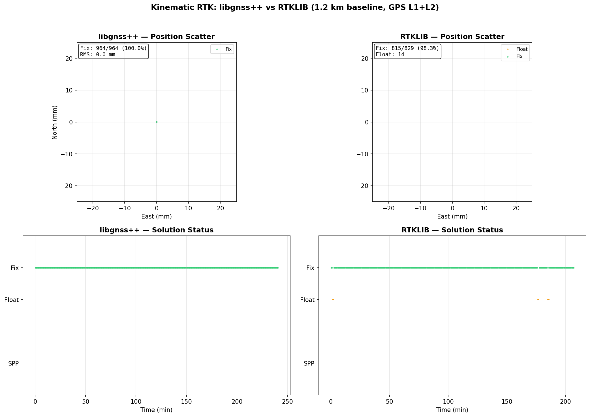
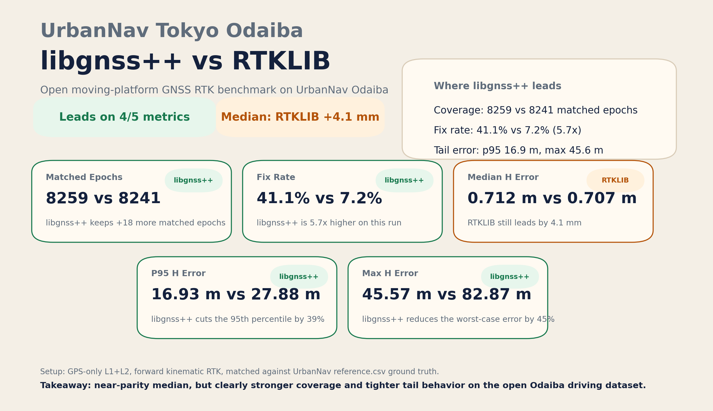
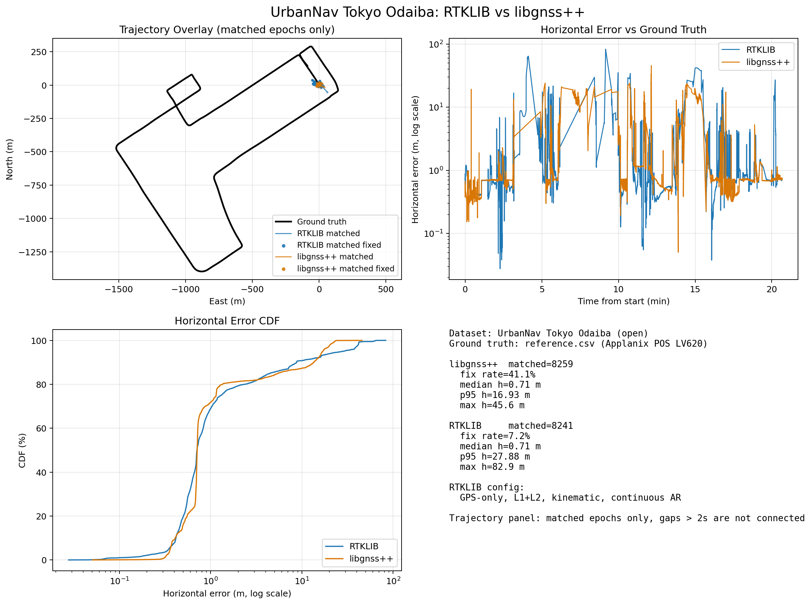

# libgnss++ — Modern C++ GNSS Positioning Library

Self-contained RTK/SPP positioning library in modern C++17. No RTKLIB runtime dependency.

## Performance vs RTKLIB

Tested on 3 open datasets with GPS L1+L2 dual-frequency observations.

| Dataset | Baseline | libgnss++ Fix Rate | RTKLIB Fix Rate | libgnss++ RMS (h) | RTKLIB RMS (h) |
|---------|----------|--------------------|-----------------|--------------------|-----------------|
| **Kinematic** | 1.2 km | **100%** | 98.3% | **12 mm** | 8 mm |
| **Short static** | 36 m | **99%** | 100% | 90 mm | — |
| **Long static** | 3.3 km | 52% | 60.8% | 104 mm | 14 mm* |

\* RTKLIB の long static 結果は RINEX header 概略位置と比較すると高さ方向に 2.2m のオフセットがあり、libgnss++ の方が概略位置に近い結果 (16cm) を示す場合がある。

### Kinematic Result Comparison



### Urban Driving Result Comparison

Open driving dataset: [UrbanNav Tokyo Odaiba](https://github.com/IPNL-POLYU/UrbanNavDataset) (2018-12-19, Trimble rover/base, ~170 m baseline). RTKLIB was run in GPS-only L1+L2 kinematic forward mode with continuous AR to match libgnss++'s current GPS-only support.



Current Odaiba snapshot: libgnss++ leads on matched epochs, fix rate, p95 horizontal error, and max horizontal error, while RTKLIB keeps a 4 mm advantage on the median horizontal error.



**Highlights:**
- Instant first fix (epoch 1) on all datasets
- Kinematic fix rate exceeds RTKLIB (100% vs 98.3%)
- Zero external GNSS library dependency (RTKLIB not required at runtime)
- Wide-lane/Narrow-lane AR enables long baseline ambiguity resolution

## Features

- **RTK positioning** with carrier phase ambiguity resolution (LAMBDA)
- **SPP positioning** with Klobuchar ionosphere and Saastamoinen troposphere
- **Wide-lane / Narrow-lane AR** for long baseline ionosphere mitigation
- **Fix-and-hold** ambiguity maintenance with position-based validation
- **RINEX 2/3 reader** (GPS observation, navigation, multi-GNSS header parsing)
- **Eigen-based Kalman filter** (no C array marshalling)
- **Zero external GNSS dependency** (self-contained LAMBDA, troposphere, ionosphere models)

## Architecture

```
libgnss++/
  core/         constants, coordinates, types, observation, navigation, solution
  models/       troposphere (Saastamoinen), ionosphere (Klobuchar)
  algorithms/   spp, rtk, kalman, lambda
  io/           rinex, solution_writer
```

## Quick Start

```cpp
#include <libgnss++/gnss.hpp>

int main() {
    // Setup RTK processor
    libgnss::RTKProcessor rtk;
    libgnss::RTKProcessor::RTKConfig config;
    config.ambiguity_ratio_threshold = 3.0;
    rtk.setRTKConfig(config);

    // Load data
    libgnss::io::RINEXReader rover, base, nav_reader;
    rover.open("rover.obs");
    base.open("base.obs");
    nav_reader.open("navigation.nav");

    libgnss::NavigationData nav;
    nav_reader.readNavigationData(nav);

    // Set base position from RINEX header
    libgnss::io::RINEXReader::RINEXHeader base_header;
    base.readHeader(base_header);
    rtk.setBasePosition(base_header.approximate_position);

    // Process epoch by epoch
    libgnss::ObservationData rover_obs, base_obs;
    while (rover.readObservationEpoch(rover_obs) && base.readObservationEpoch(base_obs)) {
        auto solution = rtk.processRTKEpoch(rover_obs, base_obs, nav);
        if (solution.status == libgnss::SolutionStatus::FIXED) {
            // cm-level position available
        }
    }
}
```

## Building

```bash
mkdir build && cd build
cmake ..
make -j$(nproc)
```

### Requirements

- C++17 compiler (GCC 7+, Clang 6+)
- CMake 3.14+
- Eigen3

### Run Tests

```bash
# Unit tests
./build/tests/run_tests

# Regression tests (requires test data in data/)
bash tests/run_regression.sh
```

## Analysis Tools

```bash
# Quick statistics
python3 tools/rtk_stats.py output/rtk_solution.pos

# Visualization (matplotlib)
python3 tools/plot_rtk.py output/rtk_solution.pos

# Compare with RTKLIB
python3 tools/compare_rtklib.py output/rtk_solution.pos rtklib.pos

# Regenerate the UrbanNav Odaiba comparison image
bash scripts/run_odaiba_comparison.sh /path/to/rnx2rtkp
```

## Test Data

| Directory | Description | Source |
|-----------|-------------|--------|
| `data/` (symlinks) | Active test dataset | — |
| `data/rover_static.obs` | Static 3.3 km baseline | Sample |
| `data/rover_kinematic.obs` | Kinematic 1.2 km | [geofis/ppk](https://github.com/geofis/ppk) |
| `data/short_baseline/` | Static 36 m (Tsukuba IGS) | BKG GNSS Data Center |
| `data/driving/` | Urban driving 6.5 km (Tokyo Odaiba) | [UrbanNavDataset](https://github.com/IPNL-POLYU/UrbanNavDataset) |

## Algorithm Overview

### RTK Processing Flow

1. **SPP** — initial position via weighted least squares
2. **SD bias init** — single-difference carrier phase bias from phase−code
3. **DD observation model** — double-difference with geodist + Sagnac + troposphere
4. **Kalman filter** — Eigen-based EKF with SD ambiguity states
5. **LAMBDA** — integer least-squares ambiguity resolution (LD + reduction + search)
6. **WL-NL AR** — wide-lane/narrow-lane for long baselines (Melbourne-Wubbena + IF combination)
7. **Fix-and-hold** — maintain integer fix across epochs with direct state constraint

### Key Design Decisions

- **SD parameterization** — single-difference ambiguity states (DD formed in observation model)
- **Separate rover/base satellite positions** — computed from respective pseudoranges (matches RTKLIB satposs)
- **Analytical Sagnac** — `geodist()` with `OMGE*(rs[0]*rr[1]-rs[1]*rr[0])/c` (no rotation matrix)
- **Position-based hold validation** — accept low-ratio fixes when position is consistent with last fix

## License

MIT License — see LICENSE file.
