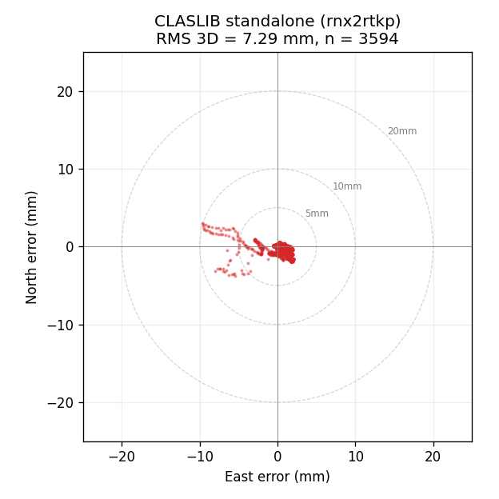
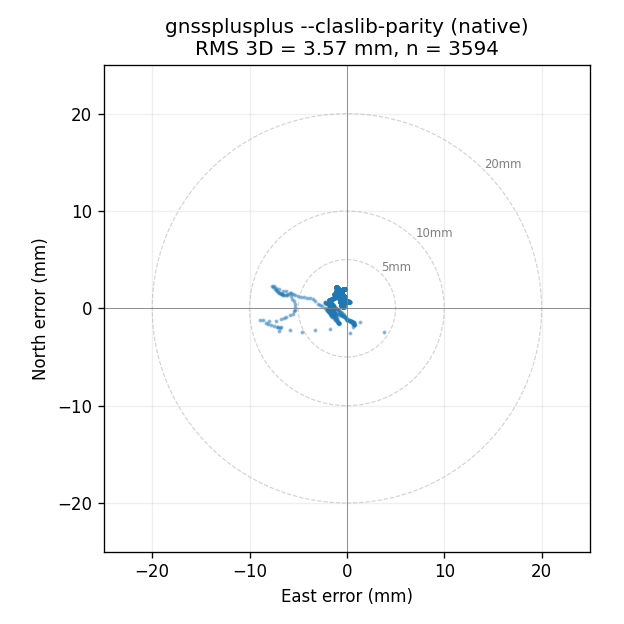

# libgnss++ — Modern C++ GNSS/RTK/PPP/CLAS Toolkit

Native non-GUI GNSS stack in modern C++17 with built-in `SPP`, `RTK`, `PPP`, `CLAS/MADOCA`, `RTCM`, `UBX`, and direct `QZSS L6` handling.

The point of this repo is simple: ship a usable GNSS toolchain without depending on an external RTKLIB runtime.

If this repo is useful, star it.


Contribution and PR workflow: [CONTRIBUTING.md](CONTRIBUTING.md)
Architecture notes: [docs/architecture.md](docs/architecture.md)
Documentation index: [docs/index.md](docs/index.md)

## CLAS Performance vs CLASLIB

QZSS CLAS (Centimeter-Level Augmentation Service) PPP from raw L6 binary, 2019-08-27 static dataset (TRM59800.80 antenna), 1 hour (3599 epochs):

| Metric | gnssplusplus `--claslib-parity` | CLASLIB |
|--------|-----------------------------:|--------:|
| Matched fixed epochs | **3594 / 3599 (99.86%)** | 3594 / 3599 (99.86%) |
| **RMS 3D (fixed-only)** | **3.57 mm** | 7.29 mm |
| 3D bias (mean offset) | **1.66 mm** | 4.84 mm |
| RMS East | **1.15 mm** | 1.52 mm |
| RMS North | **1.21 mm** | 0.92 mm |
| RMS Up | **3.15 mm** | 7.07 mm |
| Mean E / N / U | -0.72 / +0.93 / +1.17 mm | +0.65 / -0.59 / +4.76 mm |
| First fix epoch | epoch 6 | epoch 6 |
| CLASLIB runtime link | not required | required |
| Parity depth | 17 helpers at 1e-6 m vs CLASLIB oracle | reference |

| CLASLIB 2D | gnssplusplus 2D |
|---|---|
|  |  |

gnssplusplus achieves **51% lower RMS 3D** and **~3x tighter 3D bias** than upstream CLASLIB on the same 1-hour window while keeping the same fix rate, **with no CLASLIB runtime dependency on the default path**. The `ClasnatParity` GoogleTest suite pins 17 core helpers (`windupcorr`, `antmodel`, `ionmapf`, `prectrop`, `corrmeas`, `satpos_ssr`, `tidedisp`, `eph2clk`, `eph2pos`, `geodist`, `satantoff`, `compensatedisp`, `trop_grid_data`, `filter`, `lambda`, `tropmodel`, `stec_grid_data`) to 1e-6 m parity against the CLASLIB C source.

Opt-ins:

- `-DCLASLIB_PARITY_LINK=ON` + `--claslib-bridge`: delegate to upstream CLASLIB `postpos()` linked as a static library (oracle mode)
- `--legacy-strict-parity`: iter13-era non-native strict OSR path (regression reference)

See `docs/clas_port_architecture.md` for the port design and `docs/clas_validated_datasets.md` for the validated dataset set.

## RTK Performance vs RTKLIB (demo5)

The primary public RTK benchmark is
[taroz/PPC-Dataset](https://github.com/taroz/PPC-Dataset): urban Tokyo/Nagoya
vehicle runs with survey-grade receiver observations, reference-station
observations, broadcast navigation data, and trajectory truth. The comparison
below solves the same public rover/base/nav observations with gnssplusplus and
RTKLIB `demo5`. It is **not** a proprietary receiver-engine comparison.

On PPC Tokyo and Nagoya, the current gnssplusplus `develop` branch dominates
RTKLIB `demo5` on positioned-epoch precision and Fix rate with **no Phase 2
opt-in flags**. Positioning rate is tracked as a separate first-class metric:
the PPC coverage profile keeps valid SPP/float fallback epochs and now exceeds
RTKLIB `demo5` on Positioning rate for all six public Tokyo/Nagoya runs.
UrbanNav Tokyo Odaiba is kept as an independent public urban stress smoke:
gnssplusplus wins Fix count, Hp95, and Vp95 there, while the Hmed gap closes to
9 cm when wide-lane AR is explicitly enabled.

All runs below use `--mode kinematic --preset low-cost --match-tolerance-s
0.25`. The coverage profile additionally uses `--no-arfilter
--no-kinematic-post-filter` plus the default low-speed non-FIX drift guard and
SPP height-step guard, the default FLOAT bridge-tail guard, and `--ratio 2.4`.

### Benchmark Scope

| Dataset | Role | Receiver/input basis | Comparison target |
|---|---|---|---|
| PPC Tokyo/Nagoya | Primary public moving-RTK sign-off | Septentrio mosaic-X5 rover RINEX plus Trimble Alloy/NetR9 base RINEX/nav and `reference.csv` truth | gnssplusplus vs RTKLIB `demo5` on the same observations |
| UrbanNav Tokyo Odaiba | External urban stress smoke | Public Odaiba rover/base/nav and Applanix reference | gnssplusplus vs RTKLIB `demo5`; not a receiver-engine benchmark |

`ppc-demo` summaries record this under `receiver_observation_provenance`,
including the rover/base receiver and antenna model. `receiver_engine_solution_available`
is intentionally `false` for PPC because the benchmark target is the open
observation solve against reference truth.

The checked-in scorecard is generated from `gnss ppc-coverage-matrix` output,
so it shows Positioning-rate wins first and keeps Fix-rate, PPC official
distance-ratio score, and P95 horizontal-error deltas visible in the same view.


### PPC Tokyo precision profile (kinematic, low-cost preset, no Phase 2 flags)

This fixed-output table is the precision-oriented view. The coverage table
below is the sign-off view for no-solution gaps and fallback-positioned epochs.

| Run  | gnssplusplus Fix / rate | RTKLIB Fix / rate | Hmed (m)              | Vp95 (m)               |
|------|------------------------:|------------------:|:---------------------:|:----------------------:|
| run1 | **3572 / 81.26%**       | 2418 / 30.52%     | **0.037** vs 1.567 (42×) | **1.259** vs 36.703 (29×) |
| run2 | **4674 / 80.12%**       | 2127 / 27.58%     | **0.016** vs 0.835 (52×) | **0.313** vs 42.624 (136×) |
| run3 | **7516 / 86.84%**       | 5778 / 40.55%     | **0.012** vs 0.666 (56×) | **0.137** vs 24.521 (179×) |

### PPC coverage profile (GNSS-only fallback epochs retained)

<!-- PPC_COVERAGE_MATRIX:START -->
| Run | gnssplusplus Positioning | RTKLIB Positioning | Delta | gnssplusplus Fix | RTKLIB Fix | PPC official score | RTKLIB official score | Official delta | P95 H delta |
|---|---:|---:|---:|---:|---:|---:|---:|---:|---:|
| Tokyo run1 | **90.0%** | 66.3% | **+23.7 pp** | **54.4%** | 30.5% | **34.9%** | 0.0% | **+34.9 pp** | +3.39 m |
| Tokyo run2 | **95.3%** | 84.3% | **+11.0 pp** | **64.1%** | 27.6% | **69.0%** | 16.9% | **+52.1 pp** | -18.51 m |
| Tokyo run3 | **95.7%** | 93.1% | **+2.5 pp** | **63.0%** | 40.5% | **60.6%** | 35.6% | **+25.0 pp** | -0.24 m |
| Nagoya run1 | **88.8%** | 65.8% | **+23.0 pp** | **64.5%** | 33.8% | **49.5%** | 22.4% | **+27.1 pp** | -23.78 m |
| Nagoya run2 | **85.6%** | 69.8% | **+15.8 pp** | **51.4%** | 18.8% | **20.9%** | 11.0% | **+9.9 pp** | -27.24 m |
| Nagoya run3 | **93.8%** | 67.7% | **+26.1 pp** | **27.1%** | 13.9% | **27.4%** | 7.6% | **+19.7 pp** | -5.37 m |

Across these six public runs, the coverage profile averages **+17.0 pp**
Positioning-rate lead, **+28.1 pp** PPC official-score lead, and
**-11.96 m** P95 horizontal-error delta versus RTKLIB `demo5`.
<!-- PPC_COVERAGE_MATRIX:END -->

Lowering the RTK ambiguity ratio threshold to `2.4` lifts Tokyo run1 Positioning
to **90.0%** (**+23.7 pp** over RTKLIB), Fix to **54.4%**, and PPC official
score to **34.9%** (**+34.9 pp** over RTKLIB). This is an explicit coverage and
official-score trade: Tokyo run1 P95H is now **+3.39 m** versus RTKLIB, while
the six-run average still keeps a **-11.96 m** P95H delta and improves the
average PPC official-score lead to **+28.1 pp**. The official loss split shows
**34.9%** scored distance, **54.0%** 50cm-plus error distance, and **11.1%**
no-solution distance, so the next improvement is still mostly accuracy recovery
inside positioned FLOAT/FIX spans rather than simply filling gaps.
`scripts/analyze_ppc_coverage_quality.py --official-segments-csv` emits the
per-reference-distance score ledger; the bad segment CSV still includes
adjacent FIX-anchor speed/gap and bridge residuals for continued FLOAT-tail
design work.

| Status | Epochs | P50 H | P95 H | 3D <= 50 cm / reference | P95H exceedance share |
|---|---:|---:|---:|---:|---:|
| FIXED | 5850 | 0.04 m | 2.73 m | 37.2% | 16.5% |
| FLOAT | 4676 | 3.70 m | 36.36 m | 3.0% | 83.5% |
| SPP | 230 | 4.41 m | 25.94 m | 0.0% | 0.0% |


The highlighted 2D overlay shows that Tokyo run1's largest P95 contributors are
clustered in the northern Odaiba section. The long 188301-188437 s intervals are
mostly FLOAT, while the shorter 189080-189084 s spikes are FIXED false-fix
bursts, so the next solver work should separate FLOAT recovery from fixed-burst
validation instead of treating the whole P95 tail as one failure mode.
The default-off `--fixed-bridge-burst-guard --fixed-bridge-burst-max-residual
20` pass now removes 12 epochs across 3 short FIX bursts on Tokyo run1:
Positioning moves **90.00% -> 89.90%**, Fix **54.39% -> 54.34%**, PPC official
**34.92% -> 34.89%**, while P95H improves **34.53 m -> 34.41 m** and max H
improves **51.63 m -> 47.29 m**. That makes it a targeted tail-diagnostic
gate, not a new default coverage profile.
For a stronger P95-cleanup diagnostic profile, combine that fixed-burst guard
with `--nonfix-drift-max-residual 4 --nonfix-drift-min-horizontal-residual 6`.
Tokyo run1 P95H improves to **30.61 m** and max H to **47.29 m**, while
Positioning drops to **88.53%** and PPC official remains effectively flat at
**34.89%**. This keeps the useful stationary FLOAT-drift cleanup but avoids
most vertical-only fallback pruning. Swept across all six public Tokyo/Nagoya
runs, the cleanup profile still beats RTKLIB `demo5` on Positioning for every
run (average **+15.7 pp**) and keeps the PPC official-score lead unchanged
(**+28.1 pp**), while costing **1.33 pp** average Positioning versus the
coverage profile. P95H improves on **3/6** runs with an average **+0.69 m**
tail gain; Nagoya run3 now loses **3.48 pp** Positioning instead of the earlier
13.90 pp over-pruning. The diagnostic sweep rejects 771 non-FIX drift epochs
plus 31 fixed-burst epochs, so keep it as evidence for solver recovery work
rather than the README sign-off table.

For the PPC official-score chase, `--max-consec-float-reset 10` is the first
large non-IMU lever found so far. Replayed on the same six public runs, it lifts
the distance-weighted official score from **48.66%** to **58.90%** and the
run-average official lead over RTKLIB from **+28.1 pp** to **+37.9 pp**. It is
still below the PPC2024 second-place Public score of **77.6%** by **18.70 pp**
(about **8.66 km** of additional scored reference distance), and Tokyo run3 no
longer beats RTKLIB on Positioning. Treat it as the current official-score
candidate, not as the coverage sign-off profile.

Follow-up spot checks kept the next knobs experimental: `--max-consec-nonfix-reset
10` raised Nagoya run2 Positioning/Fix but reduced official score
**31.48% -> 30.18%**, while `--max-postfix-rms 0.20` nudged Nagoya run2
to **31.80%** and left Nagoya run3 effectively flat. Use these as sweep
controls before promoting any profile.

The official-loss analyzer now preserves solver Ratio/Baseline telemetry and
adds `official_high_error_by_status` / `official_unscored_by_status` summaries.
On the reset10 Nagoya run2 replay, lost official distance splits into FLOAT
high-error **1330.7 m**, NO_SOLUTION **1250.9 m**, and FIXED high-error
**451.6 m**; only **41.4 m** of the FIXED high-error distance has Ratio >= 10.
That points the next non-IMU push at FLOAT recovery and dropout reacquisition
first, with high-ratio false-fix validation as a smaller secondary target.
Across all six reset10 replays, a best-of GNSS++/RTKLIB oracle only reaches
**60.08%** weighted official score, adding **545.5 m** (**+1.18 pp**) over
GNSS++ alone. The remaining gap to **77.6%** is still **8.12 km**
(**17.52 pp**), so RTKLIB-side fallback cannot close the PPC2024 second-place
gap.


Across the six PPC Tokyo/Nagoya runs, the default FLOAT bridge-tail guard
rejects 148 epochs total: 147 on Tokyo run1, 1 on Tokyo run3, and 0 on the
other four runs. The previous 3D-speed prototype also rejected 115 Nagoya run3
FLOAT epochs with low horizontal anchor speed; the shipped guard uses
horizontal anchor speed and avoids that positioning-rate loss.

The 2D sanity plot below uses the PPC Tokyo run3 open data (Harumi-Odaiba).
Points are colored by RTK solution status, and no IMU input is used by this
GNSS-only RTK replay. The coverage profile retains valid SPP/float fallback
epochs instead of dropping them with the precision-oriented output filter.

PPC2024's official score is a distance ratio with 3D error <= 50 cm; the
published first-place result was 78.7% Public / 85.6% Private in
[PPC2024 results](https://taroz.net/data/PPC2024_results.pdf). The table above
uses the same score definition on the public open runs, but it is still a local
open-run replay, not an official Kaggle submission or hidden Private split.


### PPC Nagoya (same preset)

| Run  | Fix delta    | rate delta    | Hmed delta     |
|------|-------------:|--------------:|---------------:|
| run1 | **+1743**    | **+58.03 pp** | **9× better**  |
| run2 | **+1735**    | **+64.00 pp** | **10× better** |
| run3 | **+154**     | **+50.16 pp** | **44× better** |

### UrbanNav Tokyo Odaiba (kinematic, low-cost preset)

| Config                                                                     | Fix              | Rate        | Hmed (m)           | Hp95 (m)    | Vp95 (m)    |
|----------------------------------------------------------------------------|-----------------:|------------:|:------------------:|:-----------:|:-----------:|
| RTKLIB demo5                                                               | 595              | 7.22%       | **0.707**          | 27.878      | 45.212      |
| gnssplusplus default                                                       | **1268** (+673)  | **36.98%**  | 1.707              | **19.585**  | **25.495**  |
| gnssplusplus `--enable-wide-lane-ar --wide-lane-threshold 0.10`            | 818 (+223)       | 33.65%      | **0.799** (9 cm gap) | **19.971**  | **26.429**  |

PPC Tokyo + Nagoya need no Phase 2 flags. On Odaiba, `--enable-wide-lane-ar
--wide-lane-threshold 0.10` is the precision optimum.

| RTKLIB 2D | libgnss++ 2D |
|---|---|
|  |  |

## Phase 2 opt-in tuning gates

The low-speed non-FIX drift guard is part of the default kinematic output path,
including the coverage profile. It rejects long FLOAT/SPP fallback drifts only
when the surrounding FIX anchors indicate near-stationary motion. Use
`--no-nonfix-drift-guard` to reproduce the raw unguarded fallback stream.
The SPP height-step guard is also default-on in the kinematic output path; it
rejects SPP-only vertical spikes above `--spp-height-step-min` /
`--spp-height-step-rate` while preserving FLOAT and FIXED epochs.
The FLOAT bridge-tail guard is now default-on after six-run PPC sign-off; it
rejects FLOAT epochs in slow bounded FIX-to-FIX segments when they diverge from
the anchor bridge, and uses horizontal FIX-anchor speed for its motion gate.
Use `--no-float-bridge-tail-guard` to reproduce the pre-bridge-tail coverage
stream.

The default RTK pipeline already dominates demo5 on the PPC production runs
above. Additional gates ship default-off for situations where you want to
push further on precision-vs-fix-count tradeoffs, especially on Odaiba-style
urban multipath stress. All are byte-identical to the default behavior unless
explicitly enabled.

| Flag | Purpose | Default |
|------|---------|---------|
| `--ar-policy {extended\|demo5-continuous}` | AR extras gate. `demo5-continuous` disables relaxed-hold-ratio / subset-fallback / hold-fix / Q-regularization for demo5-style continuous ambiguity tracking. | `extended` |
| `--max-hold-div <m>` | Reject fix if the hold-state diverges from float by more than N meters. | `0` (disabled) |
| `--max-pos-jump <m>` | Reject fix if the epoch-to-epoch position jump exceeds N meters. | `0` (disabled) |
| `--max-pos-jump-min <m>` + `--max-pos-jump-rate <m/s>` | Reject fix if the jump from the last fixed position exceeds `max(min, rate * dt)`, so vehicle gaps can be tested without a stale absolute distance clamp. | `0` / `0` (disabled) |
| `--nonfix-drift-max-residual <m>` + `--nonfix-drift-min-horizontal-residual <m>` | Tighten the default low-speed non-FIX drift guard for tail diagnostics while avoiding vertical-only fallback pruning. The PPC diagnostic profile uses `4` / `6`. | `30` / `0` |
| `--fixed-bridge-burst-guard` + `--fixed-bridge-burst-max-residual <m>` | Reject isolated short FIX bursts when they diverge from the straight bridge between surrounding FIX anchors. Tokyo run1 removes 12 false-fix-tail epochs with a small Positioning/Fix-rate cost, so it remains opt-in. | `false` / `20` |
| `--max-consec-float-reset <N>` | Auto-reset ambiguities after N consecutive float epochs. `10` is the current PPC official-score candidate, trading Positioning coverage for more FIX recovery. | `0` (disabled) |
| `--max-consec-nonfix-reset <N>` | Auto-reset ambiguities after N consecutive FLOAT/SPP/no-solution epochs. Useful as a dropout-reacquisition diagnostic, but `10` hurt Nagoya run2 official score in the first spot check. | `0` (disabled) |
| `--max-postfix-rms <m>` | Reject fix if the L1 post-fix DD phase residual RMS exceeds N meters. | `0` (disabled) |
| `--enable-wide-lane-ar` + `--wide-lane-threshold <cycle>` | Pre-compute MW wide-lane integers and inject them as Kalman constraints into the LAMBDA search. Halves Hmed on Odaiba at the cost of ~35% Fix count. | `false` / `0.25` |

These were added in PR #19–#23. On PPC Tokyo and Nagoya the defaults already
win, so leave them off. On Odaiba (or other urban multipath sets),
`--enable-wide-lane-ar --wide-lane-threshold 0.10` is the precision optimum.

## Docs

- Public site: <https://rsasaki0109.github.io/gnssplusplus-library/>
- [Documentation index](docs/index.md)
- [Architecture notes](docs/architecture.md)
- [Reference analyses](docs/references/index.md)
- [Contribution workflow](CONTRIBUTING.md)

Local docs site:

```bash
python3 -m pip install -r requirements-docs.txt
python3 -m mkdocs serve
```

## Docker

Build the runtime image:

```bash
docker build -t libgnsspp:latest .
```

Pull the published image:

```bash
docker pull ghcr.io/rsasaki0109/gnssplusplus-library:develop
```

Run the CLI against a mounted workspace or dataset directory:

```bash
docker run --rm -it \
  -v "$PWD:/workspace" \
  libgnsspp:latest \
  solve --rover /workspace/data/rover_kinematic.obs \
  --base /workspace/data/base_kinematic.obs \
  --nav /workspace/data/navigation_kinematic.nav \
  --out /workspace/output/docker_rtk.pos
```

Serve the local web UI from inside the container:

```bash
docker run --rm -it \
  -p 8085:8085 \
  -v "$PWD:/workspace" \
  libgnsspp:latest \
  web --host 0.0.0.0 --port 8085 --root /workspace
```

The image installs the `gnss` dispatcher, Python helpers, and `libgnsspp` Python package, but it does not embed the repo sample datasets. Mount your source tree or your own dataset directory.

Run the web UI with Compose:

```bash
docker compose up gnss-web
```

Override the image if you want a local or tagged build:

```bash
LIBGNSSPP_IMAGE=ghcr.io/rsasaki0109/gnssplusplus-library:v0.1.0 docker compose up gnss-web
```

## What You Get

- Native solvers: `SPP`, `RTK`, `PPP`, `CLAS-style PPP`
- Native protocols: `RINEX`, `RTCM`, `UBX`, direct `QZSS L6`
- Raw/log tooling: `NMEA`, `NovAtel`, `SBP`, `SBF`, `Trimble`, `SkyTraq`, `BINEX`
- Product tooling: `fetch-products`, `ionex-info`, `dcb-info`
- Analysis tooling: `visibility`, `visibility-plot`, and `moving-base-plot` for az/el/SNR exports plus moving-base/visibility PNG quick-looks
- Moving-base tooling: `moving-base-prepare` plus `moving-base-signoff` for real bag/replay/live validation, including optional commercial receiver side-by-side summaries
- One CLI entrypoint: `gnss spp`, `solve`, `ppp`, `visibility`, `stream`, `convert`, `live`, `rcv`
- Local web UI: `gnss web` for benchmark snapshots, live/moving-base/PPP-product sign-offs, 2D trajectories, visibility views, artifact bundles, receiver status, and artifact links
- Built-in sign-off scripts and checked-in benchmark artifacts
- CMake install/export, Python bindings, and ROS2 playback node


## Quick Start

### Build

```bash
cmake -S . -B build -DCMAKE_BUILD_TYPE=Release
cmake --build build -j
```

### First solutions

```bash
python3 apps/gnss.py spp \
  --obs data/rover_static.obs \
  --nav data/navigation_static.nav \
  --out output/spp_solution.pos

python3 apps/gnss.py solve \
  --rover data/short_baseline/TSK200JPN_R_20240010000_01D_30S_MO.rnx \
  --base data/short_baseline/TSKB00JPN_R_20240010000_01D_30S_MO.rnx \
  --nav data/short_baseline/BRDC00IGS_R_20240010000_01D_MN.rnx \
  --mode static \
  --out output/rtk_solution.pos

python3 apps/gnss.py ppp \
  --static \
  --obs data/rover_static.obs \
  --nav data/navigation_static.nav \
  --out output/ppp_solution.pos

python3 apps/gnss.py visibility \
  --obs data/rover_static.obs \
  --nav data/navigation_static.nav \
  --csv output/visibility.csv \
  --summary-json output/visibility_summary.json \
  --max-epochs 60

python3 apps/gnss.py replay \
  --rover-rinex data/rover_kinematic.obs \
  --base-rinex data/base_kinematic.obs \
  --nav-rinex data/navigation_kinematic.nav \
  --mode moving-base \
  --out output/moving_base_replay.pos \
  --max-epochs 20
```

### Inspect receiver logs

```bash
python3 apps/gnss.py ubx-info \
  --input logs/session.ubx \
  --decode-observations

python3 apps/gnss.py sbf-info \
  --input logs/session.sbf \
  --decode-pvt \
  --decode-lband \
  --decode-p2pp
```

### Useful commands

| Command | Purpose |
|---|---|
| `gnss spp` | Batch SPP from rover/nav RINEX |
| `gnss solve` | Batch RTK from rover/base/nav RINEX |
| `gnss ppp` | Batch PPP from rover RINEX plus nav or precise products |
| `gnss visibility` | Export azimuth/elevation/SNR visibility rows and summary JSON from rover/nav RINEX |
| `gnss visibility-plot` | Render a visibility CSV into a polar/elevation PNG quick-look |
| `gnss moving-base-plot` | Render a moving-base solution/reference pair into a baseline/heading PNG quick-look |
| `gnss fetch-products` | Fetch and cache `SP3`/`CLK`/`IONEX`/`DCB` files from local or remote sources |
| `gnss moving-base-prepare` | Extract rover/base UBX, reference CSV, and optional receiver CSV from a ROS2 moving-base bag |
| `gnss scorpion-moving-base-signoff` | Prepare and validate the public SCORPION moving-base ROS2 bag through replay with receiver side-by-side output |
| `gnss stream` | Inspect and relay RTCM over file, NTRIP, TCP, or serial |
| `gnss convert` | Convert RTCM or UBX into simple RINEX outputs |
| `gnss ubx-info` | Inspect `NAV-PVT`, `RAWX`, `SFRBX` from file or serial |
| `gnss sbf-info` | Inspect Septentrio SBF `PVTGeodetic`, `LBandTrackerStatus`, `P2PPStatus` from file or serial |
| `gnss novatel-info` | Inspect NovAtel ASCII/Binary `BESTPOS` and `BESTVEL` logs |
| `gnss nmea-info` | Inspect `GGA` and `RMC` NMEA logs from file or serial |
| `gnss ionex-info` | Inspect `IONEX` header, map count, grid metadata, and auxiliary DCB blocks |
| `gnss dcb-info` | Inspect `Bias-SINEX` or auxiliary DCB product contents |
| `gnss qzss-l6-info` | Inspect direct QZSS L6 frames and export Compact SSR payloads |
| `gnss social-card` | Regenerate the Odaiba share image |
| `gnss short-baseline-signoff` | Static RTK sign-off |
| `gnss rtk-kinematic-signoff` | Kinematic RTK sign-off |
| `gnss ppp-static-signoff` | Static PPP sign-off |
| `gnss ppp-kinematic-signoff` | Kinematic PPP sign-off |
| `gnss ppp-products-signoff` | Static, kinematic, or PPC PPP sign-off with fetched SP3/CLK/IONEX/DCB products, optional MALIB delta gates, and comparison CSV/PNG artifacts |
| `gnss live-signoff` | Realtime/error-handling sign-off for recorded RTCM/UBX live inputs |
| `gnss ppc-demo` | External PPC-Dataset RTK/PPP verification against `reference.csv`, with optional RTKLIB/commercial receiver side-by-side summaries |
| `gnss ppc-rtk-signoff` | Fixed RTK sign-off profiles for PPC Tokyo/Nagoya, with optional RTKLIB/commercial receiver side-by-side gates |
| `gnss ppc-coverage-matrix` | Full six-run PPC Tokyo/Nagoya coverage-profile matrix with JSON/Markdown summaries and RTKLIB delta gates |
| `gnss moving-base-signoff` | Real moving-base replay/live sign-off against per-epoch base/rover reference coordinates |
| `gnss odaiba-benchmark` | End-to-end Odaiba benchmark pipeline |
| `gnss web` | Local browser UI for summary JSON, live/moving-base/PPP-product sign-offs, `.pos` trajectories, moving-base/visibility plots and histories, receiver status, and artifact/provenance links |

See all commands:

```bash
python3 apps/gnss.py --help
```

### Local web UI

```bash
python3 apps/gnss.py web \
  --port 8085 \
  --rcv-status output/receiver.status.json
```

Then open `http://127.0.0.1:8085` to inspect Odaiba metrics, live/moving-base/PPP-product sign-offs, 2D trajectories, moving-base and visibility plots, moving-base history, PPC summaries, receiver status, and linked artifact bundles in a browser. The PPP products table links directly to fetched products, MALIB `.pos`, comparison CSV/PNG artifacts, and dataset provenance.

Long-running dashboard commands can also read TOML config files. See
`configs/web.example.toml`, `configs/live_signoff.example.toml`,
`configs/moving_base_signoff.example.toml`, `configs/ppc_rtk_signoff.example.toml`,
and `configs/ppp_products_ppc.example.toml`, then pass `--config-toml <file>`.

Container form:

```bash
docker run --rm -it -p 8085:8085 -v "$PWD:/workspace" \
  libgnsspp:latest web --host 0.0.0.0 --port 8085 --root /workspace
```

### Real moving-base sign-off

`gnss solve`, `gnss replay`, and `gnss live` accept `--mode moving-base`. For real moving-base datasets, use `gnss moving-base-signoff` with a reference CSV carrying per-epoch base/rover ECEF coordinates. The repo does not ship a bundled moving-base dataset, so this command is intended for external real logs.

```bash
python3 apps/gnss.py moving-base-prepare \
  --input /datasets/moving_base/2023-06-14T174658Z.zip \
  --rover-ubx-out output/moving_base_rover.ubx \
  --base-ubx-out output/moving_base_base.ubx \
  --reference-csv output/moving_base_reference.csv \
  --commercial-csv output/commercial_receiver_solution.csv \
  --summary-json output/moving_base_prepare.json

python3 apps/gnss.py fetch-products \
  --date 2023-06-14 \
  --preset brdc-nav \
  --summary-json output/moving_base_products.json

python3 apps/gnss.py moving-base-signoff \
  --solver replay \
  --rover-ubx output/moving_base_rover.ubx \
  --base-ubx output/moving_base_base.ubx \
  --nav-rinex ~/.cache/libgnsspp/products/nav/2023/165/BRDC00IGS_R_20231650000_01D_MN.rnx \
  --reference-csv output/moving_base_reference.csv \
  --summary-json output/moving_base_summary.json \
  --require-fix-rate-min 90 \
  --require-p95-baseline-error-max 1.0 \
  --require-realtime-factor-min 1.0 \
  --max-epochs 120

python3 apps/gnss.py scorpion-moving-base-signoff \
  --summary-json output/scorpion_moving_base_summary.json \
  --require-matched-epochs-min 100 \
  --require-fix-rate-min 80

python3 apps/gnss.py moving-base-signoff \
  --config-toml configs/moving_base_signoff.example.toml

python3 apps/gnss.py live-signoff \
  --config-toml configs/live_signoff.example.toml
```

### Product-driven PPP

```bash
python3 apps/gnss.py fetch-products \
  --date 2024-01-02 \
  --preset igs-final \
  --preset ionex \
  --preset dcb \
  --summary-json output/products.json

python3 apps/gnss.py ppp-static-signoff \
  --fetch-products \
  --product-date 2024-01-02 \
  --product sp3=https://cddis.nasa.gov/archive/gnss/products/{gps_week}/COD0OPSFIN_{yyyy}{doy}0000_01D_05M_ORB.SP3.gz \
  --product clk=https://cddis.nasa.gov/archive/gnss/products/{gps_week}/COD0OPSFIN_{yyyy}{doy}0000_01D_30S_CLK.CLK.gz \
  --product ionex=https://cddis.nasa.gov/archive/gnss/products/ionex/{yyyy}/{doy}/COD0OPSFIN_{yyyy}{doy}0000_01D_01H_GIM.INX.gz \
  --product dcb=https://cddis.nasa.gov/archive/gnss/products/bias/{yyyy}/CAS0MGXRAP_{yyyy}{doy}0000_01D_01D_DCB.BSX.gz \
  --summary-json output/ppp_static_summary.json

python3 apps/gnss.py ppp-kinematic-signoff \
  --max-epochs 120 \
  --require-common-epoch-pairs-min 120 \
  --require-reference-fix-rate-min 95 \
  --require-converged \
  --require-convergence-time-max 300 \
  --require-mean-error-max 7 \
  --require-p95-error-max 7 \
  --require-max-error-max 7 \
  --require-mean-sats-min 18 \
  --require-ppp-solution-rate-min 100

python3 apps/gnss.py ppp-products-signoff \
  --config-toml configs/ppp_products_ppc.example.toml

python3 apps/gnss.py ppc-rtk-signoff \
  --config-toml configs/ppc_rtk_signoff.example.toml
```

## Benchmark Snapshot

### UrbanNav Tokyo Odaiba

Dataset: [UrbanNav Tokyo Odaiba](https://github.com/IPNL-POLYU/UrbanNavDataset) (`2018-12-19`, Trimble rover/base, ~`170 m` baseline).
Comparison baseline: [RTKLIB](https://github.com/tomojitakasu/RTKLIB).

Current checked-in snapshot (kinematic, low-cost preset):

- RTKLIB demo5: Fix `595` / Rate `7.22%` / Hmed `0.707 m` / Hp95 `27.878 m` / Vp95 `45.212 m`
- libgnss++ default: Fix `1268` (+673) / Rate `36.98%` / Hmed `1.707 m` / Hp95 `19.585 m` / Vp95 `25.495 m`
- libgnss++ `--enable-wide-lane-ar --wide-lane-threshold 0.10`: Fix `818` (+223) / Rate `33.65%` / Hmed `0.799 m` (9 cm gap) / Hp95 `19.971 m` / Vp95 `26.429 m`

libgnss++ dominates Fix count, Hp95, and Vp95 at any config; Hmed is the sole
demo5 edge under default flags, and Phase 2 wide-lane AR closes it to 9 cm.

| RTKLIB 2D | libgnss++ 2D |
|---|---|
|  |  |

More artifacts:

- [Full comparison figure](docs/driving_odaiba_comparison.png)
- [Scorecard](docs/driving_odaiba_scorecard.png)
- [Summary JSON](output/odaiba_summary.json)
- Optional side-by-side PPP benchmark path: [JAXA-SNU/MALIB](https://github.com/JAXA-SNU/MALIB)
- Additional low-cost GNSS RTK/PPP reference implementation: [rtklibexplorer/RTKLIB](https://github.com/rtklibexplorer/RTKLIB)

### Other checked sign-offs

- Mixed-GNSS short-baseline RTK
- Mixed-GNSS kinematic RTK
- Static PPP
- Kinematic PPP
- CLAS-style PPP from compact sampled SSR and raw QZSS L6

### External dataset demo

`PPC-Dataset` can be verified directly from an extracted dataset tree:

```bash
python3 apps/gnss.py ppc-demo \
  --dataset-root /datasets/PPC-Dataset \
  --city tokyo \
  --run run1 \
  --solver rtk \
  --require-realtime-factor-min 1.0 \
  --summary-json output/ppc_tokyo_run1_rtk_summary.json

python3 apps/gnss.py ppc-rtk-signoff \
  --dataset-root /datasets/PPC-Dataset \
  --city tokyo \
  --rtklib-bin /path/to/rnx2rtkp \
  --summary-json output/ppc_tokyo_run1_rtk_signoff.json

python3 apps/gnss.py ppc-coverage-matrix \
  --dataset-root /datasets/PPC-Dataset \
  --rtklib-root output/benchmark \
  --ratio 2.4 \
  --summary-json output/ppc_coverage_matrix/summary.json \
  --markdown-output output/ppc_coverage_matrix/table.md

python3 scripts/update_ppc_coverage_readme.py \
  --summary-json output/ppc_coverage_matrix/summary.json

python3 apps/gnss.py ppc-coverage-matrix \
  --dataset-root /datasets/PPC-Dataset \
  --rtklib-root output/benchmark \
  --ratio 2.4 \
  --max-consec-float-reset 10 \
  --output-dir output/ppc_coverage_matrix_floatreset10 \
  --summary-json output/ppc_coverage_matrix_floatreset10/summary.json \
  --markdown-output output/ppc_coverage_matrix_floatreset10/table.md

python3 apps/gnss.py ppc-coverage-matrix \
  --dataset-root /datasets/PPC-Dataset \
  --rtklib-root output/benchmark \
  --ratio 2.4 \
  --fixed-bridge-burst-guard \
  --fixed-bridge-burst-max-residual 20 \
  --nonfix-drift-max-residual 4 \
  --nonfix-drift-min-horizontal-residual 6 \
  --output-dir output/ppc_coverage_matrix_tail_hres6 \
  --summary-json output/ppc_coverage_matrix_tail_hres6/summary.json \
  --markdown-output output/ppc_coverage_matrix_tail_hres6/table.md

python3 scripts/generate_ppc_tail_cleanup_scorecard.py \
  --baseline-summary-json output/ppc_coverage_matrix/summary.json \
  --cleanup-summary-json output/ppc_coverage_matrix_tail_hres6/summary.json \
  --output docs/ppc_tail_cleanup_scorecard.png
```

The PPC summary records `receiver_observation_provenance` for the bundled
survey-grade rover/base RINEX streams. Proprietary receiver-engine solutions are
not assumed to be part of the PPC benchmark target. RTK ionosphere sweeps can be
run reproducibly through `ppc-demo`, `ppc-rtk-signoff`, or
`ppc-coverage-matrix` with `--iono auto|off|iflc|est`; PPC summaries record the
requested value as `rtk_iono`. Ambiguity-ratio sweeps use `--ratio <value>`;
PPC summaries record the requested value as `rtk_ratio_threshold`. Fixed-solution
validation sweeps can also pass `--max-hold-div`, `--max-pos-jump`,
`--max-pos-jump-min`, and `--max-pos-jump-rate`.

Dataset source: [taroz/PPC-Dataset](https://github.com/taroz/PPC-Dataset)

## Install And Package

```bash
cmake --install build --prefix /opt/libgnsspp
```

Installed layout includes:

- `bin/gnss`
- native binaries such as `gnss_spp`, `gnss_solve`, `gnss_ppp`, `gnss_stream`
- Python command wrappers and sign-off scripts
- `scripts/` asset generators
- `lib/cmake/libgnsspp/libgnssppConfig.cmake`
- `lib/pkgconfig/libgnsspp.pc`
- Python package `libgnsspp`

Examples:

```bash
# pkg-config
pkg-config --cflags --libs libgnsspp

# source the installed dispatcher
/opt/libgnsspp/bin/gnss social-card \
  --lib-pos output/rtk_solution.pos \
  --rtklib-pos output/driving_rtklib_rtk.pos \
  --reference-csv data/driving/Tokyo_Data/Odaiba/reference.csv \
  --output docs/driving_odaiba_social_card.png
```

## Python And ROS2

Python bindings expose:

- RINEX header and epoch inspection
- `.pos` loading and solution statistics
- coordinate conversion helpers
- file-based `SPP`, `PPP`, and `RTK` solve helpers

ROS2 support includes a playback node that publishes `.pos` files as:

- `sensor_msgs/NavSatFix`
- `geometry_msgs/PoseStamped`
- `nav_msgs/Path`
- solution status and satellite-count telemetry

## Tests And Dogfooding

Run the full non-GUI regression set:

```bash
ctest --test-dir build --output-on-failure
```

Important checks already covered in-tree:

- solver/unit tests
- live realtime/error-handling regression
- benchmark/image generation tests
- installed-prefix packaging smoke tests
- installed `gnss social-card` dogfooding
- installed feature-overview image generation
- Python bindings smoke tests
- ROS2 node smoke tests

## Data

Bundled samples live under:

- `data/`
- `data/short_baseline/`
- `data/driving/Tokyo_Data/Odaiba/`

Generated benchmark outputs live under:

- `output/`
- `docs/`

## Scope

This repo is intentionally focused on a strong non-GUI GNSS stack.

It already covers:

- native `RTK`, `PPP`, `CLAS`, `RTCM`, `UBX`, `QZSS L6`
- installed CLI tooling
- benchmarks, sign-off scripts, and README asset generation

It is still not marketed as a perfect RTKLIB drop-in replacement. The remaining gaps are about scope breadth, not the core non-GUI workflow shipped here.

## License

MIT License. See [LICENSE](LICENSE).
