# libgnss++

Modern C++20 GNSS toolkit for non-GUI positioning.

Native `SPP`, `RTK`, `PPP`, `CLAS/MADOCA`, `RTCM`, `UBX`, and direct `QZSS L6`
handling without an external RTKLIB runtime.

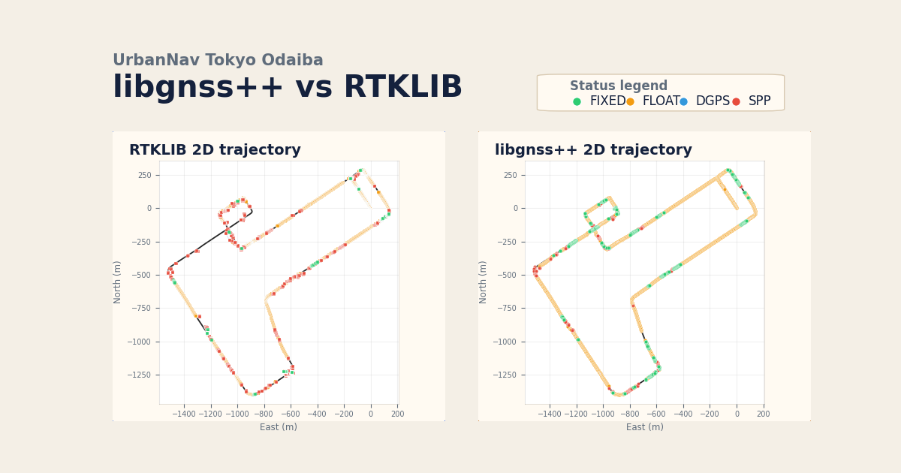

## What You Get

- Solvers: `gnss spp`, `gnss solve`, `gnss ppp`
- Inputs/tools: RINEX, RTCM, UBX, SBF, NMEA, BINEX, QZSS L6
- Products: `SP3`, `CLK`, `IONEX`, `DCB`
- Extras: benchmarks, web dashboard, Python bindings, Docker, ROS 2 playback

[Choose a use case](docs/use_cases.md): [urban RTK + IMU continuity](docs/use_cases/urban_rtk_fgo.md),
[RTKLIB migration](docs/use_cases/rtklib_migration.md),
[ROS2 receiver/bag replay](docs/use_cases/ros2.md), or [QZSS L6 / CLAS / MADOCA](docs/use_cases/qzss_l6.md).

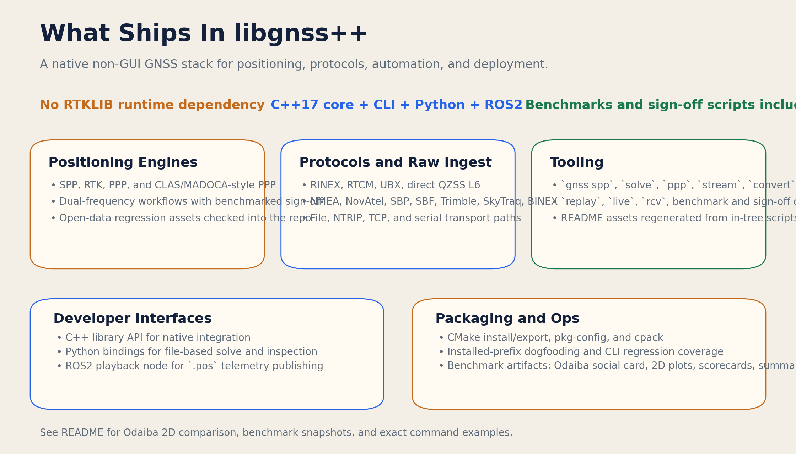

## Try it

The fastest first run uses the published runtime image; no local build is
needed:

```bash
mkdir -p output
docker run --rm \
  -v "$PWD/output:/workspace/output" \
  ghcr.io/rsasaki0109/gnssplusplus-library:v0.2.0 \
  demo --output-dir /workspace/output/self-contained-demo
```

The command runs the tracked, project-authored synthetic PPP fixture entirely
offline after the image is available. It should report 8 processed and 8 valid
PPP solutions and write `demo_solution.pos`, `demo_solution.kml`, and
`demo_summary.json` under `output/self-contained-demo/`. This validates
CLI/build/artifact plumbing, not field accuracy, real-world satellite
geometry, or RTK fix performance. See the [full demo guide](docs/self_contained_demo.md)
for provenance and native-build instructions.

Prefer a native source checkout? Build the PPP executable and run the same
tracked demo:

```bash
cmake -S . -B build -DCMAKE_BUILD_TYPE=Release
cmake --build build --target gnss_ppp --parallel 2
python3 apps/gnss.py demo
```

## Use the C++20 library

The install exports a standard CMake package and the `libgnsspp::gnss_lib`
target for downstream C++20 applications:

```cmake
cmake_minimum_required(VERSION 3.14)
project(my_gnss_app LANGUAGES CXX)

set(CMAKE_CXX_STANDARD 20)
set(CMAKE_CXX_STANDARD_REQUIRED ON)

find_package(libgnsspp CONFIG REQUIRED)
add_executable(my_gnss_app main.cpp)
target_link_libraries(my_gnss_app PRIVATE libgnsspp::gnss_lib)
```

Build the complete exported library set before installing it:
`cmake --build build --parallel 2`, followed by
`cmake --install build --prefix <prefix>`. Configure the consumer with
`-DCMAKE_PREFIX_PATH=<prefix>`. Start with the
[simple SPP example](examples/simple_spp.cpp), the
[RTK positioning example](examples/rtk_positioning.cpp), the
[public API header](include/libgnss++/gnss.hpp), and the
[interface notes](docs/interfaces.md).

See the [v0.2.0 release highlights](docs/releases/v0.2.0.md) and
[maintainer release runbook](docs/release_runbook.md) for distribution details.

## Results And Validation Status

| Area | Public comparison | Evidence / status |
|---|---|---|
| RTK | PPC Tokyo/Nagoya vs RTKLIB `demo5` | +17.0 pp positioning, +28.1 pp official score, -11.96 m P95 H delta |
| GNSS/IMU FGO | PPC Tokyo vs `tightly-coupled-gnss-imu-fgo` | Higher <50 cm fraction (avg +5.6 pp) and fix-rate (avg +8.2 pp) on all 3 runs; fixed-only RMS also wins 2 of 3 runs |
| CLAS PPP | Six PPC Tokyo/Nagoya runs vs MRTKLIB CLAS | 24.851% aggregate FIX, 0.377 m FIX RMS2D (lower than MRTKLIB on all six runs), 36.523 m all-solution RMS2D across 58,259 scored epochs; 19 FIX epochs (0.03%) exceed 3 m, all in one pre-existing 4 s Nagoya 2 burst |
| Urban RTK | UrbanNav Tokyo Odaiba vs RTKLIB `demo5` | More fixes, lower Hp95/Vp95; `--preset odaiba` closes Hmed |
| SPP | PPC SPP adaptive robust + policy gate | No P95 regression with <=1 pp positioning drop |
| Smartphone GSDC 2023 | Galileo E1/Hatch/WLS and native FGO lanes | Native best observed server score 3.952 public / 4.276 private; 0.782-class native target not yet achieved |

The Phase 14 native E1 carrier-code-leveling experiment is a raw-only,
opt-in structural No-Go: the only unused identity available for a smoke lacks
the GNSS elapsed-time anchor required by the native IMU contract, so no truth
was opened and no accuracy claim was made.  See the [phase 14 record](docs/use_cases/records/smartphone_r5_phase14_carrier_code_leveling_structural_blocker_v1.json).

Phase 15 adds a raw-only, opt-in UTC/GPS affine timing fallback for Android
logs whose `elapsedRealtimeNanos` column is entirely blank.  It uses only
`TimeNanos - FullBiasNanos - BiasNanos` and `utcTimeMillis`, with fixed
monotonicity, 5 s gap, 1000 ppm drift, and 2 ms fit-residual gates; valid
elapsed anchors remain authoritative and production defaults are unchanged.
The mi8 structural smoke reached the native graph (1,417 anchors, 0.061 ppm
drift, 0.00356 ms maximum fit residual), while the unchanged Phase 14 E1
Hatch candidate was rejected before truth because its raw carrier/code seam
diagnostics reached 399,723 m.  See the [Phase 15 freeze](docs/use_cases/records/smartphone_r5_phase15_utc_wall_clock_fallback_freeze_v1.json)
and [sealed structural result](docs/use_cases/records/smartphone_r5_phase15_utc_wall_clock_fallback_structural_result_v1.json).

Phase 16 adds an opt-in raw P-vs-ADR innovation reset to that Hatch lane.  The
40 m boundary is taken from the existing upstream adjacent P-D rule; only a
strictly larger innovation resets the satellite/signal arc and emits raw P.
On the mi8 structural route this converted the 399,723 m accepted Hatch
adjustment into 18 fail-closed arc resets, with accepted innovation <=13.293 m
and 1,416/1,416 finite keys.  On the already-used Pixel7 development route no
reset was needed, so the candidate is byte-identical to its Phase 14 Hatch
control; compared with the separately frozen Phase 12 submission it scored
3.146250666 m versus 3.192248964 m across the local WGS84-linear diagnostic.
This is development-only evidence (the evaluation needed one failed CLI
key-alias recovery plus one scoring read), not a new validation/holdout claim;
native 0.782-class remains unachieved.  See the [Phase 16 freeze](docs/use_cases/records/smartphone_r5_phase16_carrier_code_innovation_reset_freeze_v1.json)
and [sealed score result](docs/use_cases/records/smartphone_r5_phase16_carrier_code_innovation_reset_score_result_v1.json).

Phase 17 is an opt-in extension that applies the same raw P-vs-ADR
innovation reset independently to GPS L1 C/A and Galileo E1.  Both 40 m
thresholds come from the pinned upstream adjacent P-D rule; unsupported bands
are rejected and the historical single-signal API remains unchanged.  The
mi8 and Pixel7 raw-only runs were finite, converged, deterministic, and had
no physical-transition gate violation.  The mi8 candidate processed 9,541
GPS L1 C/A and 5,917 Galileo E1 eligible rows, with 18 Galileo resets; the
Pixel7 candidate had no resets and was byte-identical to its Phase 16
control.  See the [Phase 17 freeze](docs/use_cases/records/smartphone_r5_phase17_primary_l1_e1_freeze_v1.json)
and [structural manifest](docs/use_cases/records/smartphone_r5_phase17_primary_l1_e1_freeze_v1_manifest.json).

The permitted post-freeze mi8 development comparison opened its exact-phone
`ground_truth.csv` once, but stopped before scoring at the frozen key check
(`extra=17`, `missing=1`).  It was not retried, so no accuracy or promotion
claim is made; the failure and truth-open count are sealed in the [Phase 17
result record](docs/use_cases/records/smartphone_r5_phase17_primary_l1_e1_score_result_v1.json).
Pixel7 truth was not reread, and validation/holdout/test truth remained
unopened.  Native 0.782-class remains unachieved.

Phase 18 adds a reusable intersection evaluator for recovery of a failed
multi-submission key check.  Its policy was frozen before implementation:
surplus prediction keys are counted/hashed but ignored for scoring, missing
truth keys are counted without filling, and control/candidate must share the
same matched-key set.  The fixed acceptance floor is 99.9% coverage with at
most one missing key, plus strict improvement in all four local diagnostics.
On the sealed mi8 artifacts, one Phase 18 process read the already
materialized truth once (cumulative truth reads: two including Phase 17),
matched 1,399/1,400 keys, and found 17 surplus and one missing key.  The
candidate was worse than control on all four variants (2.068163 vs 2.043566 m
WGS84-linear), so the result is No-Go; no artifact, policy, or parameter was
changed afterward.  See the [Phase 18 policy freeze](docs/use_cases/records/smartphone_r5_phase18_intersection_metric_freeze_v1.json),
[implementation seal](docs/use_cases/records/smartphone_r5_phase18_intersection_metric_manifest_v1.json),
and [sealed result](docs/use_cases/records/smartphone_r5_phase18_intersection_metric_score_result_v1.json).

Phase 19 evaluates a GPS-L1-free Galileo extension: the frozen Galileo E1
safe-Hatch control versus an opt-in E1 + Galileo E5a safe-Hatch candidate.
E1 keeps the upstream-derived 40 m innovation boundary; E5a uses the L5
20 m boundary, with independent `(satellite, signal)` arcs and diagnostics.
The raw-only mi8 and Pixel7 structural runs were finite, converged,
deterministic, and had no >70 m/s transition.  After sealing those artifacts,
the candidate improved all four local diagnostics on both development
comparisons: mi8 WGS84-linear `2.043565555 -> 2.000224284 m` (intersection
coverage 1,399/1,400), and Pixel7 `3.146250666 -> 3.143874942 m`
(exact coverage 1,383/1,383).  This is development-only evidence, not a
validation/holdout or generalization claim; native 0.782-class remains
unachieved and no Kaggle submission was made.  See the [Phase 19 freeze](docs/use_cases/records/smartphone_r5_phase19_gal_e1_e5a_freeze_v1.json),
[sealed raw manifest](docs/use_cases/records/smartphone_r5_phase19_gal_e1_e5a_manifest_v1.json),
and [sealed score result](docs/use_cases/records/smartphone_r5_phase19_gal_e1_e5a_score_result_v1.json).

Phase 20 adds an opt-in translation of the upstream stationary stop
constraints to the native raw Android GNSS+IMU graph: robust zero-velocity
priors and consecutive-stop `Pose3` identity factors.  On the already-used
Pixel7 development route, the sealed candidate improved all four local
diagnostics, WGS84-linear `3.192248964 -> 3.188229554 m`, with 1,383/1,383
keys and a byte-identical repeat.  This is reused development evidence only;
the native 0.782-class target remains unachieved, so no Kaggle submission was
made.  See the [Phase 20 freeze](docs/use_cases/records/smartphone_r5_phase20_upstream_stop_constraints_freeze_v1.json),
[raw structural manifest](docs/use_cases/records/smartphone_r5_phase20_upstream_stop_constraints_manifest_v1.json),
and [one-shot score](docs/use_cases/records/smartphone_r5_phase20_upstream_stop_constraints_score_result_v1.json).

Phase 21 ports the pinned upstream phone-specific antenna-to-body position
offset as an opt-in raw-only post-processing step using the optimized native
GTSAM `Rot3::rpy()` and the exact `Rx*Ry*Rz(rpy-[0,0,pi])` transform.  The
Pixel7 candidate improved the four local diagnostic scores from
`3.192248964` to `3.138544251 m` (WGS84/Vincenty-linear), with 1,383/1,383
keys and a byte-identical repeat; H P50 improved while H P95 increased
slightly.  This is already-used development evidence only, not validation or
holdout generalization, and native 0.782-class remains unachieved.  The
default solver and prior lanes are unchanged.  See the [Phase 21 freeze](docs/use_cases/records/smartphone_r5_phase21_position_offset_freeze_v1.json),
[raw structural manifest](docs/use_cases/records/smartphone_r5_phase21_position_offset_manifest_v1.json),
and [one-shot score](docs/use_cases/records/smartphone_r5_phase21_position_offset_score_result_v1.json).

Phase 22 audited the native GNSS measurement model against the pinned
RTKLIB/MATLAB specification.  Orbit/clock/relativity, Sagnac, broadcast
ionosphere, and troposphere corrections are already present; the largest
raw-only, source-supported gap selected for a bounded experiment was
Galileo E1 broadcast group-delay selection (F/NAV BGD E1/E5a versus I/NAV
BGD E1/E5b).  The opt-in candidate was finite and converged on both raw-only
structural routes, but its sealed Pixel7 development score regressed all four
diagnostics from `3.192248964` to `3.268181634 m` (WGS84/Vincenty-linear), so
it is a No-Go and remains unpromoted.  No validation/holdout/test truth,
`.mat` input, or production-default change was made.  See the [Phase 22
measurement-model audit](docs/use_cases/records/smartphone_r5_phase22_measurement_model_gap_audit_v1.json),
[freeze](docs/use_cases/records/smartphone_r5_phase22_galileo_tgd_freeze_v1.json),
[truth-free manifest](docs/use_cases/records/smartphone_r5_phase22_galileo_tgd_manifest_v1.json),
and [sealed score](docs/use_cases/records/smartphone_r5_phase22_galileo_tgd_score_result_v1.json).
The separate mi8 cross-device development comparison improved all four
variants by roughly 0.041--0.045 m, but does not override the Pixel7 primary
route failure and is not validation/generalization evidence.

### RTK runtime and smartphone GSDC 2023

The Release RTK broadcast-state cache preserves the position stream and
reduces measured solver wall time. The paired run used 120 valid epochs, 116
fixed epochs, and zero wrong fixes in both variants; the complete evidence is
in the [RTK cache record](docs/use_cases/records/rtk_ppc_tokyo_spp_cache_prepost_release.json).

| RTK metric | Baseline | Optimized |
|---|---:|---:|
| Solver wall (s) | 1.4098465 | **1.3217735 (-6.246992%)** |
| Epoch P50 (ms) | 11.728235 | **11.030901** |
| Epoch P95 (ms) | 13.204182 | **12.3482985** |
| Valid / fixed | 120 / 116 | 120 / 116 |
| Wrong fixes | 0 | 0 |
| Position output | byte-identical reference | byte-identical reference |

The native libgnss++ lane comparison below reports the server values from two
native submissions; they are evidence, not tuning targets. Native FGO v5 is
the current best at 3.952 public / 4.276 private, so the native 0.782-class
target has not yet been achieved.

| Native libgnss++ lane | Public | Private |
|---|---:|---:|
| WLS | 4.018 | 4.873 |
| Native FGO v5 | 3.952 | 4.276 |

An earlier external/precomputed-MAT experiment is deliberately excluded from
the native result summary: it was not a libgnss++ inference run and cannot
establish the native 0.782-class target. Native smartphone experiments remain
development-only, and RTK/SPP production defaults are unchanged.

Phase 31 adds an opt-in raw/nav-only quality-anchor SPP replay initializer to
address the Samsung startup transient.  The three fixed development routes
all reached finite converged output and byte-identical repeat artifacts; the
Samsung first-30-transition maximum dropped from the sealed comparator's
174.084 m/s to 3.116 m/s with no >70 m/s transitions.  This is truth-free
structural evidence only—no new truth was opened and native 0.782-class
accuracy remains unachieved.  See the [Phase 31 freeze](docs/use_cases/records/smartphone_r5_phase31_quality_anchor_freeze_v1.json)
and [structural result](docs/use_cases/records/smartphone_r5_phase31_quality_anchor_structural_result_v1.json).

Phase 35 froze a route-disjoint raw-only matrix containing the unchanged
quality-anchor control and three opt-in native variants (Galileo E1/E5a
Hatch, plus upstream stop or position-offset extensions).  An interrupted
truth-free runner was resumed byte-safely: all 32 route/lane/repeat runs
passed finite/converged, exact raw-key, continuity, and repeat-identity gates.
The three development truth files were then read once each in one process.
No candidate passed every route-wise gate: A and B regressed H P50 on the
first route, while C had a Samsung route regression despite a lower macro
diagnostic mean (1.6061 m versus control 1.8109 m).  Validation truth,
holdout, MAT, token, and Kaggle were not opened; no lane was promoted and no
submission was made.  See the [Phase 35 freeze](docs/use_cases/records/smartphone_r5_phase35_matrix_freeze_v1.json),
[resume recovery record](docs/use_cases/records/smartphone_r5_phase35_interruption_recovery_v1.json),
[structural seal manifest](docs/use_cases/records/smartphone_r5_phase35_matrix_evaluator_manifest_v2.json),
and [train No-Go result](docs/use_cases/records/smartphone_r5_phase35_matrix_evaluation_result_v1.json).

Phase 36 audited the sealed native Phase 31 champion for phone/model-specific
systematic bias using one process over the three already-opened Phase 29
development truths.  It reports fixed-ENU median/MAD/covariance,
prefix/tail stability, and coarse raw-IMU orientation groups.  Each exact
model has only one route (Pixel5 only one identity), and no calibrated
device-to-antenna pose is available, so a constant or body-frame lever-arm
calibration is not identifiable.  This is a recorded development-only
No-Go: no fit, native correction, validation/holdout read, or Kaggle mutation
was made, and the Phase 31 champion is unchanged.  A metadata-only proposal
selects three additional complete Pixel5 identities for a future repeated-
model experiment; that proposal requires a new freeze before materialization
or truth access.  See the [Phase 36 freeze](docs/use_cases/records/smartphone_r5_phase36_phone_bias_audit_freeze_v1.json),
[evaluator manifest](docs/use_cases/records/smartphone_r5_phase36_phone_bias_audit_evaluator_manifest_v1.json),
and [No-Go result](docs/use_cases/records/smartphone_r5_phase36_phone_bias_audit_result_v1.json).

Phase 37 froze the repeated-model Pixel5 experiment with the numeric
identifiability gates in the [v2 freeze](docs/use_cases/records/smartphone_r5_phase37_pixel5_repeatability_freeze_v2.json)
and committed the [evaluator source manifest](docs/use_cases/records/smartphone_r5_phase37_pixel5_repeatability_evaluator_manifest_v1.json)
before materializing any new payload.  Only the three added routes' raw
`device_gnss.csv`, `device_imu.csv`, and broadcast `brdc.nav` were
materialized.  The unchanged Phase 31 native binary and flags were used:
the MTV-h route failed closed on run 1 because its solution contained a
non-finite or out-of-Earth ECEF position, so run 2 and all truth access were
forbidden.  The LAX-t and MTV-u routes passed repeat-byte-identity,
raw-key, convergence, factor, and <=70 m/s structural checks, but the
experiment remains a structural No-Go because all four identities did not
pass.  No ground truth, MAT, validation, holdout, token, or Kaggle access
occurred; no common/body-frame fit was made and the Phase 31 champion is
unchanged.  See the [fail-closed record](docs/use_cases/records/smartphone_r5_phase37_pixel5_repeatability_structural_failure_v1.json)
and [failure manifest](docs/use_cases/records/smartphone_r5_phase37_pixel5_repeatability_structural_failure_manifest_v1.json).

Phase 38 diagnosed the MTV-h Pixel5 failure under a new truth-free freeze,
using only the already-materialized raw GNSS/IMU streams and broadcast
navigation.  The first existing-binary attempt returned rc=127 because the
Phase 37 runtime `LD_LIBRARY_PATH` was missing; this environment failure is
recorded transparently.  With the existing runtime environment restored, the
unchanged binary returned rc=1 before UTC key projection because its native
GNSS-first states included out-of-Earth ECEF positions (GDB: 1325 states,
611 invalid, first invalid index 0, norm 7,432,673.743891388 m).  The original
raw-only graph seeds were 1325/1325 Earth-valid epochs.  A bounded exploratory
handoff rejection retained those in-memory raw-only seeds, but the existing
Android heading gate then failed and the TDCP contract stopped at built=2085,
inserted=0 on both attempts.  It was therefore sealed **diagnosis No-Go**:
the opt-in candidate was not committed, no six-route matrix or truth access
was authorized, and the Phase 31/default binary and outputs remain unchanged.
See the [Phase 38 diagnosis](docs/use_cases/smartphone_native_fgo_phase38_mtvh_failure_diagnosis.md)
and [No-Go result](docs/use_cases/records/smartphone_r5_phase38_mtvh_failure_diagnosis_result_v1.json).

Phase 39 adds a truth-free, native opt-in candidate that hands off only the
GNSS-first optimizer's independently optimized Doppler velocity/heading
sequence.  A raw-Doppler WLS result is initialization only; the handed-off
sequence is the final GNSS-first optimizer result.  Its ECEF-to-ENU origin is the first original raw SPP seed, while
GNSS-first position and receiver-clock states are never copied.  Every epoch
must have a finite velocity with norm <=70 m/s; the summary exposes GNSS-first
out-of-Earth/invalid-position counts and the position/clock copy count.  The
candidate flag is
`--native-gnss-first-velocity-only-handoff`; absent the flag, defaults and the
Phase 31 champion are unchanged.  The fixed six-route, two-run structural
matrix and flag-off identity contract are frozen before execution.  See the
[Phase 39 handoff contract](docs/use_cases/smartphone_native_fgo_phase39_velocity_only_handoff.md)
and [freeze record](docs/use_cases/records/smartphone_r5_phase39_gnss_first_velocity_only_handoff_freeze_v1.json).
The frozen MTV-h candidate run failed closed because 1,181 of 1,325 final
optimizer Doppler velocity states exceeded 70 m/s (maximum 8,919.75 m/s); no
candidate output or flag-off control was promoted.  See the [Phase 39 No-Go
result](docs/use_cases/records/smartphone_r5_phase39_gnss_first_velocity_only_handoff_result_v1.json)
and [failure manifest](docs/use_cases/records/smartphone_r5_phase39_gnss_first_velocity_only_handoff_structural_failure_manifest_v1.json).

Phase 40 tests a separate truth-free opt-in that consumes the existing raw
Doppler WLS estimates directly as the IMU velocity/heading seed, with no
GNSS-first optimizer handoff:
`--native-direct-doppler-wls-handoff`.  It requires complete finite coverage,
the unchanged <=70 m/s velocity and <=2000 m/s clock-rate gates, and only the
existing <=1.0 s propagation bound; raw SPP positions remain authoritative and
position/clock copy count is zero.  The candidate failed closed on MTV-h:
0/1,325 WLS estimates were valid, 1,181 four-row solves hit `physical-gate`,
and the first solved velocity/clock norms were 8,919.7537472980548 m/s and
7,314.3850372387406 m/s.  Production/default behavior and the Phase 31
champion are unchanged.  See the [Phase 40 contract](docs/use_cases/smartphone_native_fgo_phase40_direct_doppler_wls_handoff.md),
[freeze](docs/use_cases/records/smartphone_r5_phase40_direct_doppler_wls_handoff_freeze_v1.json),
and [No-Go result](docs/use_cases/records/smartphone_r5_phase40_direct_doppler_wls_handoff_result_v1.json).

Phase 41 audits the raw Android Doppler measurement contract without truth,
MAT files, precomputed coordinates, threshold changes, or estimator-model
changes.  On the same first solvable epoch it compares raw
`PseudorangeRateMetersPerSecond` (m/s), adapter Doppler (Hz), source/FGO
wavelengths, measured range rate, broadcast satellite state and clock drift,
Earth rotation, LOS, known satellite range rate, and independent receiver
residuals with the unchanged FGO factor fields.  All six frozen routes pass
the unit/sign/known-term identities; MTV-h has 33 raw candidate rows versus 4
FGO rows, and its public SPP solve returns `ok=false` without exposing the
post-fit reason.  The source-frequency versus nominal GLONASS conversion
delta is recorded but is not a proven contract bug.  Phase 41 is therefore a
diagnosis No-Go: no correction or gate relaxation was made, and the next
measurement is raw-row attrition by signal, broadcast-nav availability/health,
masks, and geometry.  See the [Phase 41 contract](docs/use_cases/smartphone_native_fgo_phase41_doppler_measurement_contract_audit.md),
[freeze](docs/use_cases/records/smartphone_r5_phase41_doppler_measurement_contract_audit_freeze_v1.json),
[result](docs/use_cases/records/smartphone_r5_phase41_doppler_measurement_contract_audit_result_v2.json),
and [six-route structural manifest](docs/use_cases/records/smartphone_r5_phase41_doppler_measurement_contract_audit_structural_manifest_v2.json).

Phase 42 follows that No-Go with a truth-free raw-row attrition audit.  The
frozen MTV-h first solvable epoch contains 35 parsed Raw rows, 33 selected
rows, and 4 unchanged corrected-undifferenced FGO factors: the 29 selected
row losses partition into 9 unsupported constellation/signal/frequency rows
and 20 below-horizon rows.  The 24 supported rows all have valid transmit
time, both broadcast-navigation state calls, present/healthy ephemerides,
and finite SNR/geometry; UTC-to-GPS week/TOW identity mismatches are zero.
MTV-h has no quality-anchor SPP solution and uses the sentinel ECEF seed
`(6378137,0,0)`, whose first-epoch geometry has median elevation `-40.1623°`
and 20/24 rows below zero.  The other five frozen routes select fresh raw/nav
SPP anchors and have no below-horizon first-epoch rows.  This proves a
generalizable fallback-seed elevation-mask selection bug, but Phase 42 makes
no production or numeric correction.  A separate opt-in may bypass only the
elevation gate for the sentinel fallback while retaining navigation, health,
SNR, physical-geometry, clock, and receiver-drift gates.  See the [Phase 42
audit](docs/use_cases/smartphone_native_fgo_phase42_doppler_row_attrition.md),
[freeze](docs/use_cases/records/smartphone_r5_phase42_doppler_row_attrition_freeze_v1.json),
[evaluator manifest v2](docs/use_cases/records/smartphone_r5_phase42_doppler_row_attrition_audit_evaluator_manifest_v2.json),
and [sealed result](docs/use_cases/records/smartphone_r5_phase42_doppler_row_attrition_result_v1.json).

Phase 43 adds a truth-free, opt-in recovery for that no-anchor case:
`--native-fallback-seed-quality-anchor-recovery`.  The existing normal
quality-anchor reconnaissance runs to completion first; only when it has no
eligible candidate does the same raw-pseudorange/broadcast-navigation SPP
reconnaissance retry at an elevation gate of −90°.  SNR, health, navigation,
geometry, GDOP, residual, satellite-count, and deterministic ranking gates are
unchanged.  A selected raw/nav-derived anchor seeds ordinary 0° forward and
backward replay; the factor builder remains at 0°, and recovery failure stays
fail-closed without a sentinel factor bypass.  The fixed six-route, two-run
matrix selected anchor index 904 on MTV-h (27 satellites, GDOP
0.9928008873297592, normalized residual RMS 2.3663773350268436), replayed all
3,140 epochs, built and inserted 41,383 TDCP factors, converged, and produced
no >70 m/s transitions.  The other five routes did not trigger recovery, and
their flag-on projected artifacts matched flag-off controls; all truth/MAT/
validation/holdout/Kaggle reads were zero.  See the [Phase 43 contract](docs/use_cases/smartphone_native_fgo_phase43_fallback_seed_quality_anchor_recovery.md),
[freeze](docs/use_cases/records/smartphone_r5_phase43_native_fallback_seed_quality_anchor_recovery_freeze_v1.json),
[evaluator manifest](docs/use_cases/records/smartphone_r5_phase43_native_fallback_seed_quality_anchor_recovery_evaluator_manifest_v1.json),
and [structural result](docs/use_cases/records/smartphone_r5_phase43_native_fallback_seed_quality_anchor_recovery_result_v1.json).

Phase 44 then scored the sealed Phase 43 candidate on four route-disjoint
Pixel 5 development identities, with no native rerun.  The evaluator fixed
exact `(phone, UnixTimeMillis)` matching (no interpolation or edge hold),
per-row Haversine distance, and `Kaggle=(P50+P95)/2` before opening truth.
It read the existing truth once and materialized/opened/read each added
archive truth member once (four reads total); MTV-h's flag-off control remained
the Phase 43 fail-closed run.  The candidate rows were finite and had zero
transitions over 70 m/s, but MTV-a and MTV-u each lacked their leading raw-UTC
warm-up key, while MTV-h scored 3.606966 m and LAX-t 4.511656 m.  The
four-route Pixel 5 macro score was 3.536447 m (absolute limit 2.0 m), and the
0.782 m target was not met.  This is a development No-Go; validation, holdout,
Kaggle, MAT, WLS, and precomputed-coordinate inputs remained sealed.  See the
[Phase 44 contract](docs/use_cases/smartphone_native_fgo_phase44_pixel5_development_accuracy.md),
[freeze](docs/use_cases/records/smartphone_r5_phase44_pixel5_development_accuracy_freeze_v1.json),
[evaluator manifest](docs/use_cases/records/smartphone_r5_phase44_pixel5_development_accuracy_evaluator_manifest_v1.json),
and [result](docs/use_cases/records/smartphone_r5_phase44_pixel5_development_accuracy_result_v1.json).

Phase 45 then audited whether the sealed four-route Pixel 5 residual is
identifiable as a common raw-only factor.  The v3 freeze corrected the
prediction-domain coverage wording while retaining the v1/v2 records and all
numeric thresholds.  A single evaluator process reused the Phase44
materialized truths and read each candidate, truth, and raw `device_imu.csv`
once; it performed no archive access, solver rerun, corrected-coordinate
write, validation/holdout read, MAT/WLS/precomputed inference, or Kaggle/token
access.  The fixed local ENU diagnostics report route medians/MAD/covariance,
prefix/tail and quartile/time drift, prediction-only speed bins, and raw
UncalAccel/UncalMag orientation/heading groups.  Leave-one-route-out common
median scores are diagnostic only.

Phase 45 is `no-go-residual-not-identifiable`: route-center dispersion,
prefix/tail stability, orientation independence, all-route LOO improvement,
LOO macro improvement, and the 0.782 m reachability check fail.  The LOO
macro moves from **3.533210 m** to **4.248509 m** (−0.715299 m), with maximum
individual worsening **2.298791 m**; the full-cohort common-median diagnostic
is **3.229678 m** macro and **3.220895 m** on MTV-h.  Known MTV-a/u warm-up
rows remain unmatched while truth-row coverage is reported separately from
the complete prediction-domain key coverage.  The strongest structure is
common-median non-transfer; the one next source-supported raw factor is an
Android raw GNSS receiver clock/timing residual, which is not implemented in
this phase.  See the [Phase 45 contract](docs/use_cases/smartphone_native_fgo_phase45_pixel5_residual_diagnostic.md),
[v3 freeze](docs/use_cases/records/smartphone_r5_phase45_pixel5_residual_diagnostic_freeze_v3.json),
[evaluator manifest](docs/use_cases/records/smartphone_r5_phase45_pixel5_residual_diagnostic_evaluator_manifest_v1.json),
and [result](docs/use_cases/records/smartphone_r5_phase45_pixel5_residual_diagnostic_result_v1.json).

Phase 46 audited that next factor using only the same four Pixel5 raw
`device_gnss.csv` files.  Each raw file was read once in one evaluator process;
truth, Phase45 residual payload, solver, archive, validation/holdout, MAT,
WLS, precomputed coordinates, and Kaggle/token inputs remained sealed.  The
UTC/GPS clock residual and drift gates passed (maximum detrended residual
**0.012085 ms**, maximum drift **0.047444 ppm**), but `FullBiasNanos` changed
on **7,578** subsequent epochs without a HCDC change or a strict >1 s segment
boundary.  Segment-base versus per-row TOW differences reached **29,421.032
m** c-scaled on MTV-a, while same-epoch clock and constellation/signal
differences were zero.  This is a common receiver-clock gauge, so Phase 46 is
`no-go-clock-correction-common-mode-only`; no correction was implemented.  The
single next raw physical factor is satellite-specific code
propagation/multipath residual.  See the [Phase 46 contract](docs/use_cases/smartphone_native_fgo_phase46_pixel5_raw_clock_timing.md),
[freeze](docs/use_cases/records/smartphone_r5_phase46_pixel5_raw_clock_timing_freeze_v1.json),
[evaluator manifest](docs/use_cases/records/smartphone_r5_phase46_pixel5_raw_clock_timing_evaluator_manifest_v1.json),
and [result](docs/use_cases/records/smartphone_r5_phase46_pixel5_raw_clock_timing_result_v1.json).

Phase 47 audited that factor truth-free from the same four Pixel5 raw
`device_gnss.csv` files.  Each file was read once in one process; truth,
Phase45/46 payloads, navigation, solver, archive, validation/holdout, MAT,
WLS, `SvPosition`/`SvElevation`, precomputed coordinates, and Kaggle/token
inputs remained sealed.  Same-epoch dual-frequency code differences and
median-centered ADR CMC arcs were reported with raw C/N0, state,
`MultipathIndicator`, `ReceivedSvTimeUncertaintyNanos`, rate-uncertainty, and
ADR buckets.  Pair coverage, flagged-vs-clean p95, non-common-mode,
satellite-dispersion, FGO signal adoption, and LOO threshold observations
were emitted, but the descriptive route metric varied from **20.686 m** to
**64.815 m** (route MAD **7.570 m** vs frozen **2.0 m**).  More importantly,
the one-shot route output exposed a stale-loop CMC group-summary defect and a
collapsed aggregate route-median presentation field.  Phase 47 is therefore
**no-go-evaluator-integrity-failure**; no correction, weighting, or mask was
implemented and no raw payload was reopened.  The exact one next factor is
raw Android per-satellite `ReceivedSvTimeUncertaintyNanos`/code-tracking
residual.  The [Phase 47 contract](docs/use_cases/smartphone_native_fgo_phase47_pixel5_raw_code_multipath.md),
[freeze](docs/use_cases/records/smartphone_r5_phase47_pixel5_raw_code_multipath_freeze_v1.json),
[evaluator manifest](docs/use_cases/records/smartphone_r5_phase47_pixel5_raw_code_multipath_evaluator_manifest_v1.json),
and [result](docs/use_cases/records/smartphone_r5_phase47_pixel5_raw_code_multipath_result_v1.json)
record the fixed gates, source/static adoption audit, read accounting, and
output hashes.

Phase 48 audited the one raw factor selected by Phase 47: per-satellite
`ReceivedSvTimeUncertaintyNanos`/code-tracking residual.  The four pinned
Pixel5 raw files were each read once in one process, with no truth, Phase45 or
Phase47 metric input, navigation, solver, coordinates, validation, or
correction implementation.  The raw code-increment versus trapezoidal
`PseudorangeRateMetersPerSecond` association was positive in every route
(Spearman **0.444–0.498**, `>10 ns` p95 excess **6.034–9.315 m**, ratio
**3.104–4.036x**) and the presentation-integrity checks passed.  The audit is
**no-go**: only two ordered uncertainty buckets were populated, low/base
retention was **0.124–0.225** against the frozen 0.30 minimum, only one signal
family was available per route, and the pinned adapter/observation/FGO path
does not parse, retain, or consume this field as sigma.  No sigma floor or
weighting was implemented; `0.782` reachability was not evaluated without
truth.  The exactly one next raw physical factor is Android per-satellite
carrier-phase ADR cycle-slip/lock-loss residual.  See the [Phase 48
contract](docs/use_cases/smartphone_native_fgo_phase48_pixel5_raw_code_rate_uncertainty.md),
[freeze](docs/use_cases/records/smartphone_r5_phase48_pixel5_raw_code_rate_uncertainty_freeze_v1.json),
[evaluator manifest](docs/use_cases/records/smartphone_r5_phase48_pixel5_raw_code_rate_uncertainty_evaluator_manifest_v1.json),
and [result](docs/use_cases/records/smartphone_r5_phase48_pixel5_raw_code_rate_uncertainty_result_v1.json).

Phase 49 audited the one raw factor selected by Phase 48: per-satellite
Android carrier-phase ADR cycle-slip/lock-loss residual.  The same four
Pixel5 raw files were each read once by one evaluator process; truth, prior
truth/metric payloads, navigation, solver/trajectory, coordinates,
validation/holdout, archive, MAT, WLS, and correction paths remained sealed.
The fixed Pixel5 ADR sign, state-bit, HCDC, 1.5 s pair, existing mask, and
Phase 25 raw-time contracts were statically pinned.  Ordinary unflagged clean
residual p95 was **0.038575–0.062970 m**, but ordinary coverage was only
**3,728–8,763** pairs per route against the frozen 10,000 minimum; all routes
contained only **GAL_E1**, and the fixed 1.5 m two-sided jump score found
**zero candidates**.  Large tails were confined to the separately reported
reset/cycle-slip/invalid/mask/gap transitions.  Phase 49 is therefore
**no-go-adr-insufficient-ordinary-tdcp-coverage**; presentation integrity and
fixed-threshold LOO consistency passed, but coverage, candidate population /
materiality, event reproducibility, route direction, signal composition, and
current-TDCP impact failed.  No reset, mask, weighting, or correction was
implemented, and `0.782` was not evaluated without truth.  The exactly one
next source-supported raw factor is per-satellite carrier-phase half-cycle
ambiguity/resolution residual.  See the [Phase 49 contract](docs/use_cases/smartphone_native_fgo_phase49_pixel5_adr_cycle_slip_lock_loss.md),
[freeze](docs/use_cases/records/smartphone_r5_phase49_pixel5_adr_cycle_slip_lock_loss_freeze_v1.json),
[evaluator manifest](docs/use_cases/records/smartphone_r5_phase49_pixel5_adr_cycle_slip_lock_loss_evaluator_manifest_v1.json),
and [result](docs/use_cases/records/smartphone_r5_phase49_pixel5_adr_cycle_slip_lock_loss_result_v1.json).

Phase 50 audited the one raw factor selected by Phase 49: Android
per-satellite carrier-phase ADR half-cycle ambiguity/resolution transitions.
The same four Pixel5 raw files were each read once in one process; truth,
Phase49 metric payload, navigation, solver/trajectory, coordinates,
validation/holdout, archive, MAT, WLS, and correction paths remained sealed.
The source-pinned bits were VALID=1, RESET=2, CYCLE_SLIP=4,
HALF_CYCLE_RESOLVED=8, and HALF_CYCLE_REPORTED=16.  Ordinary pairs met the
frozen minimum (**3,728–8,763** per route; **6–11** satellites), but every
ordinary pair was `resolved_to_resolved`: unresolved/toggle and implicated
populations were **zero** in all routes, with no half-cycle cluster to test.
The one-shot output is therefore **no-go-evaluator-integrity-failure** because
the hard presentation check found that excluded transitions were included in
the emitted state-class total before comparison with ordinary pairs.  Pair
reason, signal/satellite groups, four route medians, aggregate median/MAD, and
event count passed; no raw input was reopened or evaluator rerun.  No arc
reset, mask, weighting, or correction was implemented, and `0.782` was not
evaluated without truth.  The exactly one next source-supported raw factor is
carrier-frequency/antenna phase-bias residual.  See the [Phase 50 contract](docs/use_cases/smartphone_native_fgo_phase50_pixel5_adr_half_cycle.md),
[freeze](docs/use_cases/records/smartphone_r5_phase50_pixel5_adr_half_cycle_freeze_v1.json),
[evaluator manifest](docs/use_cases/records/smartphone_r5_phase50_pixel5_adr_half_cycle_evaluator_manifest_v1.json),
and [result](docs/use_cases/records/smartphone_r5_phase50_pixel5_adr_half_cycle_result_v1.json).

### PPC 2024 goal matrix vs Kaiyodai and gici-open

The audited KF/FGO selected profile clears the distance-weighted PPC public
target at **78.8455%** (published target: **78.7%**). It also exceeds the
Tokyo 1 public FIX rate (**80.861%** vs **80.8%**). A separate FIX-target
profile clears Nagoya 1 by the narrow measured margin **85.100974%** vs
**85.1%**, with 0.913% Wrong FIX/FIX and 1.460 m P95 horizontal error. The
public FIX targets come from the [Kaiyodai RTK paper](https://www.denshi.e.kaiyodai.ac.jp/wp-content/uploads/pdf/content/2024okada,sasaki,ando.pdf),
and the PPC score target from the [Turing tight-coupling slides](https://www.denshi.e.kaiyodai.ac.jp/wp-content/uploads/2025/01/Turing-Inc.-Tight-coupling-Factor-Graph-%E4%BA%95%E4%B8%8A%E6%A7%98-%E5%9C%A7%E7%B8%AE.pdf).

| Run | libgnss++ FIX | gici-open FIX | Wrong FIX/FIX | libgnss++ correct FIX/ref | gici-open correct FIX/ref | 50 cm/ref | libgnss++ official | gici-open official | P95 H |
|---|---:|---:|---:|---:|---:|---:|---:|---:|---:|
| Tokyo 1 | **80.861%** | 46.472% | 2.855% | **71.467%** | 43.528% | 80.286% | 79.458% | **80.263%** | 2.082 m |
| Tokyo 2 | **82.340%** | 76.938% | 0.463% | **79.827%** | 74.462% | 88.395% | 88.696% | **90.652%** | 1.604 m |
| Tokyo 3 | **78.461%** | 73.347% | 1.366% | **75.962%** | 71.923% | 86.295% | **85.969%** | 83.787% | 1.671 m |
| Nagoya 1 | **83.659%** | 67.812% | 0.547% | **78.460%** | 60.005% | 85.845% | 65.201% | **70.851%** | 1.332 m |
| Nagoya 2 | **55.553%** | 39.988% | 0.541% | **48.587%** | 35.330% | 60.787% | **55.529%** | 39.847% | 18.144 m |
| Nagoya 3 | **44.761%** | 21.399% | 3.007% | **43.415%** | 18.285% | 61.354% | **72.336%** | 33.495% | 1.908 m |
| **Macro mean** | **70.939%** | 54.326% | **1.463%** | **66.287%** | 50.589% | 77.160% | **74.532%** | 66.483% | 4.457 m |

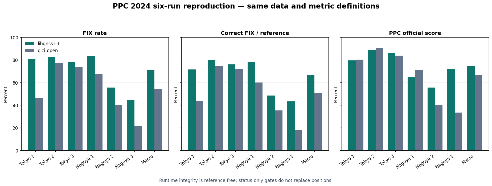

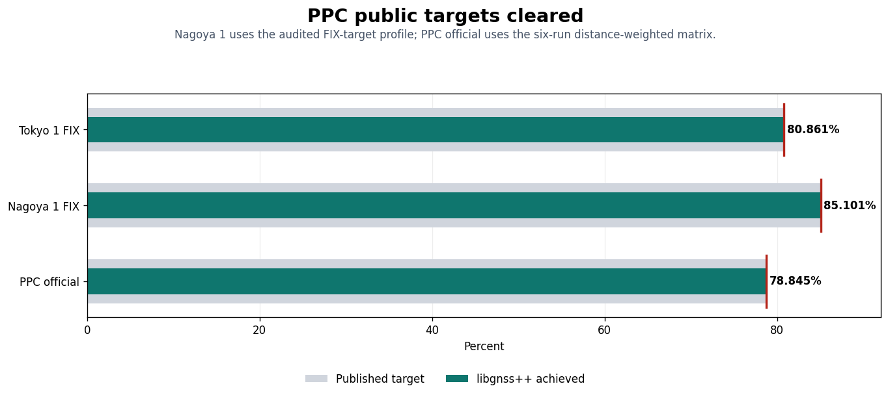

The audited runtime profile uses candidate telemetry only; reference truth is
used after output generation for scoring. It reaches an official score of
**78.845491%** while reducing aggregate wrong FIX from 869 to **574**, errors
above 5 m from 96 to **42**, and errors above 10 m from 59 to **5**.

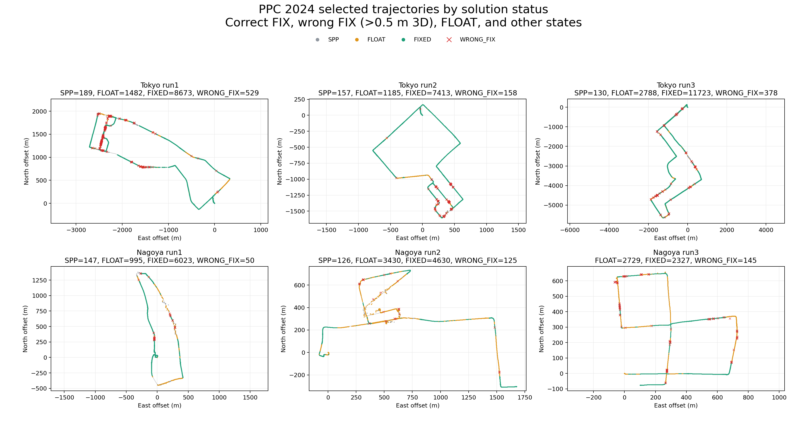

`gici-open` was reproduced from commit
`e7666110a88d22e08aad24345a253564af9b8024` on its `forppc2024` branch and
evaluated with the same six references and metric code. The libgnss++ FIX macro
is **+16.613 pp** higher and Wrong FIX/FIX is **1.025 pp** lower. These are
in-sample benchmark results, not a held-out generalization claim.

See the [goal audit](docs/ppc_goal_completion_audit.md),
[FIX integrity audit](docs/ppc_fix_integrity_audit.md),
[kinematic integrity LOO report](docs/ppc_kinematic_integrity_loo.md), and
[external residual-integrity holdout](docs/ppc_residual_integrity_external_audit.md).
The [Nagoya 3 root-cause analysis](docs/ppc_nagoya3_wrong_fix_root_cause.md)
documents the catastrophic float-KF wrong basin. See the
[reproduction commands](docs/ppc_reproduction.md) for the gate design,
external replay, event ledger, machine-readable metrics, and licensing details.

### GNSS/IMU Tightly-Coupled FGO vs tightly-coupled-gnss-imu-fgo

GTSAM fixed-lag factor-graph backend (tightly-coupled IMU, multi-frequency DD
RTK, partial LAMBDA, fix-and-hold, CMC screening, CP-hold recovery,
DDPR-anchored resets, FDE, varerr, surplus-satellite validation) on public PPC
Tokyo replays, versus
[inuex35/tightly-coupled-gnss-imu-fgo](https://github.com/inuex35/tightly-coupled-gnss-imu-fgo)
on the same rover/base/IMU data:

| Run | libgnss++ <50cm | Reference <50cm | libgnss++ fix | Reference fix | libgnss++ fixed RMS | Reference fixed RMS |
|---|---:|---:|---:|---:|---:|---:|
| Tokyo run1 | 54.9% | **56.7%** | **53.8%** | 49.5% | 1.180 m | **0.815 m** |
| Tokyo run2 | **85.7%** | 69.9% | **78.6%** | 60.8% | **0.109 m** | 0.277 m |
| Tokyo run3 | **77.5%** | 67.9% | **69.3%** | 59.4% | **0.125 m** | 0.211 m |

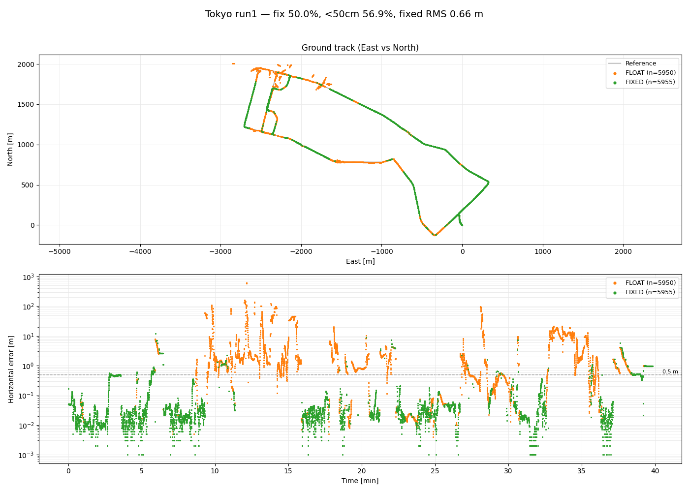
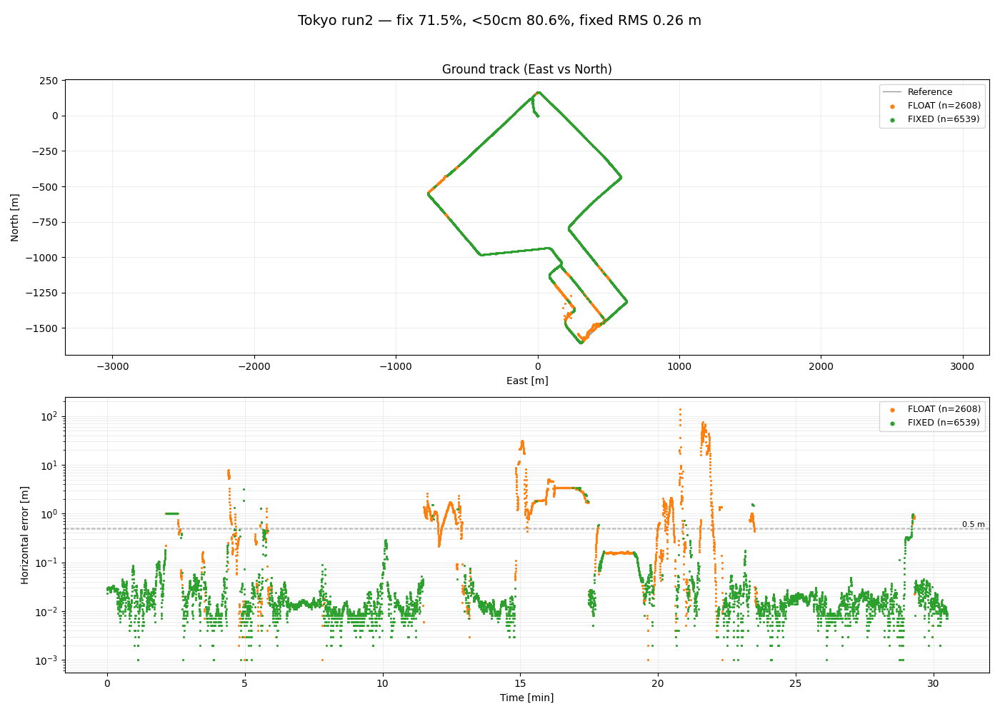
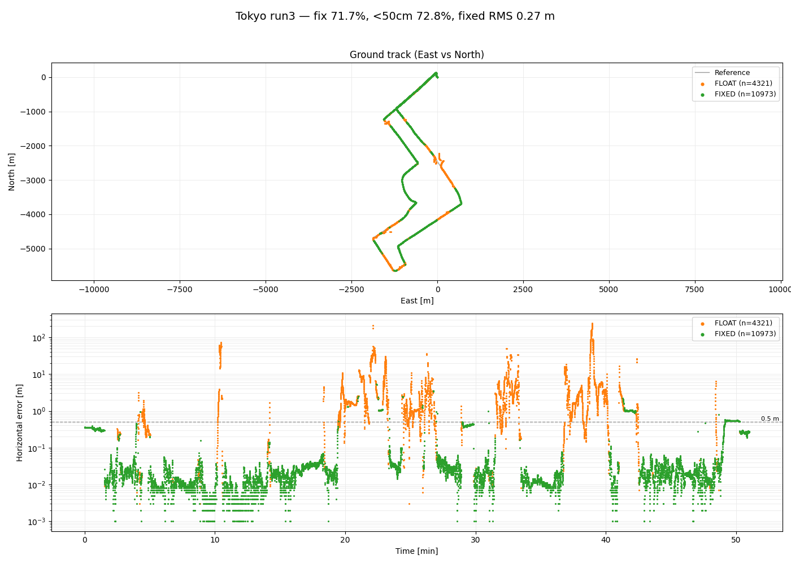

With the geometry-free reset, libgnss++ exceeds the reference on raw FIX rate
(all runs) and on <50 cm / fixed RMS (two of three), and improves the PPC
official score:

| Run | Correct FIX, baseline -> GF reset | Wrong FIX, baseline -> GF reset | Official score, baseline -> GF reset | GF guard demotions |
|---|---:|---:|---:|---:|
| Tokyo run1 | 25.656% -> **33.322%** | 23.765% -> **21.221%** | 30.823% -> **39.375%** | 14 |
| Tokyo run2 | 60.304% -> **74.599%** | 12.573% -> **1.386%** | 65.264% -> **81.615%** | 0 |
| Tokyo run3 | 59.175% -> **65.099%** | 7.918% -> **1.818%** | 64.081% -> **71.207%** | 17 |
| Aggregate | 49.181% -> **57.409%** | 13.741% -> **7.650%** | 54.178% -> **63.692%** | 31 |

Wrong FIX/FIX falls 21.839% -> 11.759%; matched distance is unchanged (99.682%);
fixed-only RMS/P95 and vertical P95 improve on all runs. Wall times were
463.5/584.6/844.9 s.

Every new behavior is opt-in; non-GTSAM builds are unchanged. Reproduce with
`gnss_fgo_parity` (GTSAM build) and this preset:

```
--imu <run>/imu.csv --fixed-lag 5 --multi-freq --partial-ar --hold \
--elev-mask 25 --snr-mask 30 --cmc --cmc-level 0.75 --cp-hold \
--exc-recovery --ddpr-anchor --fde --varerr --fix-demote \
--fix-demote-res 25 --fix-demote-posthold 5 \
--fix-demote-surplus-crosscheck --fix-demote-surplus-anchor-reprieve \
--fix-demote-spp-model-reprieve --surplus-validation \
--surplus-validation-min-n 3 \
--surplus-validation-aperture-lt1 0.15 --surplus-validation-aperture-1to2 0.3 \
--surplus-validation-aperture-gt2 0.45 --anchor-gated-unfix-reset \
--imu-ratio-relaxed 1.5 --gf-slip-reset
```

A default-off Doppler-only DR witness failed the run1 zero-wrong gate (112
correct / 112 wrong), so it stays monitor-only. See the
[external Doppler-DR witness audit](docs/fgo_external_doppler_dr_witness_audit.md).

`--dump-csv` writes the ambiguity-candidate funnel (`amb_*`), the last LAMBDA
candidate (`lambda_candidate_*`), and a satellite trace
(`<path>.ar_candidates.csv`); its `disposition` codes (0-10) label each row's
funnel exit. The same dump adds default-off, monitor-only diagnostics --
receiver-clock-free temporal carrier, causal DD-PR Doppler/IMU and pair-bias,
geometry-free slip (`--gf-slip-reset` restarts both bands and guards
low-redundancy FIX), integer consensus, counterfactual partial-AR
(`--ratio-impact-monitor`), disjoint-partition AR, fresh-SPP (`spp_seed_fresh`),
and FFRT covariance -- each documented under `docs/`.

#### Surplus-satellite rescue integrity

Ratio-rejected candidates can be rescued by an independent surplus-satellite
test (excluded DD carrier rows re-differenced against an alternate reference,
PDOP-scaled nearest-integer aperture, GQEBR->GQ fallback; requires >=10 sats,
DD-code RMS <=5 m, carrier RMS <=0.05 m). The fixed-lag-5 preset replayed over
all three Tokyo runs ("Correct"/"wrong" = FIXED 3D error < / >= 0.5 m):

| Run | Correct FIX | Wrong FIX | Fixed horizontal RMS | All epochs 3D <50 cm |
|---|---:|---:|---:|---:|
| Tokyo run1 | 4759 -> **4955** | 1088 -> **978** | 0.6866 -> **0.6616 m** | 5722 -> **5932** |
| Tokyo run2 | 6336 -> **6339** | **314 -> 314** | 0.21668 -> **0.21663 m** | **7130 -> 7130** |
| Tokyo run3 | 9961 -> **9963** | **1002 -> 1002** | 0.25744 -> **0.25742 m** | **10407 -> 10407** |

Three opt-in, fail-closed guards add only correct fixes:
`--fix-demote-surplus-anchor-reprieve` (surplus + >=12 sats + DD-code anchor
within 8 m), `--anchor-gated-unfix-reset` (reacquisition only after a
current-epoch anchor agrees with the IMU prediction and differs from the
antenna by >=1 m), and `--fix-demote-spp-model-reprieve` (fresh candidate,
<=2 cm IMU separation, <=8 m SPP separation). Full replays added correct fixes
with zero wrong; correct-FIX distance reached ~58.28% (+1.2 pp).
`--surplus-validation-veto` is false-alarm dominated - leave it off;
`--problem-cache` speeds repeated validation. Counterfactual fixed-lag-QR
auditing moved `--fix-demote-res` to 40 (tokyo fix 67.23/77.71/75.14%, fixed
RMS 0.797/0.742/1.054 m).

### Moving CLAS PPP vs MRTKLIB

The current moving-data gate replays all six public PPC Tokyo/Nagoya runs at
5 Hz from QZSS L6 corrections with kinematic dynamics enabled. Scoring matches
solutions to the PPC reference, discards the first 60 matched epochs per run,
and defines TTFF as the first run of at least 30 consecutive FIX epochs.

MRTKLIB columns are the published v0.4.2 results from the
[CLAS benchmark article](https://zenn.dev/hatognss/articles/7a54dd82606faf).
The native results below are the complete-run outputs after the
hold-continuation carve-out landed in #349 and the outage-counter parity
fix landed in #351; each run has 100% interval coverage and at least
99.92% epoch coverage.

| Run | libgnss++ FIX | MRTKLIB FIX | FIX RMS2D* | MRTKLIB RMS2D† | All RMS2D* | FLOAT RMS2D* | SINGLE RMS2D* | max FIX* | >3 m FIX* |
|---|---:|---:|---:|---:|---:|---:|---:|---:|---:|
| Tokyo 1 | **10.704%** | 4.900% | **0.352 m** | 0.747 m | 41.862 m | 16.800 m | 80.343 m | 1.961 m | 0 |
| Tokyo 2 | 21.507% | **21.700%** | **0.322 m** | 0.514 m | 25.882 m | 18.287 m | 45.148 m | 1.013 m | 0 |
| Tokyo 3 | **37.951%** | 7.400% | **0.192 m** | 0.801 m | 35.276 m | 19.531 m | 88.519 m | 2.986 m | 0 |
| Nagoya 1 | **36.737%** | 17.000% | **0.450 m** | 1.105 m | 57.163 m | 7.948 m | 119.111 m | 1.043 m | 0 |
| Nagoya 2 | **23.959%** | 23.400% | **0.625 m** | 1.119 m | 25.829 m | 16.230 m | 40.405 m | 3.200 m | 19 |
| Nagoya 3 | **8.776%** | 6.300% | **0.304 m** | 0.318 m | 13.724 m | 14.360 m | 14.380 m | 0.587 m | 0 |
| **Six-run aggregate** | **24.851%** | — | **0.377 m** | — | **36.523 m** | **16.843 m** | **70.337 m** | **3.200 m** | **19** |

\* libgnss++ precision uses the raw PPC reference point (already
antenna-positioned; no lever-arm transform is applied — an earlier revision
of this table double-applied a vehicle→antenna lever arm on top of an
already-antenna-positioned reference, inflating FIX RMS2D by ~0.3–0.9 m and
incidentally masking the Nagoya 2 tail below the 3 m line). † The published
MRTKLIB precision uses the same raw PPC reference, so the FIX RMS2D and p68
columns are directly comparable, not merely contextual — libgnss++ FIX
RMS2D is now lower than MRTKLIB's on all six runs (bolded above).

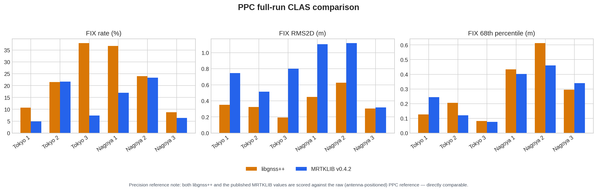

Across 58,259 scored epochs, native CLAS produced 14,478 FIX epochs. A finite
SPP candidate rejected by the chi-square/redundancy validation still remains
excluded from ordinary filter admission, cold starts, and AR. For catastrophic
FLOAT/SPP disagreement above 250 m only, it can continue the counted MRTKLIB
`maxdiffp` recovery path. On Tokyo 2 this moves the bad-seed recovery from TOW
177750.0 to 177747.4 (311.6 m to 5.4 m), 0.8 s before the MRTKLIB recovery at
177748.2. The six-run all-solution RMS2D is 36.523 m; FLOAT and SINGLE RMS2D are
16.843 m and 70.337 m respectively.

Of the 14,478 FIX epochs, 19 (0.03%) exceed 3 m horizontal error; all 19 fall
in a single contiguous 4-second burst on Nagoya 2 (TOW 556406.4–556410.4,
errors 3.17–3.20 m, max 3.200 m), inside the known seed-geometry `maxdiffp`
reset zone. The identical 19 epochs, at matching TOWs and errors, are present
in the pre-#349 baseline run, so this is a pre-existing wrong-fix tail, not a
regression from the hold-continuation carve-out or the #351 outage-counter
parity fix — it was previously invisible because the lever-arm
double-correction happened to shift it under the 3 m line (old Nagoya 2 max
was 2.486 m). The other five runs still have zero FIX epochs above 3 m.

| Complete trajectories | Horizontal error and FIX epochs |
|---|---|
| 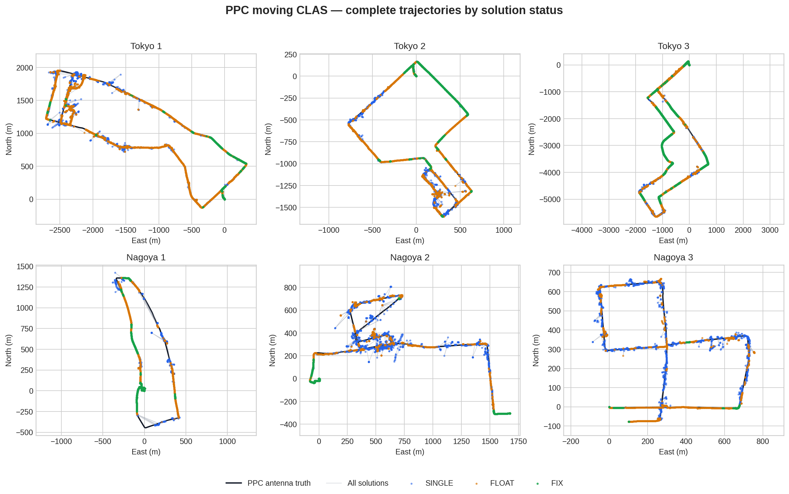 | 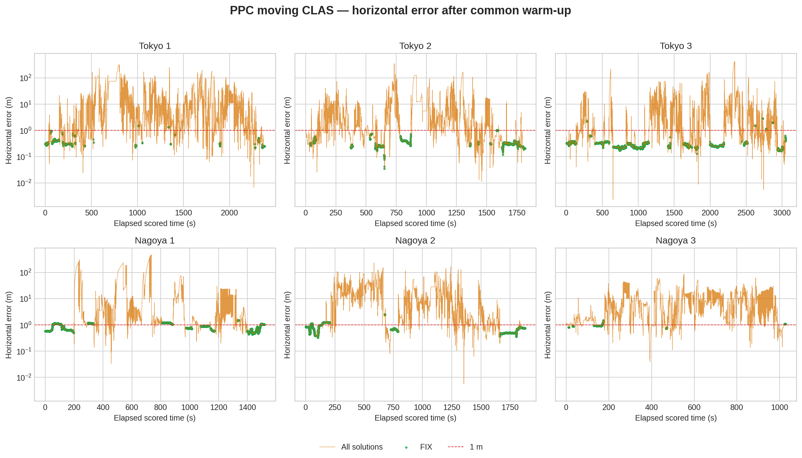 |

See the [complete table](docs/ppc_clas_full_table.md),
[machine-readable metrics](docs/ppc_clas_full_metrics.json), and
[PPC CLAS validation note](docs/ppc_clas_validation.md) for definitions and
reproduction details.

## Quick Start

Choose the entrypoint that matches your job:

- [Robotics quick start](docs/robotics_quickstart.md): RTK replay, local web
  inspection, ROS2 receiver launch, and rosbag capture.
- [Research quick start](docs/research_quickstart.md): repeatable sign-off
  runs, profile comparisons, Python inspection, and artifact layout.
- [Self-contained offline demo](docs/self_contained_demo.md): one tracked
  fixture, one command, and `.pos`/KML/JSON artifacts without a download.
- [Dataset gallery](docs/dataset_gallery.md): current public dataset lanes and
  the adapter contract for adding more.

For repository orientation, see [application structure](apps/README.md),
[script layout](scripts/README.md), and [standalone tools](tools/README.md).

Build:

```bash
cmake -S . -B build -DCMAKE_BUILD_TYPE=Release
cmake --build build -j
python3 apps/gnss.py doctor
python3 apps/gnss.py demo
python3 apps/gnss.py ros2-doctor --device /dev/ttyUSB0
python3 apps/gnss.py ros2-bag-doctor --bag /path/to/rosbag --summary-json output/ros2_bag_doctor_summary.json
python3 apps/gnss.py field-report --out output/field_report.md
python3 apps/gnss.py robotics-smoke --profile realtime
```

`ros2-bag-doctor` reads sqlite ROS2 bags for message-level rates/gaps. For MCAP
bags it uses the optional Python `mcap` package when available, and otherwise
falls back to MCAP `metadata.yaml` for topic presence, counts, and duration.
`gnss web` auto-discovers `output/field_report*.json` and shows the report
links, Markdown preview, setup/ROS2/bag/smoke status, and next debug commands.

Run a solution:

```bash
python3 apps/gnss.py spp \
  --obs data/rover_static.obs \
  --nav data/navigation_static.nav \
  --out output/spp_solution.pos
```

RTK example:

```bash
python3 apps/gnss.py solve \
  --rover data/rover_kinematic.obs \
  --base data/base_kinematic.obs \
  --nav data/navigation_kinematic.nav \
  --mode kinematic \
  --out output/rtk_solution.pos
```

Run the web UI:

```bash
python3 apps/gnss.py web --port 8085
```

Then open `http://127.0.0.1:8085`.

List commands:

```bash
python3 apps/gnss.py commands
python3 apps/gnss.py commands --json
python3 apps/gnss.py commands --query ppp --limit 10
```

## Docker

```bash
docker build -t libgnsspp:latest .
docker run --rm -it -p 8085:8085 -v "$PWD:/workspace" \
  libgnsspp:latest web --host 0.0.0.0 --port 8085 --root /workspace
```

## Benchmarks

- [Benchmarks](docs/benchmarks.md)
- [Validation](docs/validation.md)
- [PPC reproduction commands](docs/ppc_reproduction.md)
- [SPP accuracy notes](docs/references/spp-accuracy-improvement.md)

Phase51 adds the opt-in native Android `ReceivedSvTimeUncertaintyNanos`
measurement-sigma floor (`sigma_m = max(existing_sigma_m, c * ns * 1e-9)`) to
adopted raw FGO pseudorange factors; missing/non-finite/non-positive values
fall back to the existing sigma and the default remains byte-identical.  The
four-route structural matrix completed (12 deterministic solver runs), but its
sealed evaluator stopped after reading each development truth once because it
mistakenly treated the known Phase44 warm-up truth-row exclusion as a coverage
failure.  Accuracy is therefore deliberately unscored; no truth was reread,
no tuning or solver rerun occurred, and the Phase43 champion remains preserved.
See the [Phase51 result record](docs/use_cases/records/smartphone_r5_phase51_android_sv_time_uncertainty_sigma_floor_result_v1.json)
and [evaluator manifest v2](docs/use_cases/records/smartphone_r5_phase51_android_sv_time_uncertainty_sigma_floor_evaluator_manifest_v2.json).

Phase52 performs the sealed integrity recovery using only the immutable Phase51
candidate/control run1 outputs; it fixes the warm-up accounting by requiring
full prediction-domain coverage while keeping truth-row coverage informational.
Each of the four Phase44 development truths was read once in one scorer process,
with no solver rerun or tuning.  The candidate scores are 1.590625 m (MTV-a),
2.518514 m (MTV-h), 4.320207 m (LAX-t), and 3.945431 m (MTV-u), for a
3.093694 m macro score versus the 3.536447 m control (0.442752 m improvement).
The result is no-go: LAX exceeds the 3 m route gate, MTV-u regresses by
0.038273 m, and the candidate macro/route absolute gates fail.  Phase43 remains
the champion and the Phase51 option remains experimental; fresh validation and
the 0.782 target were not pursued.  See the [Phase52 result record](docs/use_cases/records/smartphone_r5_phase52_android_sv_time_uncertainty_integrity_recovery_result_v1.json),
[freeze](docs/use_cases/records/smartphone_r5_phase52_android_sv_time_uncertainty_integrity_recovery_freeze_v1.json),
and [evaluator manifest v2](docs/use_cases/records/smartphone_r5_phase52_android_sv_time_uncertainty_integrity_recovery_evaluator_manifest_v2.json).

Phase53 audited the one raw factor selected by Phase52: Android per-satellite
carrier-phase ADR carrier-frequency/antenna phase-bias residual.  The same
four frozen Pixel5 raw files were each read once in one process; truth, prior
metric payloads, navigation, solver/trajectory, coordinates, validation,
holdout, archive, MAT, WLS, and correction paths remained sealed.  The fixed
Android ADR sign and frequency-aware relation were tested against a
constant-frequency ADR/rate control.  Ordinary pairs were **7,508 / 8,763 /
4,176 / 3,728**, with **6–11** satellites, but every route had only one
`GALILEO:GAL_E1:1575420000Hz` group, no finite antenna phase-center/bias
field, and zero direct phase pairs.  Frequency leakage p95 was only
**5.54e-12–1.07e-11 m**, frequency-vs-control p95 excess was approximately
**-6.54e-13–1.04e-12 m**, and routewise Spearman was **0.0**.  The audit is
therefore **no-go-carrier-frequency-antenna-phase-bias-not-identifiable**;
no native correction was implemented or authorized and `0.782` was not
evaluated without truth.  The result also preserves a transparent secondary
raw-integrity failure: unsupported signal rows were **266 / 435 / 247 / 137**
and the evaluator's AND gate explicitly includes zero unsupported rows, while
hash, finite-core, duplicate-epoch, and monotonicity checks passed.  The next
single raw factor is `AccumulatedDeltaRangeUncertaintyMeters`.  See the
[Phase53 contract](docs/use_cases/smartphone_native_fgo_phase53_pixel5_carrier_frequency_antenna_phase_bias.md),
[freeze](docs/use_cases/records/smartphone_r5_phase53_pixel5_carrier_frequency_antenna_phase_bias_freeze_v1.json),
[evaluator manifest](docs/use_cases/records/smartphone_r5_phase53_pixel5_carrier_frequency_antenna_phase_bias_evaluator_manifest_v1.json),
and [result](docs/use_cases/records/smartphone_r5_phase53_pixel5_carrier_frequency_antenna_phase_bias_result_v1.json).

Phase54 is a scorer-only integrity recovery for Phase53.  It read only the
sealed Phase53 output manifest, result, routes, and empty event table once
each; Phase53 raw files, truth, navigation, solver, coordinates, and prior
metric payloads were not reopened.  The Phase53 `raw_input_integrity` gate
had incorrectly included `unsupported_signal_rows == 0`, although the frozen
contract made those rows informational/excluded.  Phase54 corrected only that
presentation mismatch: exact SHA/bytes, finite core fields, duplicate epochs,
nonmonotonic epochs, all group sums, route medians, aggregate, LOO, event,
header, and artifact-map checks all pass.  The physical no-go remains
immutable: no Android antenna phase-center/bias field, one GAL E1 group per
route, approximately `1e-11 m` frequency leakage, and zero routewise
frequency/residual Spearman.  No correction or accuracy scoring was performed;
Phase43 remains champion, Phase51 remains experimental, and the next factor
remains `AccumulatedDeltaRangeUncertaintyMeters`.  See the [Phase54 contract](docs/use_cases/smartphone_native_fgo_phase54_phase53_integrity_recovery.md),
[freeze](docs/use_cases/records/smartphone_r5_phase54_phase53_integrity_recovery_freeze_v1.json),
[evaluator manifest](docs/use_cases/records/smartphone_r5_phase54_phase53_integrity_recovery_manifest_v1.json),
and [result](docs/use_cases/records/smartphone_r5_phase54_phase53_integrity_recovery_result_v1.json).

Phase55 audited the next raw-only factor, Android per-satellite
`AccumulatedDeltaRangeUncertaintyMeters`, against the existing TDCP closure
residual.  The field was present and finite on all four frozen Pixel5 routes,
with ordinary/uncertainty pair counts **7,508 / 7,508**, **8,763 / 8,763**,
**4,176 / 4,176**, and **3,728 / 3,728**.  However, every route populated
only two of the four predeclared uncertainty bins, and routewise Spearman was
only **0.06425 / 0.11604 / 0.05734 / 0.15949**; LAX-t also failed bin-median
monotonicity.  The frozen identifiability gates therefore produce
**no-go-adr-uncertainty-not-identifiable**.  No native TDCP sigma floor,
solver, truth read, or accuracy claim was made; Phase43 remains champion and
Phase51 remains experimental.  The `0.782` target was not evaluated.  The
next single raw factor is `BiasUncertaintyNanos` / receiver-clock uncertainty
relationship.  See the [Phase55 contract](docs/use_cases/smartphone_native_fgo_phase55_pixel5_adr_uncertainty.md),
[freeze](docs/use_cases/records/smartphone_r5_phase55_pixel5_adr_uncertainty_freeze_v1.json),
[evaluator manifest](docs/use_cases/records/smartphone_r5_phase55_pixel5_adr_uncertainty_evaluator_manifest_v1.json),
and [result](docs/use_cases/records/smartphone_r5_phase55_pixel5_adr_uncertainty_result_v1.json).

Phase56 deduplicated the Phase55 `BiasUncertaintyNanos` proposal using only
the sealed Phase46 receiver-clock evidence and current source contracts.  The
field is an Android `GnssClock` receiver-clock bias uncertainty, not a
per-satellite observable.  Phase46 already showed zero same-epoch receiver
clock/signal spread and zero geometry-changing non-common TOW effect on all
four routes; its output does not separately serialize BiasUncertainty
same-epoch dispersion, so the dedup is explicitly source-semantic plus that
sealed clock evidence.  Phase56 therefore records
**phase56-no-go-bias-uncertainty-duplicate-common-mode** without a new raw read
or correction.  The loader parses `BiasUncertaintyNanos` and ordinary
`PseudorangeRateMetersPerSecond`, but does not parse or retain
`PseudorangeRateUncertaintyMetersPerSecond`; FGO does not consume raw rate
uncertainty and uses fixed/configured Doppler sigma paths.  The exactly one
next source-supported factor is `PseudorangeRateUncertaintyMetersPerSecond`
as a future opt-in Doppler sigma-floor candidate; no Phase56 implementation or
truth/accuracy score was made.  Phase43 remains champion and Phase51 remains
experimental.  See the [Phase56 contract](docs/use_cases/smartphone_native_fgo_phase56_bias_uncertainty_dedup.md),
[freeze](docs/use_cases/records/smartphone_r5_phase56_pixel5_bias_uncertainty_dedup_freeze_v1.json),
[evaluator manifest](docs/use_cases/records/smartphone_r5_phase56_bias_uncertainty_dedup_manifest_v1.json),
and [result](docs/use_cases/records/smartphone_r5_phase56_bias_uncertainty_dedup_result_v1.json).

Phase57 audited the sole Phase56 next factor,
`PseudorangeRateUncertaintyMetersPerSecond`, using Phase25 raw P and the
Phase41 Android rate sign, with same-epoch/HCDC receiver common-mode centering.
All four Pixel5 routes had 100% finite positive uncertainty among 9,612–15,630
eligible transitions, four fixed bins, routewise Spearman
**0.412972 / 0.437863 / 0.465283 / 0.496254**, and fixed-sigma affected-factor
fractions **0.225151 / 0.245617 / 0.349472 / 0.312526**.  However, normalized
residual medians were **19.7973 / 15.4834 / 16.0525 / 15.5422**, outside the
frozen calibration range, and every route contained only one supported signal
family (`GALILEO:GAL_E1`), failing composition independence.  The result is
**no-go-rate-uncertainty-not-stable-or-material**: no C++ change, native sigma
floor, truth read, or `0.782` claim.  Phase43 remains champion and Phase51
remains experimental.  The exactly one next source-supported raw factor is
`Cn0DbHz`/Doppler residual calibration; no C/N0 rule is implemented here.  See
the [Phase57 contract](docs/use_cases/smartphone_native_fgo_phase57_pixel5_rate_uncertainty.md),
[freeze](docs/use_cases/records/smartphone_r5_phase57_pixel5_rate_uncertainty_freeze_v1.json),
[evaluator manifest](docs/use_cases/records/smartphone_r5_phase57_pixel5_rate_uncertainty_evaluator_manifest_v1.json),
and [result](docs/use_cases/records/smartphone_r5_phase57_pixel5_rate_uncertainty_result_v1.json).

Phase58 audited the next raw factor, Android per-satellite `Cn0DbHz`/Doppler
residual calibration, across the same four route-disjoint Pixel5 recordings.
All frozen truth-free identifiability gates passed: 9,612--15,630 transitions
per route, 7--11 satellites, five populated C/N0 bins, routewise Spearman
**-0.453578 / -0.473135 / -0.494119 / -0.512975**, and stable LOO scales.  The
exact pooled scale is **alpha = 0.7586783350728457 m/s at 40 dB-Hz**, the median
of the four sealed LOO fits.  The audit made no native change and read no truth;
the `0.782` target remains unevaluated.  A separately frozen implementation
stage is authorized for an explicit opt-in FGO-Doppler-only floor
`max(existing_sigma, alpha*10^(-(Cn0-40)/20))`, with coefficient one, no cap,
and no SPP application; the existing p85/12 path is not changed.  Phase43
remains champion and Phase51 remains experimental.  See the [Phase58 contract](docs/use_cases/smartphone_native_fgo_phase58_pixel5_cn0_doppler_calibration.md),
[freeze](docs/use_cases/records/smartphone_r5_phase58_pixel5_cn0_doppler_calibration_freeze_v1.json),
[evaluator manifest](docs/use_cases/records/smartphone_r5_phase58_pixel5_cn0_doppler_calibration_evaluator_manifest_v1.json),
and [result](docs/use_cases/records/smartphone_r5_phase58_pixel5_cn0_doppler_calibration_result_v1.json).

The Phase58 native opt-in structural matrix then ran the fixed
`--native-cn0-doppler-calibration` floor across the same four Pixel5 routes.
Control ran once and candidate twice per route; all structural gates passed,
candidate repeats were byte-identical, and every control summary/submission
matched the Phase43 flag-off artifact.  Candidate adopted-factor counts were
**61,726 / 73,264 / 34,293 / 24,373** (MTV-a / MTV-h / LAX-t / MTV-u), with
**61,722 / 73,264 / 34,293 / 24,372** factors affected.  The matrix used 12
native solver invocations and 12 one-process reads per pinned GNSS, IMU, and
navigation input; truth, validation/holdout, MAT, WLS, precomputed
coordinates, and Kaggle/token access remained zero.  This is structural only:
no accuracy truth or `0.782` evaluation was made.  Phase43 remains champion and
Phase51 remains experimental.  See the [native structural result](docs/use_cases/records/smartphone_r5_phase58_native_cn0_doppler_calibration_structural_result_v1.json),
[native freeze](docs/use_cases/records/smartphone_r5_phase58_native_cn0_doppler_calibration_freeze_v1.json),
and [native evaluator manifest](docs/use_cases/records/smartphone_r5_phase58_native_cn0_doppler_calibration_evaluator_manifest_v1.json).

Phase59 then performed the separately frozen development accuracy score using
only the immutable Phase58 candidate/control run1 artifacts and the four
Phase44 truths (one truth read per route, one scorer process, no solver/native
rerun).  Prediction-domain coverage was **1.0** on all routes; the known
leading warm-up truth rows on MTV-a and MTV-u were reported separately.  The
candidate route scores were **2.1200092363 / 3.6069568184 / 4.5116227356 /
3.9071640241 m** versus exact Phase43-control scores **2.1200062765 /
3.6069657083 / 4.5116562020 / 3.9071587965 m** (MTV-a / MTV-h / LAX-t /
MTV-u).  Macro was **3.5364382036 m** versus **3.5364467458 m**, an improvement
of only **0.0000085422 m**.  Route, MTV-h, macro-improvement, macro-absolute,
and route-absolute gates therefore fail: **no-go**, no validation/Kaggle, and
no `0.782` claim.  Phase43 remains champion and Phase58 C/N0 remains
experimental; Phase51 metrics are pinned as historical reference only, never
scoring input.  The next single factor is the raw Android
`FullInterSignalBiasNanos` + `SatelliteInterSignalBiasNanos` current
consumption/sign audit.  See the [Phase59 accuracy result](docs/use_cases/records/smartphone_r5_phase59_native_cn0_doppler_calibration_accuracy_result_v1.json),
[freeze](docs/use_cases/records/smartphone_r5_phase59_native_cn0_doppler_calibration_accuracy_freeze_v1.json),
and [evaluator manifest](docs/use_cases/records/smartphone_r5_phase59_native_cn0_doppler_calibration_accuracy_evaluator_manifest_v1.json).

Phase60 audited Android `FullInterSignalBiasNanos` and
`SatelliteInterSignalBiasNanos` consumption/sign using raw-only, same-epoch
same-satellite multi-signal observables on the four route-disjoint Pixel5
recordings.  All four CSV headers were present, but finite Full and Satellite
values were **0** in every adopted proxy row and every paired row (adopted
rows **83,612 / 108,722 / 50,706 / 35,391**; same-epoch/SVID pairs
**20,864 / 34,383 / 15,602 / 10,783** for MTV-a / MTV-h / LAX-t / MTV-u).
Finite coverage, signed materiality, and temporal-stability gates therefore
failed: **no-go**, no native correction, no solver/truth/accuracy read, and no
`0.782` claim.  Headers, raw input integrity, pair coverage, signal
composition, source-sign/decomposition, and presentation gates passed;
unsupported signal rows were informational only and no ISB values were
imputed.  The current adapter/Observation/FGO path does not parse, retain, or
consume either raw Android field; `Full - Satellite` remains the documented
receiver-side decomposition and `Full + Satellite` was prohibited.  Phase43
remains champion and Phase51 remains experimental.  The exactly one next
factor is raw Android pseudorange code-tracking/multipath residual calibration
not already masked by the current adapter.  See the [Phase60 contract](docs/use_cases/smartphone_native_fgo_phase60_pixel5_intersignal_bias.md),
[freeze](docs/use_cases/records/smartphone_r5_phase60_pixel5_intersignal_bias_freeze_v1.json),
[evaluator manifest](docs/use_cases/records/smartphone_r5_phase60_pixel5_intersignal_bias_evaluator_manifest_v1.json),
and [result](docs/use_cases/records/smartphone_r5_phase60_pixel5_intersignal_bias_result_v1.json).

Phase61 audited the sole frozen C/N0 pseudorange factor: raw Android
`Cn0DbHz` code-tracking/multipath residual calibration.  The audit used the
Phase25 Android-clock pseudorange and signed ADR CMC (`P-ADR`) on continuous
arcs of at least two rows, retaining the current code/C/N0/multipath/state
masks and excluding singleton arcs without imputation.  It read each of the
four route-disjoint Pixel5 raw GNSS files exactly once in one process, with no
truth, navigation, solver, trajectory, IMU, coordinate/WLS, enriched
pseudorange, MAT, validation/holdout, archive, Kaggle/token, or prior metric
payload access.  Phase43's configured pseudorange sigma is 3.0 m with the
elevation power path; its optional p85 SNR path is disabled and was not
reimplemented.

The frozen result is **no-go**
(`no-go-cn0-pseudorange-calibration-not-identifiable`).  Eligible CMC rows
were **8,111 / 9,337 / 4,695 / 4,169** and route medians of absolute centered
CMC were **0.886164 / 0.967753 / 0.752618 / 0.752588 m** (MTV-a / MTV-h /
LAX-t / MTV-u).  All rows had finite C/N0, but LAX-t and MTV-u missed the
5,000-row gate, every route had only one supported signal family
(`GALILEO:GAL_E1`) versus the required two, and C/N0 Spearman values were
**-0.223342 / -0.203747 / -0.256808 / -0.168379**, failing route stability in
three routes.  Fixed-bin monotonicity and LOO direction also failed.  The
fitted model stayed below the configured 3.0 m base sigma in every route, so
the conservative raw-only impact proxy was 0% throughout.  No native C++
correction or implementation stage is authorized; Phase43 remains champion
and Phase51 remains experimental.  Phase61 selects no second factor; a future
factor requires a separately frozen source audit.  The `0.782` target was not
evaluated without truth.  See the [Phase61 contract](docs/use_cases/smartphone_native_fgo_phase61_pixel5_cn0_pseudorange_calibration.md),
[freeze](docs/use_cases/records/smartphone_r5_phase61_pixel5_cn0_pseudorange_calibration_freeze_v1.json),
[evaluator manifest](docs/use_cases/records/smartphone_r5_phase61_pixel5_cn0_pseudorange_calibration_evaluator_manifest_v1.json),
and [result](docs/use_cases/records/smartphone_r5_phase61_pixel5_cn0_pseudorange_calibration_result_v1.json).

Phase64 recovered the base-RINEX preflight policy from the sealed Phase63
record without reopening the archive or any base file.  Under the official
`taroz/gsdc2023` source contract, `settings_train.csv` `Base1` selects the
declared `*_rnx2.obs` member and `correct_pseudorange.m` uses observed
`obsb.dt` (151 samples at 1 Hz, 11 at 15 s), not header `INTERVAL`;
`MARKER NAME` is informational.  The v4 scorer adapted the sealed record's
top-level `routes[route]` schema and passed all four route gates: fixed
settings/archive/materialized hashes, finite station `APPROX POSITION XYZ`,
and observed intervals **1 / 1 / 15 / 1 s** (MTV-a / MTV-h / LAX-t / MTV-u).
The blank station IDs, missing header intervals, and `3.03` payload version
versus legacy `V2` remain informational and were not used to infer identity or
timing.  Phase64 read the sealed Phase63 result once in v4 (cumulative result
JSON reads including disclosed v1/v2/v3 failed attempts: **4**); archive,
base reread, raw handset, truth, MAT, navigation, solver, and accuracy reads
were **0**.  This authorizes only a separately frozen native implementation
stage; no correction, accuracy, validation, Kaggle, or `0.782` claim was made.
See the [Phase64 policy recovery](docs/use_cases/smartphone_native_fgo_phase64_base_preflight_policy_recovery.md),
[freeze](docs/use_cases/records/smartphone_r5_phase64_base_preflight_policy_recovery_freeze_v1.json),
[v4 manifest](docs/use_cases/records/smartphone_r5_phase64_base_preflight_policy_recovery_manifest_v4.json),
and [sealed result](docs/use_cases/records/smartphone_r5_phase64_base_preflight_policy_recovery_result_v4.json).

Phase65 added the source-supported base-RINEX pseudorange compensation as an
opt-in native implementation.  It applies only to adopted undifferenced FGO
pseudorange factors, with same-satellite/same-signal matching, native
clock/atmosphere/group-delay modeling, observed-interval moving means (151 at
1 Hz and 11 at 15 s), in-domain linear interpolation, and the frozen
`P_rover_corrected=P_rover-pc` sign.  The source/tests and structural manifest
were sealed at `f8cdf3b`/`b3a02ef`, but the one-shot structural runner stopped
after the first MTV-a control invocation on a nested-hash presentation bug.
That control submission and summary were byte-identical to Phase43; no
candidate run or accuracy truth was read.  Phase65 is therefore fail-closed,
with Phase43 preserved as champion and no `0.782` claim.  See the
[Phase65 contract](docs/use_cases/smartphone_native_fgo_phase65_base_pseudorange_compensation.md),
[freeze](docs/use_cases/records/smartphone_r5_phase65_native_base_pseudorange_compensation_freeze_v1.json),
[manifest](docs/use_cases/records/smartphone_r5_phase65_native_base_pseudorange_compensation_manifest_v1.json),
and [integrity result](docs/use_cases/records/smartphone_r5_phase65_native_base_pseudorange_compensation_structural_failure_v1.json).

Phase66 started a fresh integrity recovery with the corrected nested
`phase43_control()` fixture, but stopped after one MTV-a control invocation.
The newly generated control files are byte-identical to Phase43; the remaining
failure is a report-schema collision in `P65.artifact_report()`, where parsed
summary diagnostics overwrite the summary hash metadata expected by the
recovery comparison. No candidate, accuracy truth, MAT, validation, or Kaggle
read occurred. This is sealed fail-closed and requires a new Phase67 freeze;
Phase43 remains champion and no `0.782` claim is made. See the
[Phase66 recovery record](docs/use_cases/records/smartphone_r5_phase66_phase65_structural_integrity_recovery_failure_v1.json),
[contract](docs/use_cases/smartphone_native_fgo_phase66_phase65_structural_integrity_recovery.md),
[freeze](docs/use_cases/records/smartphone_r5_phase66_phase65_structural_integrity_recovery_freeze_v1.json),
and [manifest](docs/use_cases/records/smartphone_r5_phase66_phase65_structural_integrity_recovery_manifest_v1.json).

Phase67 recovered the Phase66 report-schema check by hashing newly emitted
artifacts directly, and the MTV-a control matched Phase43 exactly. The first
base-compensation candidate then failed the frozen coverage gate: 46,556 of
61,754 adopted pseudorange rows were corrected (`0.7538944845678013`, required
at least `0.99`), with 15,198 interpolation misses. No candidate repeat or
other route ran, and no truth/MAT/validation/Kaggle read occurred. This is
sealed fail-closed; Phase43 remains champion, no accuracy or `0.782` claim was
made, and a new evidence-only freeze would be required before investigating
the matching misses. See the
[Phase67 recovery record](docs/use_cases/records/smartphone_r5_phase67_phase66_structural_integrity_recovery_failure_v1.json),
[contract](docs/use_cases/smartphone_native_fgo_phase67_phase66_structural_integrity_recovery.md),
[freeze](docs/use_cases/records/smartphone_r5_phase67_phase66_structural_integrity_recovery_freeze_v1.json),
and [manifest](docs/use_cases/records/smartphone_r5_phase67_phase66_structural_integrity_recovery_manifest_v1.json).

Phase68's first one-shot matching taxonomy failed closed on an RINEX3 physical
record-boundary bug; that failure and its one raw/base read are preserved. A
separately frozen Phase69 recovery then exposed a missing native `S` (SBAS)
system mapping and also failed closed after three routes. Phase70 recovered
both contracts with source-faithful long-line/continuation framing and native
`G/R/E/C/J/S/I` recognition. Its truth-free audit read each pinned raw GNSS
and base RINEX exactly once (4/4), with truth/MAT/nav/IMU/solver/archive reads
zero. Among 278,431 diagnostic raw adopted proxy rows, exact in-domain
matching was 201,660 (72.4273%), same-frequency variants were 0, out-of-domain
was 7,896, missing-frequency was 34,592, and missing-satellite was 34,283;
50,417 duplicate canonical-frequency events were report-only. Raw/base proxy
populations are explicitly not claimed equal to native adopted FGO factors,
the Phase67 coverage gate was not relaxed, no native correction or accuracy
truth was authorized, and `0.782` was not evaluated. The next source-supported
candidate is a separately frozen audit of enabling
`preserve_additional_frequency_bands=true` only in the base compensation
reader, preserving exact keys. See the [Phase68 failure record](docs/use_cases/records/smartphone_r5_phase68_base_matching_taxonomy_failure_v1.json),
[Phase69 recovery record](docs/use_cases/records/smartphone_r5_phase69_base_matching_taxonomy_recovery_failure_v1.json),
[Phase70 contract](docs/use_cases/smartphone_native_fgo_phase70_base_matching_taxonomy_sbas_recovery.md),
[Phase70 freeze](docs/use_cases/records/smartphone_r5_phase70_base_matching_taxonomy_sbas_recovery_freeze_v1.json),
[Phase70 manifest](docs/use_cases/records/smartphone_r5_phase70_base_matching_taxonomy_sbas_recovery_manifest_v1.json),
and [sealed result](docs/use_cases/records/smartphone_r5_phase70_base_matching_taxonomy_sbas_recovery_result_v1.json).

Phase71 froze an opt-in `RINEXReader::setPreserveAdditionalFrequencyBands(true)`
for the base pseudorange compensation reader only, with exact prediction-domain
coverage 1.0 and separate matched/all (minimum 0.80) and finite/matched
(minimum 0.99) gates. Its one-shot runner stopped after the MTV-a flag-off
control because a known summary artifact/payload key collision raised
`KeyError: sha256`; that control's submission and summary exactly matched
Phase43, candidate runs were 0, and no accuracy truth was read. The failure is
sealed as evaluator-integrity only; no Phase71 coverage or accuracy conclusion
is drawn, and a new Phase72 freeze/output root is required. See the
[Phase71 contract](docs/use_cases/smartphone_native_fgo_phase71_base_additional_frequency_bands.md),
[freeze](docs/use_cases/records/smartphone_r5_phase71_base_additional_frequency_bands_freeze_v1.json),
[manifest](docs/use_cases/records/smartphone_r5_phase71_base_additional_frequency_bands_manifest_v1.json),
and [integrity failure record](docs/use_cases/records/smartphone_r5_phase71_base_additional_frequency_bands_structural_failure_v1.json).

Phase72 separately recovered the Phase71 evaluator shape with a new output
root and fresh reads. It preserved the exact global-domain=1.0, matched/all
>=0.80, and finite/matched>=0.99 gates. The first MTV-a candidate reached
48,195/61,754 exact-stream matched adopted factors (`0.7804352754477443`) and
46,556/48,195 finite in-domain corrections (`0.965992322855068`), so the
structural coverage gate failed closed; all-band selected 69 streams including
five GPS_L5 streams. Control identity remained exact, candidate repeat and
the other routes were not run, and native reads were raw/IMU/nav 2 each,
base 1, truth/MAT/validation/archive 0. No accuracy or `0.782` conclusion is
made; Phase43 remains champion and the option remains experimental. See the
[Phase72 recovery contract](docs/use_cases/smartphone_native_fgo_phase72_base_additional_frequency_bands_recovery.md),
[freeze](docs/use_cases/records/smartphone_r5_phase72_base_additional_frequency_bands_recovery_freeze_v1.json),
[manifest](docs/use_cases/records/smartphone_r5_phase72_base_additional_frequency_bands_recovery_manifest_v1.json),
and [sealed result](docs/use_cases/records/smartphone_r5_phase72_base_additional_frequency_bands_recovery_structural_failure_v1.json).

Phase73 freezes the official source-exact pseudorange miss mask as a separate
candidate.  In `correct_pseudorange.m`, linear interpolation returns NaN
outside the base stream domain; `fgo_gnss_imu.m` inserts a pseudorange factor
only when the corrected `resPc` is finite.  The new opt-in will therefore keep
and subtract only finite in-domain base corrections, dropping missing-stream,
out-of-domain, or nonfinite pseudorange factors while leaving TDCP, Doppler,
IMU, SPP, and the Phase43 flag-off path unchanged.  The retained/original
fraction is reported separately from prediction-domain coverage and does not
relax any prior gate.  No raw/truth/accuracy read has occurred and no `0.782`
claim is made.  See the [Phase73 contract](docs/use_cases/smartphone_native_fgo_phase73_source_exact_pseudorange_miss_mask.md)
and [freeze](docs/use_cases/records/smartphone_r5_phase73_source_exact_pseudorange_miss_mask_freeze_v1.json).

Phase73's source-exact candidate then passed a separate truth-free structural
matrix: one flag-off Phase43 control and two candidate repetitions on each of
four Pixel5 routes, with 12 native invocations and zero truth/MAT/validation/
holdout/Kaggle/archive reads.  Exact prediction-domain keys, raw/base hashes,
finite retained corrections, factor accounting, candidate repeat identity,
Phase43 control identity, TDCP/Doppler/IMU/SPP invariants, and speed gates all
passed.  Retained finite-`pc` fractions were 0.7538944845678013 (MTV-a),
0.7080479218404606 (MTV-h), 0.9776508639529123 (LAX-t), and
0.9169501947120312 (MTV-u); these are miss-mask retention diagnostics, not
prediction or truth-row coverage, and do not relax prior coverage gates.  No
accuracy or `0.782` claim is made; a separate accuracy freeze is required.
See the [Phase73 structural result](docs/use_cases/smartphone_native_fgo_phase73_source_exact_pseudorange_miss_mask_structural.md),
[structural freeze](docs/use_cases/records/smartphone_r5_phase73_source_exact_pseudorange_miss_mask_structural_freeze_v1.json),
[manifest](docs/use_cases/records/smartphone_r5_phase73_source_exact_pseudorange_miss_mask_structural_manifest_v1.json),
and [sealed result record](docs/use_cases/records/smartphone_r5_phase73_source_exact_pseudorange_miss_mask_structural_result_v1.json).

The separately frozen Phase74 accuracy scorer then failed closed on its first
truth read because it required an exact three-column truth header, whereas the
sealed Phase44/59 DictReader contract allows the required coordinate fields
with optional `phone`/additional columns.  This is evaluator-integrity only:
no accuracy score was observed, no native process ran, and no validation or
Kaggle action is authorized.  The Phase74 freeze/evaluator remain immutable;
any recovery requires a new freeze/output root and one disclosed truth read per
route.  See the [Phase74 failure record](docs/use_cases/records/smartphone_r5_phase74_phase73_miss_mask_accuracy_failure_v1.json),
[failure documentation](docs/use_cases/smartphone_native_fgo_phase74_phase73_miss_mask_accuracy_failure.md),
[accuracy freeze](docs/use_cases/records/smartphone_r5_phase74_phase73_miss_mask_accuracy_freeze_v1.json),
and [manifest](docs/use_cases/records/smartphone_r5_phase74_phase73_miss_mask_accuracy_manifest_v1.json).

Phase75's scorer-only recovery then failed closed after one MTV-a truth read
because it referenced a nonexistent Phase74 helper control constant.  No
accuracy score or native process was produced; the initial evaluator/manifest
hashes and truth/artifact read accounting are preserved in the [Phase75 failure
record](docs/use_cases/records/smartphone_r5_phase75_phase74_accuracy_integrity_recovery_failure_v1.json).
Phase76 used a new freeze/output root and direct control pins from the sealed
Phase74 freeze.  The scorer accepted the required truth fields by name and
completed one truth read per route, with eight candidate and eight control
artifact reads and zero native/raw/nav/validation/MAT/Kaggle reads.  Control
identity passed for all routes and prediction-domain coverage was exactly 1.0.
The candidate macro was `3.392183792762136` versus the exact Phase43 control
`3.536446745838451` (improvement `0.1442629530763151`), but MTV-a, MTV-h, and
MTV-u regressed; the macro `<=2 m`, route `<=3 m`, and MTV-h P95 `<=5 m` gates
also failed.  The unchanged policy therefore preserves Phase43 as champion,
keeps Phase73 experimental, and authorizes no validation/Kaggle action.  The
`0.782` target was not met and remains report-only.  See the [Phase76 result
record](docs/use_cases/records/smartphone_r5_phase76_phase75_accuracy_integrity_recovery_result_v1.json),
[result documentation](docs/use_cases/smartphone_native_fgo_phase76_phase75_accuracy_integrity_recovery_result.md),
[freeze](docs/use_cases/records/smartphone_r5_phase76_phase75_accuracy_integrity_recovery_freeze_v1.json),
and [manifest](docs/use_cases/records/smartphone_r5_phase76_phase75_accuracy_integrity_recovery_manifest_v1.json).

Phase77 then evaluated the official signal-bias composition as a separate
truth-free structural candidate: the sealed Phase73 finite-base-pc miss mask
plus the existing `--native-signal-bias-states` option.  The four Pixel5 routes
ran one fresh Phase73 control and two candidate repetitions each (12 native
invocations, truth/MAT/validation/holdout/Kaggle/archive reads zero).  All
candidate repeats converged, were byte-identical, retained exact prediction
keys, exposed finite signal-bias states/factors, and passed finite/TDCP/IMU/
speed checks.  The candidate nevertheless failed the frozen Phase73 miss-mask
telemetry identity on every route because enabling the existing signal-bias
path also enables multi-frequency signal eligibility: adopted pseudorange
populations changed from 61,754/46,556 to 83,612/59,915 (MTV-a),
73,286/51,890 to 108,722/66,769 (MTV-h), 34,319/33,552 to 50,706/45,095
(LAX-t), and 24,395/22,369 to 35,391/29,881 (MTV-u).  This is a structural
composition no-go, not a coverage-threshold relaxation.  No C++ source or
accuracy truth was used; Phase43 remains champion and no validation/Kaggle
action is authorized.  The next separately frozen official factor is raw-IMU
stop velocity/pose constraints.  See the [Phase77 structural result](docs/use_cases/smartphone_native_fgo_phase77_phase73_signal_bias_composition_structural_result.md),
[result record](docs/use_cases/records/smartphone_r5_phase77_phase73_signal_bias_composition_structural_result_v1.json),
[freeze](docs/use_cases/records/smartphone_r5_phase77_phase73_signal_bias_composition_structural_freeze_v1.json),
and [manifest](docs/use_cases/records/smartphone_r5_phase77_phase73_signal_bias_composition_structural_manifest_v1.json).

Phase78 performed a sealed-artifact-only reclassification of the Phase77
signal-bias/base-pc composition.  It verified all four immutable Pixel5
candidate run-1/run-2 artifacts without native rerun or raw/truth reads:
hashes/repeats, exact prediction keys, finite-`pc` factor accounting, TDCP
built=inserted, finite material signal-bias states/factors, valid coordinates,
zero over-70-m/s rows, and epoch/IMU repeat invariants all passed.  No
route-specific selection was used.  This authorizes only a separately frozen
development-accuracy score; it is not an accuracy result or a `0.782` claim.
Phase43 remains champion and Phase77 remains experimental.  See the [Phase78
result](docs/use_cases/smartphone_native_fgo_phase78_phase77_structural_reclassification_result.md),
[result record](docs/use_cases/records/smartphone_r5_phase78_phase77_structural_reclassification_result_v1.json),
[freeze](docs/use_cases/records/smartphone_r5_phase78_phase77_structural_reclassification_freeze_v1.json),
and [manifest](docs/use_cases/records/smartphone_r5_phase78_phase77_structural_reclassification_manifest_v1.json).

Phase79 then evaluated the immutable Phase78 holistic multi-frequency plus
static signal-bias candidate against exact Phase43 control and separately
against the Phase73 no-bias candidate. The corrected scorer resolved Phase43
paths from the SHA-pinned structural seal, read each development truth once,
and used no native/raw/nav/MAT/validation/Kaggle inputs. The candidate macro
was `2.7404307830545833` versus Phase43 `3.536446745838451` (improvement
`0.7960159627838679`) and versus Phase73 `3.392183792762136` (improvement
`0.6517530097075528`), but frozen promotion gates failed: MTV-a improvement
was only `0.016861660062385653` m, MTV-h regressed by `0.27976395493017714` m
and scored `3.886729662333128` m, the candidate macro remained above 2 m, and
MTV-u scored `3.712194858995004` m. LAX improved by `3.2520022083907887` m.
The `0.782` target was not met and remains report-only. Phase43 remains
champion; no validation/Kaggle action is authorized. The next single
source-supported candidate is official raw-IMU stop velocity/pose graph
constraints, requiring a new pre-truth freeze. See the [Phase79 result](docs/
use_cases/smartphone_native_fgo_phase79_phase78_signal_bias_accuracy_result.md),
[result record](docs/use_cases/records/smartphone_r5_phase79_phase78_signal_bias_accuracy_result_v1.json),
[freeze](docs/use_cases/records/smartphone_r5_phase79_phase78_signal_bias_accuracy_freeze_v1.json),
and [manifest](docs/use_cases/records/smartphone_r5_phase79_phase78_signal_bias_accuracy_manifest_v1.json).

## Docs

- <https://rsasaki0109.github.io/gnssplusplus-library/>
- [Documentation index](docs/index.md)
- [Quick start](docs/quickstart.md)
- [Robotics quick start](docs/robotics_quickstart.md)
- [Research quick start](docs/research_quickstart.md)
- [Dataset gallery](docs/dataset_gallery.md)
- [Interfaces](docs/interfaces.md)
- [Architecture](docs/architecture.md)
- [Reference analyses](docs/references/index.md)
- [Community onboarding](docs/community.md)
- [Contributing](CONTRIBUTING.md)

## Install

```bash
cmake --install build --prefix /opt/libgnsspp
/opt/libgnsspp/bin/gnss --help
```

## Tests

```bash
ctest --test-dir build --output-on-failure
```

## License

MIT License. See [LICENSE](LICENSE). Permissive third-party attributions and
the separate GPL-only competitor-benchmark boundary are documented in
[THIRD_PARTY_NOTICES.md](THIRD_PARTY_NOTICES.md).
