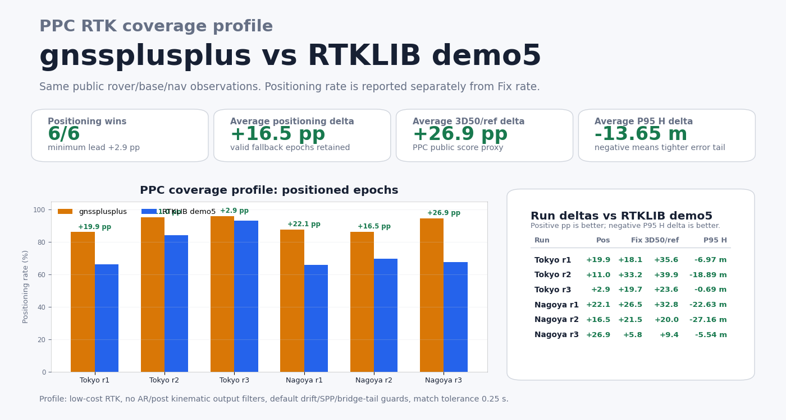
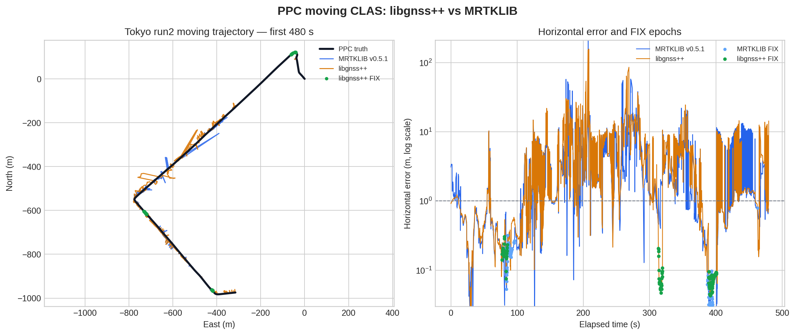

# libgnss++

Modern C++20 GNSS toolkit for non-GUI positioning.

Native `SPP`, `RTK`, `PPP`, `CLAS/MADOCA`, `RTCM`, `UBX`, and direct `QZSS L6`
handling without an external RTKLIB runtime.


## What You Get

- Solvers: `gnss spp`, `gnss solve`, `gnss ppp`
- Inputs/tools: RINEX, RTCM, UBX, SBF, NMEA, BINEX, QZSS L6
- Products: `SP3`, `CLK`, `IONEX`, `DCB`
- Extras: benchmarks, web dashboard, Python bindings, Docker, ROS 2 playback


## Results And Validation Status

| Area | Public comparison | Evidence / status |
|---|---|---|
| RTK | PPC Tokyo/Nagoya vs RTKLIB `demo5` | +17.0 pp positioning, +28.1 pp official score, -11.96 m P95 H delta |
| GNSS/IMU FGO | PPC Tokyo vs `tightly-coupled-gnss-imu-fgo` | Higher <50 cm fraction (avg +5.3 pp) and fix-rate (avg +7.9 pp) on all 3 runs; fixed-only RMS also wins 2 of 3 runs |
| CLAS PPP | PPC Tokyo run2 vs MRTKLIB CLAS | Current 480 s moving gate: zero false FIX, 0.114 m FIX RMS2D vs 0.145 m; full six-run sign-off pending. |
| Urban RTK | UrbanNav Tokyo Odaiba vs RTKLIB `demo5` | More fixes, lower Hp95/Vp95; `--preset odaiba` closes Hmed |
| SPP | PPC SPP adaptive robust + policy gate | No P95 regression with <=1 pp positioning drop |

### PPC RTK vs RTKLIB demo5

These are public PPC Tokyo/Nagoya moving-RTK replays using the same
rover/base/nav observations for libgnss++ and RTKLIB `demo5`.

<!-- PPC_COVERAGE_MATRIX:START -->
| Run | gnssplusplus Positioning | RTKLIB Positioning | Delta | gnssplusplus Fix | RTKLIB Fix | PPC official score | RTKLIB official score | Official delta | P95 H delta |
|---|---:|---:|---:|---:|---:|---:|---:|---:|---:|
| Tokyo run1 | **90.0%** | 66.3% | **+23.7 pp** | **54.4%** | 30.5% | **34.9%** | 0.0% | **+34.9 pp** | +3.39 m |
| Tokyo run2 | **95.3%** | 84.3% | **+11.0 pp** | **64.1%** | 27.6% | **69.0%** | 16.9% | **+52.1 pp** | -18.51 m |
| Tokyo run3 | **95.7%** | 93.1% | **+2.5 pp** | **63.0%** | 40.5% | **60.6%** | 35.6% | **+25.0 pp** | -0.24 m |
| Nagoya run1 | **88.8%** | 65.8% | **+23.0 pp** | **64.5%** | 33.8% | **49.5%** | 22.4% | **+27.1 pp** | -23.78 m |
| Nagoya run2 | **85.6%** | 69.8% | **+15.8 pp** | **51.4%** | 18.8% | **20.9%** | 11.0% | **+9.9 pp** | -27.24 m |
| Nagoya run3 | **93.8%** | 67.7% | **+26.1 pp** | **27.1%** | 13.9% | **27.4%** | 7.6% | **+19.7 pp** | -5.37 m |

Across these six public runs, the coverage profile averages **+17.0 pp**
Positioning-rate lead, **+28.1 pp** PPC official-score lead, and
**-11.96 m** P95 horizontal-error delta versus RTKLIB `demo5`.
<!-- PPC_COVERAGE_MATRIX:END -->



### GNSS/IMU Tightly-Coupled FGO vs tightly-coupled-gnss-imu-fgo

GTSAM-based fixed-lag factor-graph backend (`FGOBackend::GTSAM`) with
tightly-coupled IMU, multi-frequency DD RTK, per-epoch partial LAMBDA,
fix-and-hold, and an urban-robustness stack (CMC multipath screening,
CP-hold recovery, DDPR-anchored resets, FDE, elevation-dependent sigma).
Public PPC Tokyo moving-RTK replays with the dataset's tactical-grade IMU,
versus [inuex35/tightly-coupled-gnss-imu-fgo](https://github.com/inuex35/tightly-coupled-gnss-imu-fgo)
(Python + GTSAM) on the same rover/base/IMU data:

| Run | libgnss++ <50cm | Reference <50cm | libgnss++ fix | Reference fix | libgnss++ fixed RMS | Reference fixed RMS |
|---|---:|---:|---:|---:|---:|---:|
| Tokyo run1 | **56.9%** | 56.7% | **50.0%** | 49.5% | **0.655 m** | 0.815 m |
| Tokyo run2 | **80.6%** | 69.9% | **71.5%** | 60.8% | **0.261 m** | 0.277 m |
| Tokyo run3 | **72.8%** | 67.9% | **71.8%** | 59.4% | 0.272 m | **0.211 m** |


libgnss++ beats the reference on <50 cm fraction and fix-rate on all three
runs, and on fixed-only RMS on two of three runs (run3's fixed RMS remains
behind the reference, over the largest fixed population of the three: 10973
epochs). Every feature is opt-in and the library is unchanged when built
without GTSAM. Reproduce with `gnss_fgo_parity` (requires a GTSAM build) and
the shipping preset:

```
--imu <run>/imu.csv --fixed-lag 5 --multi-freq --partial-ar --hold \
--elev-mask 25 --snr-mask 30 --imu-preset-tactical --cmc --cmc-level 0.75 \
--cp-hold --cp-hold-res 2.0 --exc-recovery --ddpr-anchor --fde --varerr \
--fix-demote --fix-demote-dist 5 --fix-demote-res 25 --fix-demote-posthold 5
```

### Moving CLAS PPP vs MRTKLIB

This replaces the historical 2019 static `--claslib-parity` snapshot with a
current moving-data gate. It replays the public PPC Tokyo run2 rover at 5 Hz
from QZSS L6 corrections, with kinematic dynamics enabled. Both solvers use the
published PPC reference coordinates, discard the first 60 matched epochs, and
define TTFF as the first run of at least 30 consecutive FIX epochs.

The table compares the same first 480 seconds. MRTKLIB is a v0.5.1 local replay
from the CLAS benchmark lineage described in the
[MRTKLIB release article](https://zenn.dev/hatognss/articles/7a54dd82606faf).

| Metric | libgnss++ current CLAS | MRTKLIB v0.5.1 CLAS |
|---|---:|---:|
| Scored epochs | 2332 | **2340** |
| FIX epochs | **118 (5.06%)** | 114 (4.87%) |
| FIX RMS2D | **0.114 m** | 0.145 m |
| FIX 68th percentile | **0.091 m** | 0.146 m |
| FIX 95th percentile | **0.208 m** | 0.248 m |
| Maximum FIX horizontal error | **0.305 m** | 0.797 m |
| FIX epochs above 1 m | **0** | **0** |
| All-solution RMS2D | 11.630 m | **8.538 m** |
| All-solution 95th percentile | 15.160 m | **12.074 m** |
| 30-epoch TTFF | **301.2 s** | 375.2 s |
| Runtime dependency | **no CLASLIB runtime** | no CLASLIB runtime |



The current safety fix clears the complete dynamics/filter/AR state after the
MRTKLIB-style `maxdiffp` reset. In the 1300-epoch A/B window this removed all 34
approximately 10 m false fixes while preserving all 25 valid early fixes
bit-for-bit. FIX integrity now passes this moving gate; FLOAT recovery and the
full Tokyo/Nagoya six-run scorecard remain open before declaring parity. See the
[PPC CLAS validation note](docs/ppc_clas_validation.md) for definitions,
artifacts, and remaining gates.

## Quick Start

Choose the entrypoint that matches your job:

- [Robotics quick start](docs/robotics_quickstart.md): RTK replay, local web
  inspection, ROS2 receiver launch, and rosbag capture.
- [Research quick start](docs/research_quickstart.md): repeatable sign-off
  runs, profile comparisons, Python inspection, and artifact layout.
- [Dataset gallery](docs/dataset_gallery.md): current public dataset lanes and
  the adapter contract for adding more.

Build:

```bash
cmake -S . -B build -DCMAKE_BUILD_TYPE=Release
cmake --build build -j
python3 apps/gnss.py doctor
python3 apps/gnss.py ros2-doctor --device /dev/ttyUSB0
python3 apps/gnss.py ros2-bag-doctor --bag /path/to/rosbag --summary-json output/ros2_bag_doctor_summary.json
python3 apps/gnss.py field-report --out output/field_report.md
python3 apps/gnss.py robotics-smoke --profile realtime
```

`ros2-bag-doctor` reads sqlite ROS2 bags for message-level rates/gaps. For MCAP
bags it uses the optional Python `mcap` package when available, and otherwise
falls back to MCAP `metadata.yaml` for topic presence, counts, and duration.
`gnss web` auto-discovers `output/field_report*.json` and shows the report
links, Markdown preview, setup/ROS2/bag/smoke status, and next debug commands.

Run a solution:

```bash
python3 apps/gnss.py spp \
  --obs data/rover_static.obs \
  --nav data/navigation_static.nav \
  --out output/spp_solution.pos
```

RTK example:

```bash
python3 apps/gnss.py solve \
  --rover data/rover_kinematic.obs \
  --base data/base_kinematic.obs \
  --nav data/navigation_kinematic.nav \
  --mode kinematic \
  --out output/rtk_solution.pos
```

Run the web UI:

```bash
python3 apps/gnss.py web --port 8085
```

Then open `http://127.0.0.1:8085`.

List commands:

```bash
python3 apps/gnss.py commands
python3 apps/gnss.py commands --json
python3 apps/gnss.py commands --query ppp --limit 10
```

## Docker

```bash
docker build -t libgnsspp:latest .
docker run --rm -it -p 8085:8085 -v "$PWD:/workspace" \
  libgnsspp:latest web --host 0.0.0.0 --port 8085 --root /workspace
```

## Benchmarks

- [Benchmarks](docs/benchmarks.md)
- [Validation](docs/validation.md)
- [PPC reproduction commands](docs/ppc_reproduction.md)
- [SPP accuracy notes](docs/references/spp-accuracy-improvement.md)

## Docs

- <https://rsasaki0109.github.io/gnssplusplus-library/>
- [Documentation index](docs/index.md)
- [Quick start](docs/quickstart.md)
- [Robotics quick start](docs/robotics_quickstart.md)
- [Research quick start](docs/research_quickstart.md)
- [Dataset gallery](docs/dataset_gallery.md)
- [Interfaces](docs/interfaces.md)
- [Architecture](docs/architecture.md)
- [Reference analyses](docs/references/index.md)
- [Contributing](CONTRIBUTING.md)

## Install

```bash
cmake --install build --prefix /opt/libgnsspp
/opt/libgnsspp/bin/gnss --help
```

## Tests

```bash
ctest --test-dir build --output-on-failure
```

## License

MIT License. See [LICENSE](LICENSE).
