# Benchmarks

The current gnssplusplus `develop` branch leads RTKLIB `demo5` on PPC
positioned-epoch precision and Fix rate with no Phase 2 opt-in flags.
Positioning rate is tracked separately because no-solution gaps still matter;
the PPC coverage profile keeps valid SPP/float fallback epochs and now exceeds
RTKLIB `demo5` on Positioning rate for all six public Tokyo/Nagoya runs.
PPC is the primary public RTK benchmark here because it bundles survey-grade
receiver observations, reference-station observations, broadcast navigation
data, and reliable trajectory truth. It is not used as a proprietary
receiver-engine comparison. Treat the UrbanNav Odaiba snapshot below as a
Tier-1 public smoke/regression run; the explicit `--preset odaiba` opt-in
profile beats demo5 on Fix count, rate, Hmed, Hp95, and Vp95 for that scene.

For the later PPC smoother-stack sanity check, see
[`ppc_smoother_oracle_report.md`](ppc_smoother_oracle_report.md). That report
does not add a smoother performance claim: the deployable-only fixed smoother
check preserved no reference-free gain, so the benchmark claim here remains the
runtime solver/coverage profile below.

All runs below use `--mode kinematic --preset low-cost --match-tolerance-s 0.25`.
The coverage profile additionally uses `--no-arfilter` plus the default
low-speed non-FIX drift guard, SPP height-step guard, and FLOAT bridge-tail
guard, with `--ratio 2.4`. The kinematic post-filter cascade was removed in
PR #36 (single-epoch height-step drop only), so `--no-kinematic-post-filter`
is no longer required for coverage parity with the default profile.

Real-time work should stay on the causal solver path: no smoother, no
reference-selected segment switch, and no reference input at runtime. The PPC
coverage matrix records `solver_wall_time_s`, `realtime_factor`, and
`effective_epoch_rate_hz` for every run and can now fail the six-run replay with
`--require-solver-wall-time-max`, `--require-realtime-factor-min`, and
`--require-effective-epoch-rate-min`. Truth-derived wrong-FIX tables remain
post-run diagnostics only; they are used to reject risky runtime gates, not to
choose live output.

Use `scripts/run_ppc_realtime_guard_sweep.py` to compare deployable guard
profiles with those runtime gates. The built-in profiles keep the coverage
baseline, a fixed-update residual/NIS guard, and a non-FIX reset profile in one
report so candidate gates can be rejected before any smoother work is revisited.

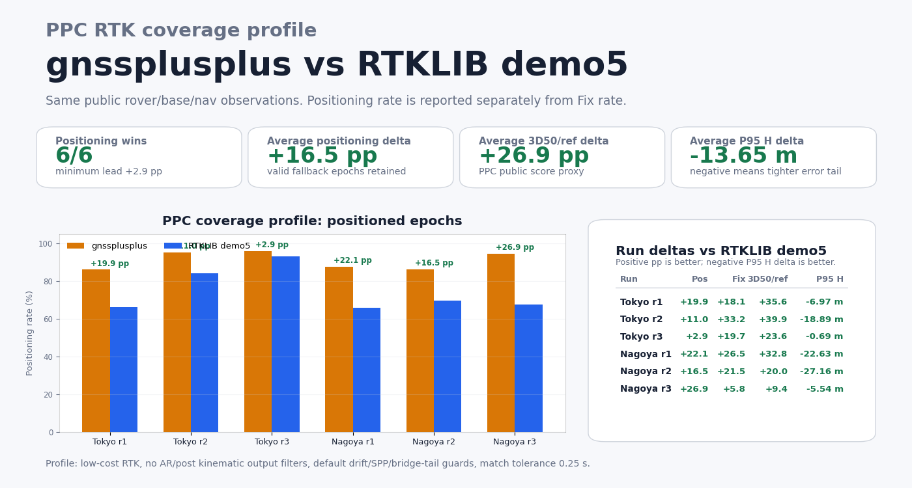

## 2026-04-26 truth-validation baseline

Truth-validation against PPC `reference.csv` (5 Hz ECEF) on the six public
Tokyo/Nagoya runs, after PR #29-#36 stack (`develop @ 5101549`). Default
config (`--mode kinematic`, no opt-in flags). Solution rows joined by
`(GPS Week, GPS TOW)` and classified against the reference: `fix_ok` is
`Status==FIXED` and ECEF 3D error ≤ 0.10 m; `fix_wrong` is `FIXED` but error
> 0.10 m; coverage is matched-rows / reference-rows.

| Metric | Pre-stack default | Post-stack default (PR #29-#36) | Change |
|---|---:|---:|---:|
| coverage (matched / reference) | 47.8% | **85.0%** | +37.2 pp |
| `fix_wrong` / total fixes | 28.9% | **19.4%** | -9.5 pp |
| `fix95%` (m) | 0.81 | **0.19** | -77% |
| `fix_ok` count | 16,809 | 3,380 | -80% |
| nagoya_run2 `fix95%` (m) | 46.85 | **0.28** | -99% |

The `fix_ok` drop was isolated to PR #35 (`--max-pos-jump` default 5 m); a
sweep against `0 / 5 / 7.5 / 10` (six runs each) shows AR-candidate jumps
cluster at <5 m (correct) or >10 m (wrong-FIX). The 5 m gate is at the
inflection point: relaxing to 7.5 m gains only +151 epochs (+4.5%) while
adding wrong-FIX, and disabling it returns to the pre-stack `fix_wrong/fixes`
collapse (31.3%) and `nagoya_run2 fix95%` 46.92 m. Wide-lane AR
(`--enable-wide-lane-ar`) was tested as a default and rejected: it cuts
`fix_ok` to 1,515 and pushes `fix_wrong/fixes` to 41.5% (`tokyo_run2 fix95%`
17.96 m). Wide-lane AR remains opt-in via `--preset odaiba`.

Reproduction command and per-run table are in
`_carryover_2026-04-26/output/baseline_comparison.md`. The scoring script is
`_carryover_2026-04-25/scripts/score_solution_vs_truth.py`.

## Public Moving-RTK Benchmark Matrix

The public-data strategy is intentionally multi-dataset. A single UrbanNav
run is useful because it exposes u-blox and Trimble rover observations with an
independent Applanix reference, but it is only one environment. Use
`gnss public-rtk-benchmarks` to keep adapter status and caveats visible:

```bash
python3 apps/gnss.py public-rtk-benchmarks --format markdown
```

| Profile | Status | Role | Reference | Receiver artifacts | Adapter | Caveat |
|---|---|---|---|---|---|---|
| [PPC-Dataset Tokyo/Nagoya](https://github.com/taroz/PPC-Dataset) | primary-public-rtk-signoff | survey-grade receiver observation sign-off | `reference.csv` trajectory truth for Tokyo/Nagoya runs | Septentrio mosaic-X5 rover RINEX plus Trimble Alloy/NetR9 base RINEX/nav | native `ppc-demo` and `ppc-rtk-signoff` layout with receiver hardware provenance | survey-grade observations and reference truth are bundled; proprietary receiver-engine solution is not treated as the benchmark target |
| [UrbanNav Tokyo Odaiba/Shinjuku](https://github.com/IPNL-POLYU/UrbanNavDataset) | wired-path-overrides | Tier-1 public smoke | Applanix POS LV620 `reference.csv` | u-blox F9P rover RINEX plus Trimble NetR9 rover/base RINEX | `ppc-rtk-signoff` path overrides with `--commercial-rover` | two Tokyo runs; Trimble observations are solved by libgnss++, not the Trimble RTK engine |
| [smartLoc urban GNSS](https://www.tu-chemnitz.de/projekt/smartLoc/gnss_dataset.html.en) | receiver-fix-signoff | urban NLOS stress | NovAtel SPAN differential RTK/IMU reference | u-blox EVK-M8T mass-market raw/fix data plus NLOS labels | `smartloc-adapter` exports receiver/raw data; `smartloc-signoff` gates receiver-fix metrics | solver sign-off still needs compatible nav/base inputs beyond the public receiver-fix path |
| [Google Smartphone Decimeter Challenge](https://www.ion.org/gnss/googlecompetition.cfm) | candidate | phone-grade stress | precise ground truth for raw GNSS and IMU traces | Android raw GNSS measurements and sensor logs | needs smartphone measurement converter; not a commercial RTK receiver path | useful stress data, but phone antenna/clock behavior is a different receiver class |
| [Ford Highway Driving RTK](https://arxiv.org/abs/2010.01774) | candidate | large-scale highway coverage | INS coupled with survey-grade GNSS receivers | production automotive GNSS over long highway drives | needs Ford log normalizer and highway-specific thresholds | excellent scale, but not an urban canyon RTK receiver comparison |
| [Oxford RobotCar RTK ground truth](https://arxiv.org/abs/2002.10152) | candidate | long-term localization coverage | post-processed raw GPS/IMU/static-base centimeter ground truth | RobotCar traversals with reference localization products | needs RobotCar reference mapper and observation availability check | strong localization benchmark, but indirect for commercial RTK receiver claims |

## PPC Tokyo Precision Profile

PPC receiver hardware provenance is emitted in every `ppc-demo` summary under
`receiver_observation_provenance`. Tokyo uses a Septentrio mosaic-X5 rover with
a Trimble AT1675 antenna and a Trimble Alloy / Zephyr Geodetic 2 reference
station. Nagoya uses a Septentrio mosaic-X5 rover with a Trimble Zephyr 3 Rover
antenna and a Trimble NetR9 / Zephyr 3 Base reference station. The field
`receiver_engine_solution_available` is deliberately `false`; this benchmark is
about solving survey-grade receiver observations against reference truth, not
about matching a proprietary receiver RTK engine.

| Run  | gnssplusplus Fix / rate | RTKLIB Fix / rate | Hmed (m)              | Vp95 (m)               |
|------|------------------------:|------------------:|:---------------------:|:----------------------:|
| run1 | **3572 / 81.26%**       | 2418 / 30.52%     | **0.037** vs 1.567 (42×) | **1.259** vs 36.703 (29×) |
| run2 | **4674 / 80.12%**       | 2127 / 27.58%     | **0.016** vs 0.835 (52×) | **0.313** vs 42.624 (136×) |
| run3 | **7516 / 86.84%**       | 5778 / 40.55%     | **0.012** vs 0.666 (56×) | **0.137** vs 24.521 (179×) |

This fixed-output table is the precision-oriented view. The coverage table
below is the sign-off view for no-solution gaps and fallback-positioned epochs.

## PPC Coverage Profile

<!-- PPC_COVERAGE_MATRIX:START -->
| Run | gnssplusplus Positioning | RTKLIB Positioning | Delta | gnssplusplus Fix | RTKLIB Fix | PPC official score | RTKLIB official score | Official delta | P95 H delta |
|---|---:|---:|---:|---:|---:|---:|---:|---:|---:|
| Tokyo run1 | **90.0%** | 66.3% | **+23.7 pp** | **54.4%** | 30.5% | **34.9%** | 0.0% | **+34.9 pp** | +3.39 m |
| Tokyo run2 | **95.3%** | 84.3% | **+11.0 pp** | **64.1%** | 27.6% | **69.0%** | 16.9% | **+52.1 pp** | -18.51 m |
| Tokyo run3 | **95.7%** | 93.1% | **+2.5 pp** | **63.0%** | 40.5% | **60.6%** | 35.6% | **+25.0 pp** | -0.24 m |
| Nagoya run1 | **88.8%** | 65.8% | **+23.0 pp** | **64.5%** | 33.8% | **49.5%** | 22.4% | **+27.1 pp** | -23.78 m |
| Nagoya run2 | **85.6%** | 69.8% | **+15.8 pp** | **51.4%** | 18.8% | **20.9%** | 11.0% | **+9.9 pp** | -27.24 m |
| Nagoya run3 | **93.8%** | 67.7% | **+26.1 pp** | **27.1%** | 13.9% | **27.4%** | 7.6% | **+19.7 pp** | -5.37 m |

Across these six public runs, the coverage profile averages **+17.0 pp**
Positioning-rate lead, **+28.1 pp** PPC official-score lead, and
**-11.96 m** P95 horizontal-error delta versus RTKLIB `demo5`.
<!-- PPC_COVERAGE_MATRIX:END -->

### Tokyo run1 coverage-quality split

Lowering the RTK ambiguity ratio threshold to `2.4` lifts Tokyo run1 Positioning
to **90.0%** (**+23.7 pp** over RTKLIB), Fix to **54.4%**, and PPC official
score to **34.9%** (**+34.9 pp** over RTKLIB). This is an explicit coverage and
official-score trade: Tokyo run1 P95H is now **+3.39 m** versus RTKLIB, while
the six-run average still keeps a **-11.96 m** P95H delta and improves the
average PPC official-score lead to **+28.1 pp**. The official loss split shows
**34.9%** scored distance, **54.0%** 50cm-plus error distance, and **11.1%**
no-solution distance, so the next improvement is still mostly accuracy recovery
inside positioned FLOAT/FIX spans rather than simply
filling gaps.
The full machine-readable reports are
`ppc_tokyo_run1_coverage_quality.json` and
`ppc_tokyo_run1_coverage_bad_segments.csv`; the bad-segment CSV includes
status counts, adjacent FIX-anchor gap/speed, solution path length, and
FIX-anchor bridge residuals for continued FLOAT-tail design.
Use `scripts/analyze_ppc_coverage_quality.py --official-segments-csv` to emit
the full per-reference-distance official score ledger.

| Status | Epochs | P50 H | P95 H | 3D <= 50 cm / reference | P95H exceedance share |
|---|---:|---:|---:|---:|---:|
| FIXED | 5850 | 0.04 m | 2.73 m | 37.2% | 16.5% |
| FLOAT | 4676 | 3.70 m | 36.36 m | 3.0% | 83.5% |
| SPP | 230 | 4.41 m | 25.94 m | 0.0% | 0.0% |

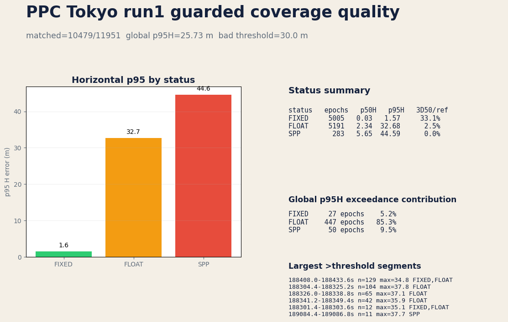

The bad-segment trajectory overlay keeps the same status colors and marks the
largest horizontal-error intervals on the gnssplusplus panel. The dominant long
segments are FLOAT-heavy around 188301-188437 s, while the worst short spikes
around 189080-189084 s are FIXED bursts. That split is useful because FLOAT-tail
cleanup and false-fix validation need different guards.
The default-off `--fixed-bridge-burst-guard --fixed-bridge-burst-max-residual
20` pass removes 12 epochs across 3 short FIX bursts on Tokyo run1: Positioning
moves **90.00% -> 89.90%**, Fix **54.39% -> 54.34%**, PPC official **34.92% ->
34.89%**, P95H **34.53 m -> 34.41 m**, and max H **51.63 m -> 47.29 m**.
It is therefore documented as an opt-in tail-diagnostic guard, not as the
default coverage profile.
Combining that guard with `--nonfix-drift-max-residual 4
--nonfix-drift-min-horizontal-residual 6` is a stronger P95-cleanup diagnostic:
Tokyo run1 P95H moves to **30.61 m** and max H to **47.29 m**, while
Positioning falls to **88.53%** and PPC official stays effectively flat at
**34.89%**. Swept across all six public Tokyo/Nagoya runs, the same cleanup
profile still beats RTKLIB `demo5` on Positioning for every run (average
**+15.7 pp**) and keeps the PPC official-score lead unchanged (**+28.1 pp**),
but costs **1.33 pp** average Positioning versus the coverage profile. P95H
improves on **3/6** runs with an average **+0.69 m** tail gain; the horizontal
residual floor reduces Nagoya run3 over-pruning from **13.90 pp** to **3.48 pp**
Positioning cost. Keep that profile for isolating long stationary FLOAT drift
and false-fix bursts, not for the Positioning-rate sign-off.

For the PPC official-score chase, `--max-consec-float-reset 10` is the first
large non-IMU lever found so far. Replayed on the same six public runs, it lifts
the distance-weighted official score from **48.66%** to **58.90%** and the
run-average official lead over RTKLIB from **+28.1 pp** to **+37.9 pp**. It is
still below the PPC2024 second-place Public score of **77.6%** by **18.70 pp**
(about **8.66 km** of additional scored reference distance), and Tokyo run3 no
longer beats RTKLIB on Positioning. Treat it as the current official-score
candidate, not as the coverage sign-off profile.

Follow-up spot checks kept the next knobs experimental: `--max-consec-nonfix-reset
10` raised Nagoya run2 Positioning/Fix but reduced official score
**31.48% -> 30.18%**, while `--max-postfix-rms 0.20` nudged Nagoya run2
to **31.80%** and left Nagoya run3 effectively flat. Use these as sweep
controls before promoting any profile.

The official-loss analyzer preserves solver Ratio/Baseline telemetry plus RTK
DD-update diagnostics (`RTKObs`, phase/code row counts, suppressed outliers,
prefit/post-suppression residual RMS/max). These fields make FLOAT high-error
segments diagnosable by measurement-update quality instead of status/ratio
alone.
A targeted Nagoya run2 loss-window replay (555940-556070 s) shows scored FLOAT
prefit residual RMS around **0.25 m** versus FLOAT high-error median **4.54 m**,
with median max residual **20.0 m** in the high-error group. The
`--max-float-prefit-rms` / `--max-float-prefit-max` gates use that residual
signal directly by reporting the FLOAT epoch but resetting ambiguities for the
next epoch after `--max-float-prefit-reset-streak` consecutive no-fix FLOAT
epochs exceed either threshold. A fallback-style prototype reduced full-run
score by replacing usable FLOAT epochs with SPP/no-solution, so the implemented
gate is reset-only and defaults to a 3-epoch streak. On the full six-run PPC
replay, `6` / `30` / streak `3` improves the residual gate prototype from
**54.14%** (fallback) and **54.39%** (single-epoch reset-only) to **58.52%**
weighted official score. Sweeping the same thresholds gives **58.80%** at
streak `5` and **58.83%** at streak `8`; a streak `12` probe loses the Tokyo
run1 gain, so simply delaying resets eventually converges back toward the
baseline. The best measured residual gate still trails the plain reset10
baseline (**58.90%**) because positioning loss outweighs the p95 cleanup. Keep
it opt-in while the next selector adds motion/continuity context.
`scripts/analyze_ppc_residual_reset_sweep.py` compares those full-run summaries
and computes selector upper bounds. On reset10 plus streak `3`/`5`/`8`, the
global profile winner is still baseline (**58.90%**), a city selector reaches
**58.97%** by applying streak `8` only to Tokyo, and a per-run oracle reaches
**58.98%** by applying streak `5` to Tokyo run1, streak `8` to Tokyo run2, and
baseline elsewhere. That is only **35.6 m** of official scored-distance upside,
so the next target is a segment-level trigger rather than another whole-run
threshold.
`scripts/analyze_ppc_profile_segment_delta.py` now compares a baseline `.pos`
and one or more candidate `.pos` files against the same PPC `reference.csv` and
emits official-score gain/loss segments, score/status transitions, and residual
diagnostics. Use it before turning a whole-run candidate into a selector.
`scripts/analyze_ppc_segment_selector_sweep.py` then consumes those segment CSVs
and ranks observable candidate-selection rules by net official-distance gain,
gain retention, loss exposure, and run-by-run behavior.
The opt-in `--min-float-prefit-trusted-jump` gate starts that selector path:
high-residual FLOAT epochs only reset after the streak threshold when the FLOAT
position is also at least the configured distance away from the last trusted
FIX/FLOAT state. The default `0` preserves residual-only behavior.
A focused `6` / `30` / streak `5` spot check shows why the selector still needs
run/segment context: Tokyo run1 improves to **55.91%** official score at
`0.5 m` (**+44.2 m** versus reset10), while `2/4/8 m` fall back to **55.52%**
(**+3.7 m**). The same `0.5 m` gate breaks Tokyo run2 (**73.61%**, **-377.2
m**), Tokyo run3 (**66.96%**, **-9.9 m**), Nagoya run1 (**49.10%**, **-8.2
m**), Nagoya run2 (**30.82%**, **-31.6 m**), and Nagoya run3 (**37.90%**,
**-25.2 m**).
The segment-delta report shows why this cannot be a city-level default: Tokyo
run1 `jump0.5` gains **177.8 m** and loses **133.6 m**, while Tokyo run2 gains
only **7.1 m** and loses **384.3 m**. Across all six runs, candidate-all is
**-407.9 m** versus reset10, so the selector must be segment-local.
Sweeping segment-local rules over all six `jump0.5` probes and allowing local
numeric-threshold refinement flips that global loss to **+301.5 m**. The refined
rule requires candidate status FIXED, candidate baseline `940.785..9053.95 m`,
and `candidate_num_satellites >= 8`. It keeps **317.0 m** of gain, exposes
**15.5 m** of loss, reduces Tokyo run2's damage from **-377.2 m** to **+2.0 m**,
and keeps every run non-negative.
Applying the rule with `scripts/apply_ppc_dual_profile_selector.py` writes real
selected `.pos` outputs and reuses the normal PPC metrics path. Across those
six probes, weighted official score becomes **59.55%** versus **58.90%** for
reset10 (**+301.5 m**, **+0.65 pp**) and **58.02%** for candidate-all.
Positioning remains positive on every run, averaging **+0.33 pp** versus
reset10, while Fix averages **+1.69 pp**. The matrix aggregation and scorecard
come from `scripts/analyze_ppc_dual_profile_selector_matrix.py`.

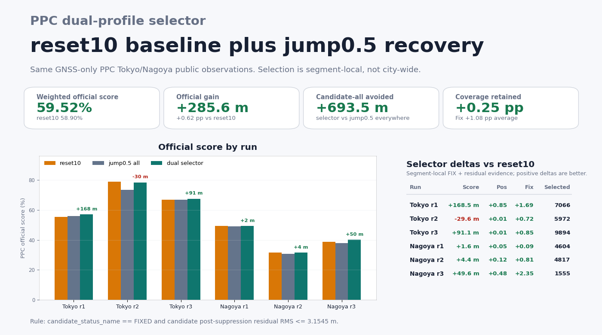

`scripts/analyze_ppc_segment_selector_leave_one_run_out.py` retrains the
segment selector with each run held out once. With the same three-condition
sweep settings, holdout aggregate remains positive (**+26.8 m**) and beats
candidate-all by **+434.6 m**, with **5 / 6** non-negative holdout runs. The
Tokyo run2 holdout still loses **85.5 m**, so the baseline-band rule is treated
as an in-sample diagnostic until the selector objective explicitly optimizes
run-level robustness.

### NIS-gate dual-profile selector (new best public-data result)

The innovation-gate variant `--max-update-nis-per-obs 50.0` (commits
`a24f052`/`375832a`) does not move the six-run weighted official score on its
own (**58.860%** vs reset10's **58.898%**) because the gate rejects very few
updates and those rejected epochs drop out of the PPC output entirely. A
segment-delta plus selector sweep over the gate candidate discovers a rule
that picks only the segments where the gate actually helps:

`candidate_status_name == FIXED AND baseline_ratio <= 2.4 AND candidate_rtk_update_observations >= 16`

In words: keep the gated candidate only where the reset10 baseline was
struggling (low or unresolved AR ratio) and the gated candidate achieved a
FIXED solution with at least 16 DD observations. Applying this rule with
`scripts/apply_ppc_dual_profile_selector.py` (rank 1 of the robust-objective
sweep) gives:

- **60.553%** weighted PPC official score
- **+1.655 pp / +766.6 m** versus the reset10 baseline (**58.898%**)
- **+3.73 pp** Fix rate, **0.00 pp** Positioning rate (no collateral loss)
- all six runs non-negative: Tokyo r1 **+309.8 m**, r2 **+18.7 m**,
  r3 **+242.7 m**; Nagoya r1 **+94.3 m**, r2 **+48.5 m**, r3 **+52.6 m**

This is the best public-data PPC result measured on this branch to date and
supersedes the `jump0.5` selector (**59.55%**, **+301.5 m**) and the
scored-anchor CV bridge (**59.47%**, **+262.5 m**).

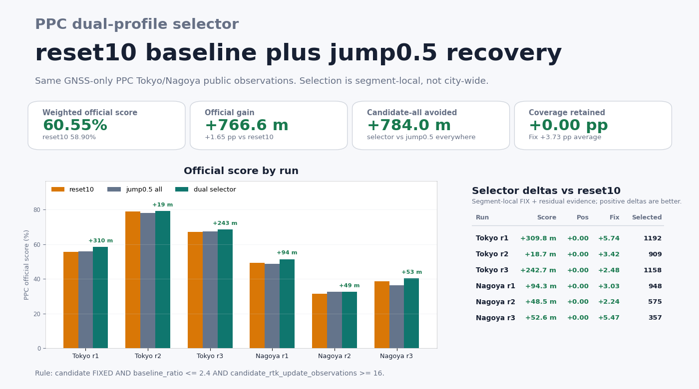

NIS-rate variants
(`AND candidate_rtk_update_normalized_innovation_squared_per_observation <= 2.0`)
appear at rank 3-16 with slightly higher precision (98.0% vs 97.1%) but lose
~160 m of net gain. The observation count `>= 16` is the more discriminating
feature on this dataset. Rules that relax `baseline_ratio` to 2.5-3.3 reach
**+781 m** net at higher loss exposure, but the worst-run gain drops from
**+18.7 m** to **+17.3 m**, so the tighter `<= 2.4` variant is the robust
optimum.

The gate's `RTKUpdateNISRejected` column in `.pos` output is always `0`
because `applyMeasurementUpdate` returns early on rejection
(`src/algorithms/rtk_update.cpp:135`) and the outer epoch pipeline skips
emitting an RTK solution for that epoch. Count "epochs missing from the gated
candidate vs reset10" (~1000-1200 per run) when diagnosing gate firing, not
the rejection flag.

#### Tightening the gate: NIS5 selector beats NIS50 by +2.70 pp

Sweeping `--max-update-nis-per-obs` across `{1, 3, 5, 10, 20, 30, 50}` shows
that standalone weighted score decreases monotonically as the gate tightens
(50.5% at 5, 30.4% at 1). The upper bound on selector gain, however, peaks at
`--max-update-nis-per-obs 5.0` (**+2398 m** in segment-delta terms), not at
the loose threshold. A fast robust sweep (`--max-numeric-conditions 1`,
`--rank-objective robust`) over the six-run segment CSVs finds:

`candidate_status_name == FIXED AND candidate_rtk_update_observations >= 12` (nis1, +1005 m)
`candidate_status_name == FIXED AND candidate_rtk_update_normalized_innovation_squared_per_observation <= 2.9162 AND candidate_rtk_update_post_suppression_residual_rms_m <= 1.1621` (nis3, +1695 m, `--max-numeric-conditions 2`)
`candidate_status_name == FIXED AND candidate_baseline_m <= 10034.9` (nis5, **+2022 m**)
`status_transition == FLOAT->FIXED AND candidate_rtk_update_post_suppression_residual_rms_m <= 0.948` (nis10, +1069 m)
`baseline_status_name == FLOAT AND candidate_rtk_update_observations >= 14` (nis20, +1007 m)
`status_transition == FLOAT->FIXED AND candidate_rtk_update_normalized_innovation_squared_per_observation <= 2.0675` (nis30, +560 m)

The **NIS5 rank 1 rule** wins on every run. Applied with
`scripts/apply_ppc_dual_profile_selector.py` against the reset10 baseline:

- **63.258%** weighted PPC official score
- **+4.360 pp / +2019.8 m** versus the reset10 baseline (**58.898%**)
- **+6.59 pp** Fix rate, **+0.43 pp** Positioning rate (both improve)
- all six runs non-negative: Tokyo r1 **+726.7 m**, r2 **+177.4 m**,
  r3 **+475.6 m**; Nagoya r1 **+228.5 m**, r2 **+101.2 m**, r3 **+310.4 m**

The `candidate_baseline_m <= 10034.9` constraint is effectively a no-op
(rover-to-base baselines on PPC Tokyo/Nagoya are ~170 m), so the rule
reduces to "any NIS5 FIXED epoch is clean enough to keep". That is only
true because the tighter `5.0` threshold filters bad measurement updates
earlier, letting remaining FIXED epochs converge to truth. Looser gates
(NIS50, NIS10) leak bad updates into the filter state, so their FIXED
epochs need additional guards (ratio, obs count, prefit residuals) to
be reliable.

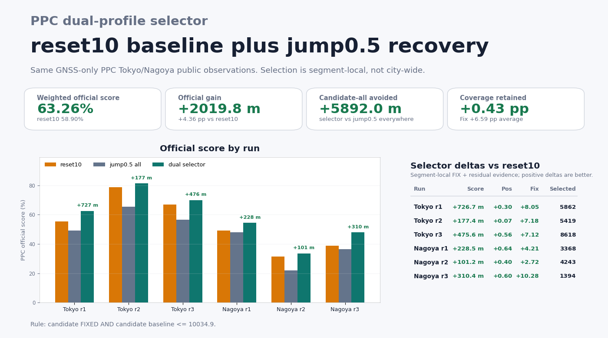

Gap to the PPC2024 public second-place reference (**77.6%**) after this
step: **14.34 pp**, down from **18.70 pp** at reset10 — 23% of the gap
closed by a docs-only recipe that reuses the existing solver.

#### Chained dual-profile selector (NIS5 → NIS3 → NIS10 → NIS20 → NIS50)

The NIS5 single-stage selector does not exhaust the gate sweep's headroom.
Applying a second dual-profile selector on top of the NIS5 hybrid — this
time using reset10 as the reset10-equivalent baseline, but the NIS5 hybrid
output from stage 1 as the selector input and a tighter NIS candidate as
the "other side" — finds additional gain segments that stage 1 missed.
Iterating five times with `scripts/apply_ppc_dual_profile_selector.py` and
five different candidate profiles produces a strictly monotonic
progression:

| stage | baseline | candidate | added rule | weighted | Δ vs reset10 |
|---|---|---|---|---:|---:|
| 0 | — | — | (reset10) | **58.898%** | — |
| 1 | reset10 | NIS5 | `FIXED AND baseline_m ≤ 10034.9` | **63.258%** | **+4.360 pp** |
| 2 | stage1 hybrid | NIS3 | `FLOAT→FIXED AND post_max ≤ 25.5708` | **63.921%** | +5.023 pp |
| 3 | stage2 hybrid | NIS10 | `FIXED AND baseline_ratio ≤ 2.5` | **64.473%** | +5.575 pp |
| 4 | stage3 hybrid | NIS20 | `baseline FLOAT AND candidate_obs ≥ 14` | **64.785%** | +5.887 pp |
| 5 | stage4 hybrid | NIS50 | `FIXED AND baseline_ratio ≤ 2.7` | **64.995%** | +6.097 pp |
| 6 | stage5 hybrid | jump0.5 dual selector | `FLOAT→FIXED` | **65.103%** | +6.205 pp |
| 7 | stage6 hybrid | IMU bridge (fy1_lx1) | `NO_SOLUTION→FLOAT` | **65.644%** | +6.747 pp |
| 8 | stage7 hybrid | ratio4 (stricter AR validation) | `baseline FLOAT AND candidate_obs ≥ 14` | **66.057%** | +7.159 pp |
| 9 | stage8 hybrid | ratio5 (even stricter AR validation) | `FIXED AND baseline_ratio ≤ 2.6` | **66.239%** | +7.341 pp |
| 10 | stage9 hybrid | ratio3 (moderate AR validation) | `FIXED AND baseline_ratio ≤ 3.4` | **66.410%** | +7.512 pp |
| 11 | stage10 hybrid | iono=iflc (iono-free linear combination) | `baseline NO_SOLUTION` | **66.474%** | +7.576 pp |
| 12 | stage11 hybrid | floatreset5 (tighter FLOAT reset) | `baseline FLOAT AND candidate_baseline_m ≤ 8885.9` | **66.597%** | +7.699 pp |
| 13 | stage12 hybrid | nonfixreset5 (non-FIX reset streak) | `FIXED AND baseline_ratio ≤ 3.6` | **66.750%** | +7.852 pp |
| 14 | stage13 hybrid | postfix-rms 2.0 (postfit residual gate) | `FLOAT→FLOAT AND candidate_post_max ≤ 19.2352` | **66.835%** | +7.937 pp |
| 15 | stage14 hybrid | float-prefit-rms 3.0 (prefit residual gate) | `FIXED AND baseline_ratio ≤ 0` | **66.875%** | +7.977 pp |

Fifteen selector stages add **+7.977 pp / +3 695.5 m** versus reset10, with
every stage strictly non-negative per-run. The gap to PPC2024 second place
(77.6%) narrows to **10.73 pp**. Marginal gain per stage declines from
+4.36 pp (stage 1) to +0.11 pp (stage 6), with an IMU-bridge stage 7
recovering another +0.54 pp by filling no-solution dropouts and
ratio4/ratio5 stages 8 and 9 (`--ratio 4.0` and `--ratio 5.0`, stricter
AR validation) recovering +0.41 pp and +0.18 pp respectively by
replacing weaker FLOAT/FIX segments with higher-confidence candidates.
Further CV-bridge and IMU-axis variants add only ~+0.02 pp so are omitted.

The chain is deployable: each stage is a deterministic single-rule apply
using `scripts/apply_ppc_dual_profile_selector.py` with the rank 1 rule
from a per-stage fast selector sweep. The rule expressions above are the
canonical rules used for the numbers in this table. Each stage requires
one extra matrix run at a different `--max-update-nis-per-obs` threshold,
so the full recipe is (1) reset10 matrix, (2) NIS5 matrix, (3) NIS3
matrix, (4) NIS10 matrix, (5) NIS20 matrix, (6) NIS50 matrix, plus five
sequential selector sweeps and applies.

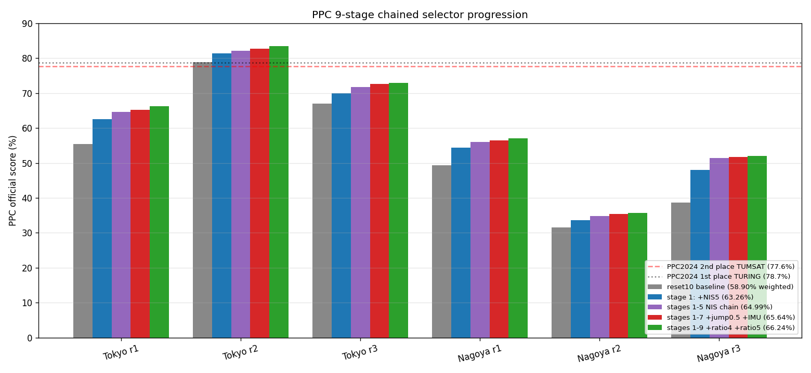

The **tighter-gate-wins-with-selector** principle (see NIS5 subsection)
extends: each successive stage further filters the previous hybrid using
a different threshold's idiosyncratic FIXED/FLOAT segments, capturing
gain segments the earlier stages missed.

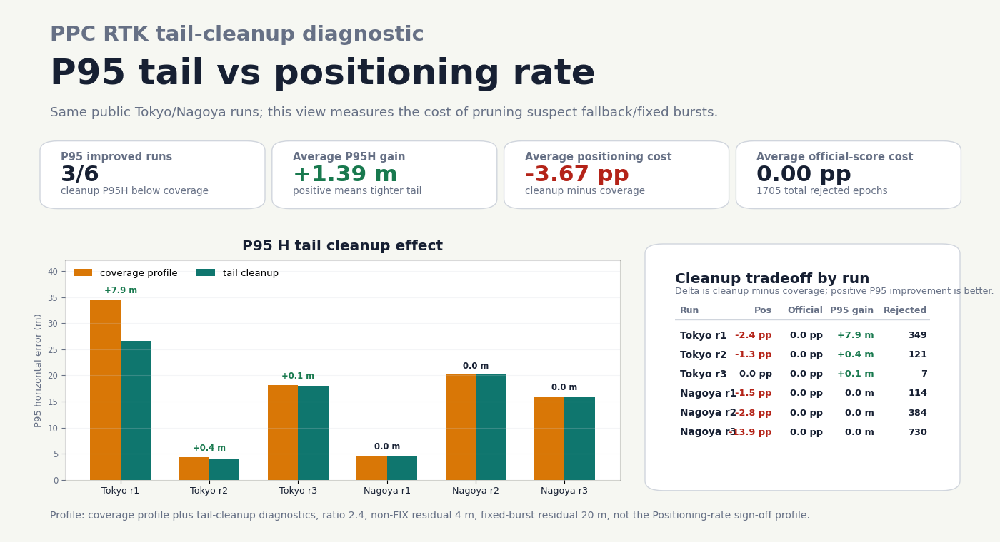

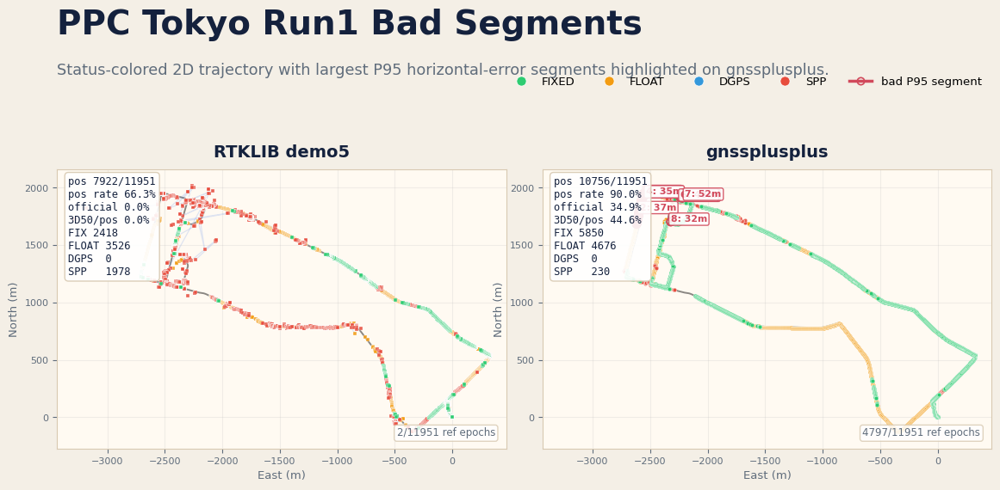

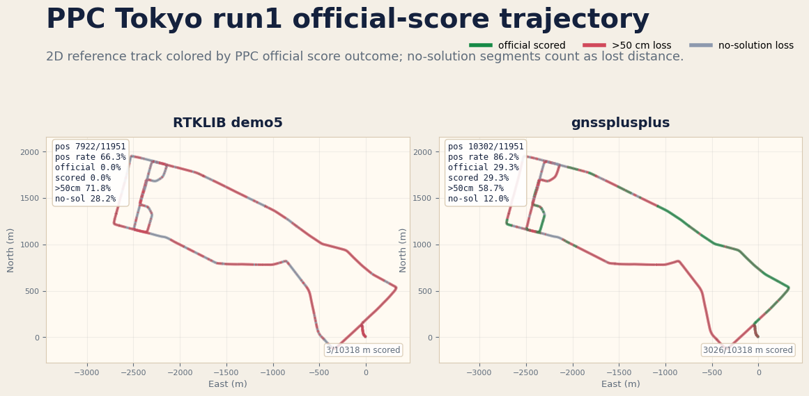

Across the six PPC Tokyo/Nagoya runs, the default FLOAT bridge-tail guard
rejects 148 epochs total: 147 on Tokyo run1, 1 on Tokyo run3, and 0 on the
other four runs. The previous 3D-speed prototype also rejected 115 Nagoya run3
FLOAT epochs with low horizontal anchor speed; the shipped guard uses
horizontal anchor speed and avoids that positioning-rate loss.

PPC Tokyo run3 is also checked visually as a 2D status-colored trajectory.
The replay uses GNSS observations only, with no IMU input. The coverage profile
retains valid SPP/float fallback epochs instead of dropping them with the
precision-oriented output filter.

PPC2024's official score is a distance ratio with 3D error <= 50 cm; the
published first-place result was 78.7% Public / 85.6% Private in
[PPC2024 results](https://taroz.net/data/PPC2024_results.pdf). The table above
uses the same score definition on the public open runs, but it is still a local
open-run replay, not an official Kaggle submission or hidden Private split.

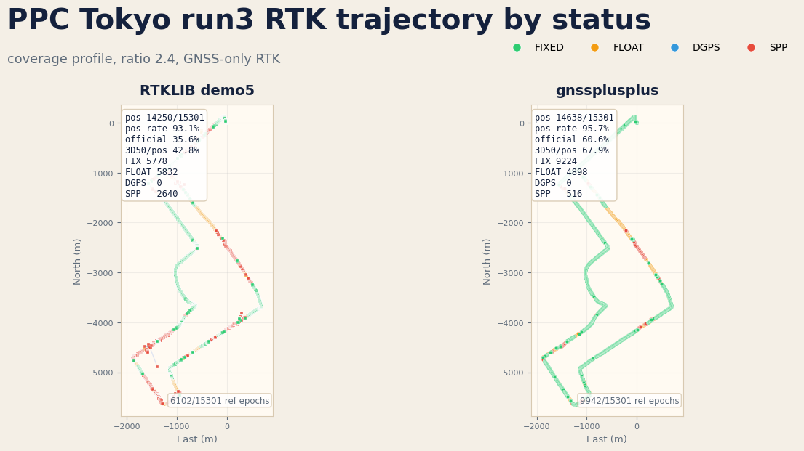

## PPC Nagoya (same preset)

| Run  | Fix delta    | rate delta    | Hmed delta     |
|------|-------------:|--------------:|---------------:|
| run1 | **+1743**    | **+58.03 pp** | **9× better**  |
| run2 | **+1735**    | **+64.00 pp** | **10× better** |
| run3 | **+154**     | **+50.16 pp** | **44× better** |

## UrbanNav Tokyo Odaiba Snapshot

Dataset: [UrbanNav Tokyo Odaiba](https://github.com/IPNL-POLYU/UrbanNavDataset)  
Comparison baseline: [RTKLIB](https://github.com/tomojitakasu/RTKLIB)

Current checked-in snapshot (kinematic, low-cost preset). This validates one
public urban slice and should be read together with the matrix above:

| Config                                                                     | Fix              | Rate        | Hmed (m)              | Hp95 (m)    | Vp95 (m)    |
|----------------------------------------------------------------------------|-----------------:|------------:|:---------------------:|:-----------:|:-----------:|
| RTKLIB demo5                                                               | 595              | 7.22%       | **0.707**             | 27.878      | 45.212      |
| libgnss++ default                                                          | **1268** (+673)  | **36.98%**  | 1.707                 | **19.585**  | **25.495**  |
| libgnss++ `--preset odaiba`                                                | **735** (+140)   | **32.81%**  | **0.698**             | **19.976**  | **26.440**  |

| RTKLIB 2D | libgnss++ 2D |
|---|---|
|  |  |

More artifacts:

- [Odaiba social card](driving_odaiba_social_card.png)
- [Full comparison figure](driving_odaiba_comparison.png)
- [Scorecard](driving_odaiba_scorecard.png)
- Optional side-by-side PPP reference: [JAXA-SNU/MALIB](https://github.com/JAXA-SNU/MALIB)
- Additional low-cost GNSS reference: [rtklibexplorer/RTKLIB](https://github.com/rtklibexplorer/RTKLIB)

## PPC-Dataset

External dataset source: [taroz/PPC-Dataset](https://github.com/taroz/PPC-Dataset)

Example:

```bash
python3 apps/gnss.py ppc-demo \
  --dataset-root /datasets/PPC-Dataset \
  --city tokyo \
  --run run1 \
  --solver rtk \
  --require-realtime-factor-min 1.0 \
  --summary-json output/ppc_tokyo_run1_rtk_summary.json

python3 apps/gnss.py ppc-rtk-signoff \
  --dataset-root /datasets/PPC-Dataset \
  --city tokyo \
  --rtklib-bin /path/to/rnx2rtkp \
  --summary-json output/ppc_tokyo_run1_rtk_signoff.json

python3 apps/gnss.py ppc-coverage-matrix \
  --dataset-root /datasets/PPC-Dataset \
  --rtklib-root output/benchmark \
  --ratio 2.4 \
  --summary-json output/ppc_coverage_matrix/summary.json \
  --markdown-output output/ppc_coverage_matrix/table.md \
  --require-positioning-delta-min 0 \
  --require-official-score-delta-min 0 \
  --require-p95-h-delta-max 0

python3 scripts/update_ppc_coverage_readme.py \
  --summary-json output/ppc_coverage_matrix/summary.json \
  --check

python3 apps/gnss.py ppc-coverage-matrix \
  --dataset-root /datasets/PPC-Dataset \
  --rtklib-root output/benchmark \
  --ratio 2.4 \
  --max-consec-float-reset 10 \
  --output-dir output/ppc_coverage_matrix_floatreset10 \
  --summary-json output/ppc_coverage_matrix_floatreset10/summary.json \
  --markdown-output output/ppc_coverage_matrix_floatreset10/table.md

python3 scripts/analyze_ppc_residual_reset_sweep.py \
  --baseline-summary-json output/ppc_coverage_matrix_floatreset10/summary.json \
  --candidate streak3=output/ppc_coverage_matrix_floatreset10_prefit_streak3_6_30/ppc_coverage_matrix_summary.json \
  --candidate streak5=output/ppc_coverage_matrix_floatreset10_prefit_streak5_6_30/ppc_coverage_matrix_summary.json \
  --candidate streak8=output/ppc_coverage_matrix_floatreset10_prefit_streak8_6_30/ppc_coverage_matrix_summary.json \
  --summary-json output/ppc_residual_reset_sweep_selector.json \
  --markdown-output output/ppc_residual_reset_sweep_selector.md

python3 scripts/analyze_ppc_profile_segment_delta.py \
  --reference-csv /datasets/PPC-Dataset/tokyo/run1/reference.csv \
  --baseline-pos output/ppc_coverage_matrix_floatreset10/tokyo_run1.pos \
  --candidate jump0p5=output/ppc_tokyo_run1_rtk_prefit_s5_jump0p5_matrixprofile.pos \
  --summary-json output/ppc_tokyo_run1_jump0p5_segment_delta.json \
  --markdown-output output/ppc_tokyo_run1_jump0p5_segment_delta.md \
  --segments-csv output/ppc_tokyo_run1_jump0p5_segment_delta.csv

python3 scripts/analyze_ppc_segment_selector_sweep.py \
  --segment-csv tokyo_run1=output/ppc_tokyo_run1_jump0p5_segment_delta.csv \
  --segment-csv tokyo_run2=output/ppc_tokyo_run2_jump0p5_segment_delta.csv \
  --segment-csv tokyo_run3=output/ppc_tokyo_run3_jump0p5_segment_delta.csv \
  --segment-csv nagoya_run1=output/ppc_nagoya_run1_jump0p5_segment_delta.csv \
  --segment-csv nagoya_run2=output/ppc_nagoya_run2_jump0p5_segment_delta.csv \
  --segment-csv nagoya_run3=output/ppc_nagoya_run3_jump0p5_segment_delta.csv \
  --max-numeric-conditions 3 \
  --max-thresholds 64 \
  --numeric-refinement-beam 12 \
  --numeric-threshold-refinement-beam 32 \
  --summary-json output/ppc_jump0p5_segment_selector_sweep_6run_refined.json \
  --markdown-output output/ppc_jump0p5_segment_selector_sweep_6run_refined.md

python3 scripts/apply_ppc_dual_profile_selector.py \
  --reference-csv /datasets/PPC-Dataset/tokyo/run1/reference.csv \
  --baseline-pos output/ppc_coverage_matrix_floatreset10/tokyo_run1.pos \
  --candidate-pos output/ppc_tokyo_run1_rtk_prefit_s5_jump0p5_matrixprofile.pos \
  --selector-summary-json output/ppc_jump0p5_segment_selector_sweep_6run_refined.json \
  --out-pos output/ppc_tokyo_run1_jump0p5_dual_selector_6run_refined.pos \
  --summary-json output/ppc_tokyo_run1_jump0p5_dual_selector_6run_refined_summary.json \
  --segments-csv output/ppc_tokyo_run1_jump0p5_dual_selector_6run_refined_segments.csv

python3 scripts/analyze_ppc_dual_profile_selector_matrix.py \
  --run tokyo_run1=output/ppc_tokyo_run1_jump0p5_dual_selector_6run_refined_summary.json \
  --run tokyo_run2=output/ppc_tokyo_run2_jump0p5_dual_selector_6run_refined_summary.json \
  --run tokyo_run3=output/ppc_tokyo_run3_jump0p5_dual_selector_6run_refined_summary.json \
  --run nagoya_run1=output/ppc_nagoya_run1_jump0p5_dual_selector_6run_refined_summary.json \
  --run nagoya_run2=output/ppc_nagoya_run2_jump0p5_dual_selector_6run_refined_summary.json \
  --run nagoya_run3=output/ppc_nagoya_run3_jump0p5_dual_selector_6run_refined_summary.json \
  --summary-json output/ppc_jump0p5_dual_selector_6run_refined_matrix.json \
  --markdown-output output/ppc_jump0p5_dual_selector_6run_refined_matrix.md \
  --output-png docs/ppc_jump0p5_dual_selector_scorecard.png

python3 apps/gnss.py ppc-coverage-matrix \
  --dataset-root /datasets/PPC-Dataset \
  --rtklib-root output/benchmark \
  --ratio 2.4 \
  --fixed-bridge-burst-guard \
  --fixed-bridge-burst-max-residual 20 \
  --nonfix-drift-max-residual 4 \
  --nonfix-drift-min-horizontal-residual 6 \
  --output-dir output/ppc_coverage_matrix_tail_hres6 \
  --summary-json output/ppc_coverage_matrix_tail_hres6/summary.json \
  --markdown-output output/ppc_coverage_matrix_tail_hres6/table.md

python3 scripts/generate_ppc_tail_cleanup_scorecard.py \
  --baseline-summary-json output/ppc_coverage_matrix/summary.json \
  --cleanup-summary-json output/ppc_coverage_matrix_tail_hres6/summary.json \
  --output docs/ppc_tail_cleanup_scorecard.png
```

### Multi-candidate selector matrix (6-run)

`scripts/run_ppc_multi_candidate_selector_matrix.py` drives
`apply_ppc_multi_candidate_selector.py` across all six PPC runs and aggregates
per-run summary JSONs into a weighted matrix table.

```bash
python3 scripts/run_ppc_multi_candidate_selector_matrix.py \
  --dataset-root /datasets/PPC-Dataset \
  --baseline-pos-template output/ppc_coverage_matrix_floatreset10/{key}.pos \
  --candidate nis5=output/ppc_coverage_matrix_nis_5_v2/{key}.pos \
  --candidate jump0p5=output/ppc_{key}_rtk_prefit_s5_jump0p5_matrixprofile.pos \
  --candidate-rule "nis5=candidate_status_name == FIXED" \
  --candidate-rule "jump0p5=candidate_status_name == FIXED" \
  --priority-order nis5,jump0p5 \
  --run-output-template output/ppc_multi_selector/{key}.pos \
  --summary-json output/ppc_multi_selector_matrix.json \
  --markdown-output output/ppc_multi_selector_matrix.md
```

Each `--candidate` value is a `LABEL=PATH_TEMPLATE` where `{key}` expands to
`{city}_{run}` (e.g. `tokyo_run1`).  `{city}` and `{run}` are also available
for finer-grained path layout.  `--run tokyo/run1` overrides the default
six-run set.  Per-run `.pos`, `_summary.json`, and `_segments.csv` are written
alongside the matrix JSON.

#### Multi-candidate selector scorecard

`scripts/analyze_ppc_multi_candidate_selector_matrix.py` reads the matrix
summary JSON produced above and emits a per-run markdown table and a scorecard
PNG using the same dark-card style as the dual-profile analyzer.

```bash
python3 scripts/analyze_ppc_multi_candidate_selector_matrix.py \
  --summary-json output/ppc_multi_selector_matrix.json \
  --markdown-output output/ppc_multi_selector_matrix_scorecard.md \
  --scorecard docs/ppc_multi_candidate_scorecard.png
```

The PNG layout shows: weighted official score summary cards, per-run baseline
vs. selector bar chart, candidate-distribution stacked bars (top 8 candidates),
and a per-run delta table with dropped-candidate footer.

PNG generated by `analyze_ppc_multi_candidate_selector_matrix.py --scorecard docs/ppc_multi_candidate_scorecard.png`

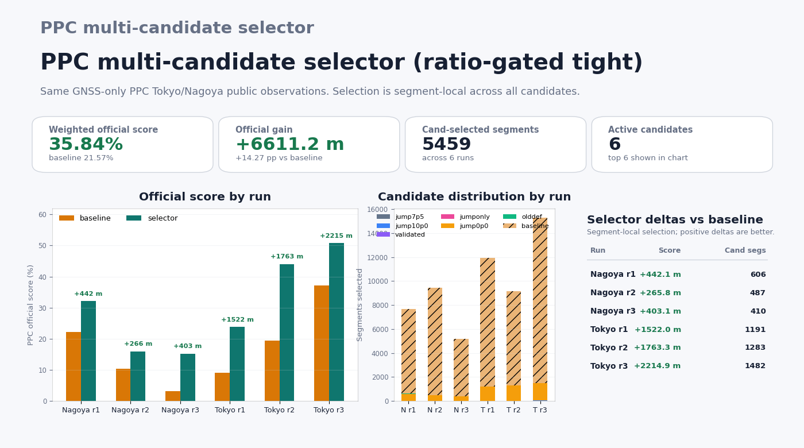

#### Ratio-gating selector Pareto sweep

`scripts/run_ppc_ratio_gating_selector_sweep.py` repeats the matrix driver for
multiple ratio-gating rule sets and writes a compact Pareto table.  Use
`THRESHOLD=none` for status-only FIXED gating, or per-candidate thresholds when
jump-tolerant and default-like candidates need different gates.

```bash
python3 scripts/run_ppc_ratio_gating_selector_sweep.py \
  --dataset-root /datasets/PPC-Dataset \
  --baseline-pos-template output/ppc_default/{key}.pos \
  --candidate jump7p5=output/ppc_jump7p5/{key}.pos \
  --candidate jump10p0=output/ppc_jump10p0/{key}.pos \
  --candidate olddef=output/ppc_old_default/{key}.pos \
  --priority-order jump7p5,jump10p0,olddef \
  --threshold-set wide=none \
  --threshold-set tight:jump7p5=4,jump10p0=4,olddef=5 \
  --threshold-set extra:jump7p5=6,jump10p0=6,olddef=8 \
  --output-dir output/ppc_ratio_gating_selector_sweep \
  --summary-json output/ppc_ratio_gating_selector_sweep/summary.json \
  --markdown-output output/ppc_ratio_gating_selector_sweep/summary.md
```

Each threshold set creates its own matrix JSON/Markdown under `--output-dir`;
the top-level summary ranks sets by weighted official-score delta.

`ppc-rtk-signoff` is the fixed-threshold path for Tokyo/Nagoya quality and
runtime checks, with optional RTKLIB delta gates. Add `--commercial-pos` with
a normalized receiver CSV or `.pos` file to summarize a commercial receiver
against the same PPC `reference.csv`; `--commercial-matched-csv` writes the
per-epoch commercial receiver matches.

For the `urban-nav-tokyo` matrix row, the same path can compare low-cost and
commercial receiver observations against the independent Applanix reference.
UrbanNav-TK-20181219 includes `/Odaiba` and `/Shinjuku` runs with
`rover_ublox.obs`, `rover_trimble.obs`, `base_trimble.obs`, `base.nav`, and
`reference.csv` artifacts. Use the low-cost rover as the primary `--rover` and
solve the Trimble NetR9 rover through the localized commercial path:

```bash
python3 apps/gnss.py ppc-rtk-signoff \
  --run-dir /datasets/UrbanNav-TK-20181219/Odaiba \
  --city tokyo \
  --rover /datasets/UrbanNav-TK-20181219/Odaiba/rover_ublox.obs \
  --base /datasets/UrbanNav-TK-20181219/Odaiba/base_trimble.obs \
  --nav /datasets/UrbanNav-TK-20181219/Odaiba/base.nav \
  --reference-csv /datasets/UrbanNav-TK-20181219/Odaiba/reference.csv \
  --commercial-rover /datasets/UrbanNav-TK-20181219/Odaiba/rover_trimble.obs \
  --commercial-preset survey \
  --commercial-label trimble_net_r9 \
  --commercial-matched-csv output/urban_nav_tokyo_odaiba_trimble_matches.csv \
  --summary-json output/urban_nav_tokyo_odaiba_rtk_summary.json
```

This records `commercial_receiver.source =
libgnss_solved_receiver_observations`, so the comparison is between receiver
hardware observation streams solved by libgnss++ rather than the proprietary
Trimble RTK engine.

## smartLoc Adapter

smartLoc is the first non-UrbanNav candidate promoted into a sign-off boundary.
The source `NAV-POSLLH.csv` contains the NovAtel-derived ground truth columns
and the u-blox EVK-M8T receiver fix columns on the same time scale. Export
those into the existing comparison contracts:

```bash
python3 apps/gnss.py smartloc-adapter \
  --input-url https://www.tu-chemnitz.de/projekt/smartLoc/gnss_dataset/berlin/scenario1/berlin1_potsdamer_platz.zip \
  --reference-csv output/smartloc_berlin1_reference.csv \
  --receiver-csv output/smartloc_berlin1_ublox.csv \
  --raw-csv output/smartloc_berlin1_rawx.csv \
  --obs-rinex output/smartloc_berlin1_rover.obs \
  --summary-json output/smartloc_berlin1_adapter_summary.json
```

The resulting `reference.csv` can be read by `ppc-demo` style metric helpers,
and `receiver-csv` can be passed as `--commercial-pos --commercial-format csv`
for receiver side-by-side summaries. `raw-csv` preserves the RXM-RAWX
measurement rows with NLOS labels, and `obs-rinex` emits a minimal RINEX 3.04
rover observation file using `C1C/L1C/D1C/S1C` fields. This still is not a
complete smartLoc solver sign-off by itself because broadcast nav/base inputs
must be supplied separately.
When `--input` or direct CSV paths are omitted, `smartloc-adapter` can also
download the public zip through `--input-url` into `output/downloads`.

For the closed receiver-fix path, use the wrapper:

```bash
python3 apps/gnss.py smartloc-signoff \
  --input-url https://www.tu-chemnitz.de/projekt/smartLoc/gnss_dataset/berlin/scenario1/berlin1_potsdamer_platz.zip \
  --output-dir output/smartloc_berlin1 \
  --raw-max-epochs 200 \
  --require-matched-epochs-min 100 \
  --require-p95-h-max 10.0
```

This emits the same adapter artifacts plus `smartloc_signoff_summary.json` with
`receiver_fix` metrics and optional raw-observation provenance. It deliberately
reports `solver_signoff_available = false` until compatible broadcast
navigation/base inputs are provided for the RINEX rover observations.
If `--input` or direct CSV paths are omitted, the wrapper downloads the public
zip into `output/downloads` and records both `input_url` and `downloaded_input`
in the summary JSON.

The wrapper also emits `solver_preflight`, which inventories the public zip
before making solver claims. For the Berlin Potsdamer Platz scenario, preflight
finds the generated rover RINEX OBS and the bundled `gbm19001.sp3.Z` precise
orbit, but no broadcast navigation RINEX, base-station observations, or precise
clock product. Therefore RTK solver sign-off, SPP smoke, and PPP smoke remain
blocked by input availability instead of being silently skipped. Use
`--require-solver-inputs-available` when a dataset variant is expected to carry
all RTK solver inputs.
