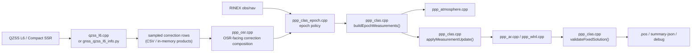
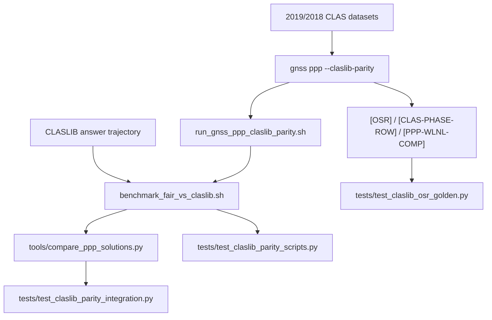

# CLAS API & Flow

This page is the developer-facing entrypoint for the `CLAS/MADOCA` path.

If you want the shortest task-oriented path first, start with
[CLAS Quick Start](clas_quickstart.md).

It answers four questions:

1. Which public commands are the stable CLAS-facing API.
2. Which files own each internal boundary.
3. How `L6 / Compact SSR -> sampled rows -> OSR -> PPP/AR` flows through the codebase.
4. Which tests define the current CLAS parity contract.

This page is about the **interface and ownership boundary**, not about claiming
full `CLASLIB` solver equivalence. That solver-equivalence work is still
ongoing.

## Public CLAS API

The stable public surface today is CLI-first.

### Runtime entrypoints

| Command / script | Role | Main output |
| --- | --- | --- |
| `gnss ppp --claslib-parity` | Run the strict parity-oriented PPP preset | `.pos`, `summary-json`, debug stderr |
| `gnss clas-ppp` | CLAS-oriented PPP workflow entrypoint | `.pos`, summary artifacts |
| `gnss qzss-l6-info` | Decode raw `QZSS L6 / Compact SSR` into inspectable rows | CSV / text diagnostics |
| `scripts/run_gnss_ppp_claslib_parity.sh` | Thin wrapper that pins the CLAS parity preset | parity `.pos`, summary JSON |
| `scripts/benchmark_fair_vs_claslib.sh` | Compare `libgnss++` output against a CLASLIB answer trajectory | benchmark JSON |

### Main CLAS configuration surface

The main CLAS knobs on `gnss ppp` are:

- `--clas-epoch-policy`
- `--clas-osr-application`
- `--clas-phase-continuity`
- `--clas-phase-bias-values`
- `--clas-phase-bias-reference-time`
- `--clas-ssr-timing`
- `--clas-expanded-values`
- `--clas-subtype12-values`
- `--clas-residual-sampling`
- `--clas-atmos-selection`
- `--clas-atmos-stale-after-seconds`

The compact-SSR ingestion knobs live on:

- `gnss qzss-l6-info`
- `gnss clas-ppp`

Those flags are listed in more detail on [Interfaces](interfaces.md).

### Stable vs experiment-only CLAS surface

The current practical split is:

#### Stable surface

These are the knobs that define the main runtime boundary and are reasonable to
document as first-class CLAS API:

- `--claslib-parity`
- `--clas-epoch-policy`
- `--clas-osr-application`
- `--clas-phase-continuity`
- `--clas-phase-bias-values`
- `--clas-phase-bias-reference-time`
- `--clas-ssr-timing`
- `--clas-expanded-values`
- `--clas-subtype12-values`
- `--clas-residual-sampling`
- `--clas-atmos-selection`
- `--clas-atmos-stale-after-seconds`
- `gnss qzss-l6-info`
- `gnss clas-ppp`
- `scripts/run_gnss_ppp_claslib_parity.sh`
- `scripts/benchmark_fair_vs_claslib.sh`

#### Experiment-only surface

These are valuable for parity work, but should be treated as tuning and
verification controls rather than long-term stable public API:

- compact merge/composition/bank/materialization policy flags
- debug stderr streams such as `[OSR]`, `[CLAS-PHASE-ROW]`, `[PPP-WLNL-COMP]`
- parity-only wrappers and temporary strategy combinations used by issue work

The compact merge/composition policy family is documented separately on
[CLAS Compact SSR Policies](clas_compact_ssr_policies.md).

## Data contracts

The CLAS path currently accepts two practical correction inputs:

1. Raw `QZSS L6 / Compact SSR`
2. Pre-expanded sampled correction rows (`ssr_csv`)

The stable outputs used across parity and sign-off work are:

- `.pos`
- `summary-json`
- sampled correction CSV
- debug stderr (`[OSR]`, `[CLAS-PHASE-ROW]`, `[PPP-WLNL-COMP]`, etc.)
- fair-benchmark JSONs

## Internal ownership map

| File | Responsibility |
| --- | --- |
| `src/io/qzss_l6.cpp` | Native raw L6 decode and message extraction |
| `apps/gnss_qzss_l6_info.py` | Python-side Compact SSR expansion and row materialization |
| `src/algorithms/ppp_atmosphere.cpp` | Atmos token resolution, grid selection, trop/STEC application |
| `src/algorithms/ppp_osr.cpp` | Sampled correction interpretation and OSR-facing correction composition |
| `src/algorithms/ppp_clas.cpp` | CLAS measurement construction, Kalman update, ambiguity bookkeeping, fixed-solution validation |
| `src/algorithms/ppp_clas_epoch.cpp` | CLAS epoch policy orchestration and fixed/float epoch path control |
| `src/algorithms/ppp_ar.cpp` | DD/WLNL ambiguity resolution and fixed-state projection |
| `src/algorithms/ppp_wlnl.cpp` | WL/NL pair construction and hold/fix support |

## Runtime flow

## Parity and debugging flow

## Current CLAS parity contract

The strongest current CLAS regression set is:

- `tests/test_compare_ppp_tool.py`
- `tests/test_claslib_parity_scripts.py`
- `tests/test_claslib_parity_integration.py`
- `tests/test_claslib_osr_golden.py`

These tests pin:

- `CLASLIB` answer ingestion
- parity wrapper behavior
- benchmark JSON generation
- first-epoch and late-epoch OSR/debug values
- fixed residual summaries

The parity datasets and expected output artifacts are documented on
[CLAS Parity Datasets & Artifacts](clas_parity_artifacts.md).

The current debug stderr tags and how to use them are documented on
[CLAS Debug Tag Playbook](clas_debug_playbook.md).

The active issue split for unresolved parity work is documented on
[CLAS Parity Blockers](clas_parity_blockers.md).

## What this page does not guarantee

This page documents the current CLAS API and ownership boundary. It does **not**
mean:

- full `CLASLIB` accuracy parity is done
- all CLAS datasets are solved equally well
- the current solver internals are frozen

The contract here is narrower:

- the CLI/API boundary is explicit
- the module ownership is explicit
- the parity/debug/test surfaces are explicit

## Recommended next documentation steps

1. Publish one issue-linked page per active parity blocker.
2. Add a compact `how to debug CLAS parity` playbook from the existing stderr tags.
3. Promote only the stable subset of CLAS flags into a narrower user-facing quickstart.
