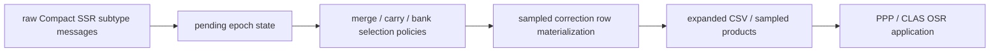

# CLAS Compact SSR Policies

This page documents the current policy surface around `Compact SSR` expansion
and row materialization.

It is intentionally narrower than [Interfaces](interfaces.md): the goal here is
to explain which policy family changes which stage of the pipeline.

## Scope

These policies are mainly exercised through:

- `gnss qzss-l6-info`
- `gnss clas-ppp`

They are used to answer questions like:

- how raw subtype fragments are merged,
- how code/phase bias banks are selected,
- how atmosphere rows are carried or reset across epochs,
- how sampled rows are materialized before PPP consumes them.

## Pipeline stages

## Policy families

### Flush policy

Controls when pending Compact SSR fragments are emitted as rows.

Examples:

- `lag-tolerant-union`
- `orbit-or-clock-only`
- `orbit-and-clock-only`

This mostly changes the boundary between incomplete message arrival and emitted
sampled rows.

### Atmosphere merge policy

Controls how `STEC / trop` atmosphere content is carried across subtype
boundaries and epoch boundaries.

Examples:

- `stec-coeff-carry`
- `no-carry`
- `network-locked-stec-coeff-carry`

This is one of the most parity-sensitive surfaces because stale carry can
silently pollute later rows.

### Atmosphere subtype merge policy

Controls how competing gridded vs combined atmosphere fragments are merged.

Examples:

- `union`
- `gridded-priority`
- `combined-priority`

### Phase-bias merge policy

Controls how multiple phase-bias fragments are combined or reset.

Examples:

- `latest-union`
- `message-reset`
- `selected-mask-prune`

### Phase-bias source policy

Controls precedence between overlapping subtype sources.

Examples:

- `arrival-order`
- `subtype5-priority`
- `subtype6-priority`

### Code-bias composition policy

Controls how network/base code-bias information is composed.

Examples:

- `direct-values`
- `base-plus-network`
- `base-only-if-present`

### Code-bias bank policy

Controls which nearby 30-second bank is selected when the current bank is
missing or incomplete.

Examples:

- `pending-epoch`
- `same-30s-bank`
- `close-30s-bank`
- `latest-preceding-bank`

### Bias row materialization policy

Controls which satellites are extended into the emitted sampled bias rows.

Examples:

- `overlap-only`
- `selected-satellite-base-extend`
- `all-base-satellite-extend`

### Phase-bias composition and bank policy

These mirror the code-bias policy families but operate on phase-bias rows.

## Recommended interpretation

Use the policy families in this order when debugging:

1. `flush`
2. `atmosphere merge`
3. `subtype merge`
4. `bias source/composition`
5. `bank selection`
6. `row materialization`

This order matches the causal direction of the pipeline. If earlier stages are
wrong, later policy tuning only hides the problem.

## Operational rule

Treat these as **experiment knobs**, not as stable end-user API, unless a policy
has become part of a documented sign-off or parity contract.

The current regression surfaces that touch these policies live in:

- `tests/test_cli_tools.py`
- `tests/test_claslib_parity_scripts.py`
- `tests/test_claslib_osr_golden.py`

## Related pages

- [CLAS API & Flow](clas.md)
- [CLAS Parity Datasets & Artifacts](clas_parity_artifacts.md)
- [Interfaces](interfaces.md)
