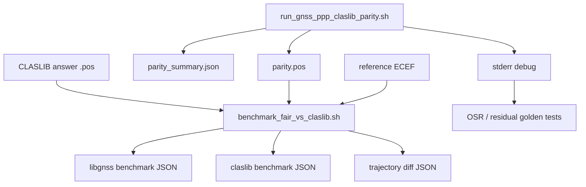

# CLAS Parity Datasets & Artifacts

This page describes the current CLAS parity dataset model and the artifacts that
the repo expects from a parity run.

It is the documentation counterpart to the in-tree CLAS parity tests.

## Main reference case

The main checked developer reference today is the `2019-08-27` CLAS parity
case, using files from the public
`QZSS-Strategy-Office/claslib` repository's `data/` directory.

Typical inputs:

- observation RINEX
- navigation RINEX
- CLAS `QZSS L6` correction file
- fixed reference ECEF coordinates

Typical driver:

```bash
GNSS_PPP=./build/gnss_ppp \
./scripts/run_gnss_ppp_claslib_parity.sh \
  --obs <obs> \
  --nav <nav> \
  --ssr <l6-or-expanded-csv> \
  --out parity.pos \
  --summary-json parity_summary.json \
  --ref-x <x> --ref-y <y> --ref-z <z>
```

## Expected artifacts

A parity run is expected to produce some or all of the following:

### Core solver artifacts

- `.pos`
- `summary-json`
- stderr debug stream

### Comparison artifacts

- fair benchmark JSON against truth/reference
- fair benchmark JSON against CLASLIB answer
- direct trajectory diff JSON

### Debug / inspection artifacts

- sampled correction CSV
- expanded CSV
- OSR dump lines
- fixed residual lines

## Artifact flow



## Current test contract

The current CLAS parity tests cover four layers.

### Tooling and parser contract

- `tests/test_compare_ppp_tool.py`

Pins:

- CLASLIB-style `.pos` parsing
- time-aligned comparison behavior
- reference-ECEF comparisons

### Wrapper and script contract

- `tests/test_claslib_parity_scripts.py`

Pins:

- parity wrapper behavior
- benchmark JSON generation
- expected JSON keys and numeric paths

### Real integration contract

- `tests/test_claslib_parity_integration.py`

Pins:

- local CLASLIB answer generation
- parity wrapper execution
- answer-vs-truth correctness

### Golden debug contract

- `tests/test_claslib_osr_golden.py`

Pins:

- first-epoch `SSR-BIAS-SEL`
- first/late `OSR`
- `CLAS-PHASE-ROW`
- `CLAS-IF-PHASE`
- `CLAS-WLNL-FIX`
- 30-epoch summary values

## How to use this page

When a parity issue is opened, record:

1. which dataset window was used,
2. which reference ECEF was used,
3. which artifacts were captured,
4. which golden or integration layer failed.

That keeps issue discussion tied to one reproducible artifact set instead of
free-floating stderr fragments.

## What this does not mean

These artifacts define a reproducible parity workflow. They do **not** by
themselves mean:

- `CLASLIB` accuracy parity is complete,
- every CLAS dataset is covered,
- every debug tag is stable forever.

The intended contract is narrower:

- the main parity dataset is named,
- the public provenance is named,
- the expected artifacts are named,
- the regression layers are named.

## Related pages

- [CLAS API & Flow](clas.md)
- [CLAS Public Validation Datasets](clas_validated_datasets.md)
- [CLAS Compact SSR Policies](clas_compact_ssr_policies.md)
