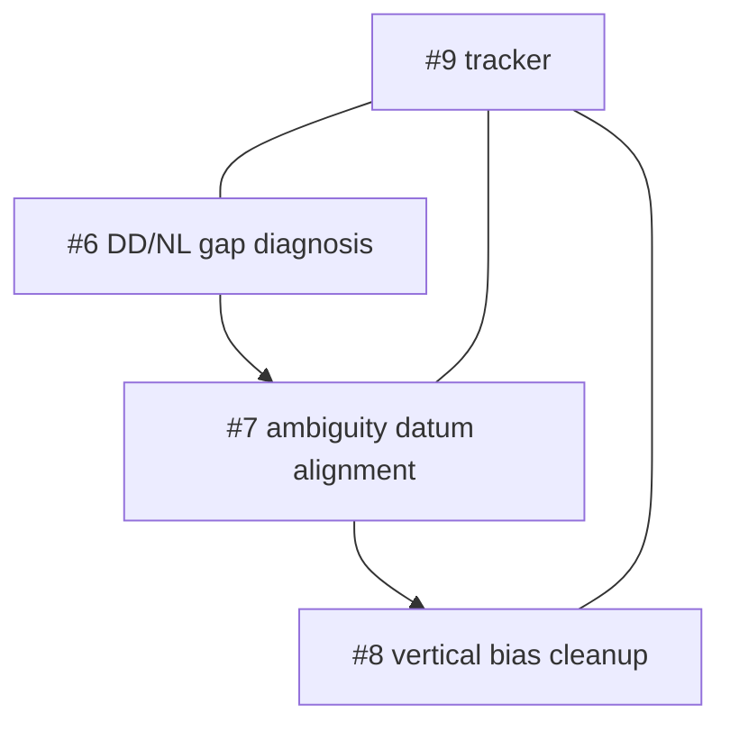

# CLAS Parity Blockers

This page is the issue-oriented index for unresolved CLAS parity work.

It is intentionally operational:

- one blocker = one boundary,
- one boundary = one artifact/debug story,
- one issue = one reason a CLAS parity claim is still incomplete.

## Tracker

### `#9` CLAS parity tracker

Role:

- top-level tracker for the overall parity status

Meaning:

- fixed-rate parity on the reference case has been reached in some runs
- accuracy parity is still unresolved

## Active blocker split

### `#6` Diagnose per-satellite NL datum mismatch in DD-WLNL

Boundary:

- `PPP-WLNL-COMP`
- observation-side NL vs state-side NL

Main question:

- why do specific satellites leak DD gap even when the common datum offset mostly cancels

Current focus:

- `G25`
- `G29`

Primary artifacts:

- `PPP-WLNL-COMP`
- `CLAS-IF-PHASE`

### `#7` Align observation-side NL and state-side ambiguity datum

Boundary:

- ambiguity seed/update path in `ppp_clas.cpp`

Main question:

- why does the first CLAS Kalman update move ambiguity states onto a different
  datum than the one implied by observation-side NL reconstruction

Primary artifacts:

- `CLAS-AMB-SEED`
- `CLAS-AMB-OBS`
- `CLAS-K-AMB`
- `CLAS-K-AMB-SUM`

### `#8` Remove remaining vertical bias after 30/30 fixed

Boundary:

- fixed-state projection and post-fix position generation

Main question:

- why does a fixed solution still keep a strong vertical error budget

Primary artifacts:

- `PPP-WLNL-FIXSTATE`
- `CLAS-WLNL-FIX`
- `CLAS-PPP`

## Suggested working order

Reason:

1. if the DD/NL mismatch is not isolated, ambiguity-datum fixes are blind
2. if ambiguity datum is still wrong, fixed-state projection analysis is noisy
3. vertical cleanup should come after the ambiguity/state boundary is coherent

## Exit criteria

### `#6` can close when

- the dominant DD gap source is localized to a concrete term or state boundary
- the result is reproducible on the reference parity dataset

### `#7` can close when

- first-update ambiguity movement is explained
- observation-side and state-side NL datum agree within the expected tolerance

### `#8` can close when

- fixed-rate parity and accuracy parity are both acceptable on the reference case
- remaining vertical bias is no longer the dominant error term

## Related pages

- [CLAS API & Flow](clas.md)
- [CLAS Debug Tag Playbook](clas_debug_playbook.md)
- [CLAS Parity Datasets & Artifacts](clas_parity_artifacts.md)
