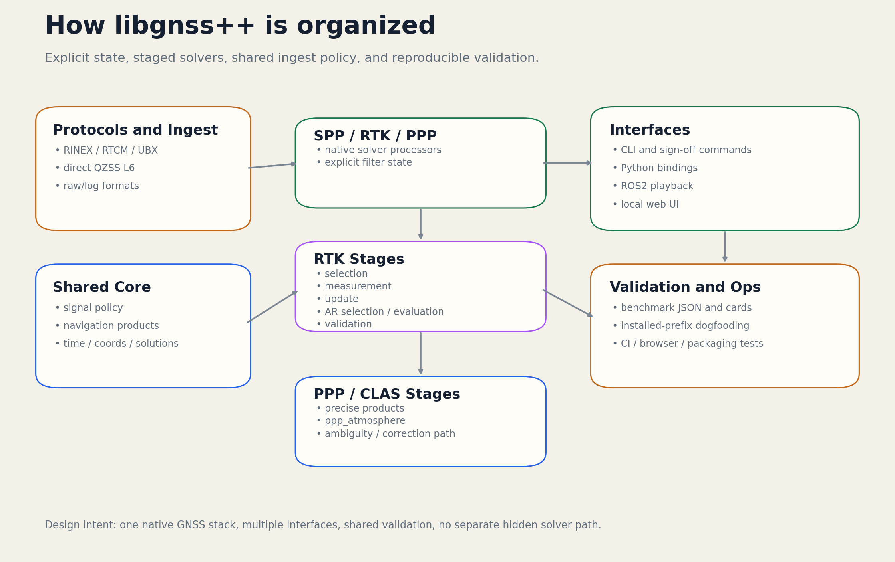

# libgnss++ Docs

Native non-GUI GNSS stack in modern C++17 with built-in `SPP`, `RTK`, `PPP`,
`CLAS/MADOCA`, `RTCM`, `UBX`, and direct `QZSS L6` handling.

This site is the short entrypoint for architecture notes, usage guides, and
checked benchmark artifacts.

## Start here

- [Architecture notes](architecture.md)
- [Quick start](quickstart.md)
- [Validation and sign-off](validation.md)
- [Interfaces](interfaces.md)
- [RTK tuning gates](rtk_tuning_gates.md)
- [PPC reproduction commands](ppc_reproduction.md)
- [Reference analyses](references/index.md)
- [Contributing](contributing.md)

## Visuals

## Benchmark artifacts

- [Benchmarks](benchmarks.md)
- [Odaiba social card](driving_odaiba_social_card.png)
- [Odaiba full comparison](driving_odaiba_comparison.png)
- [Odaiba RTKLIB 2D](driving_odaiba_comparison_rtklib_2d.png)
- [Odaiba libgnss++ 2D](driving_odaiba_comparison_libgnss_2d.png)
- [Odaiba scorecard](driving_odaiba_scorecard.png)
