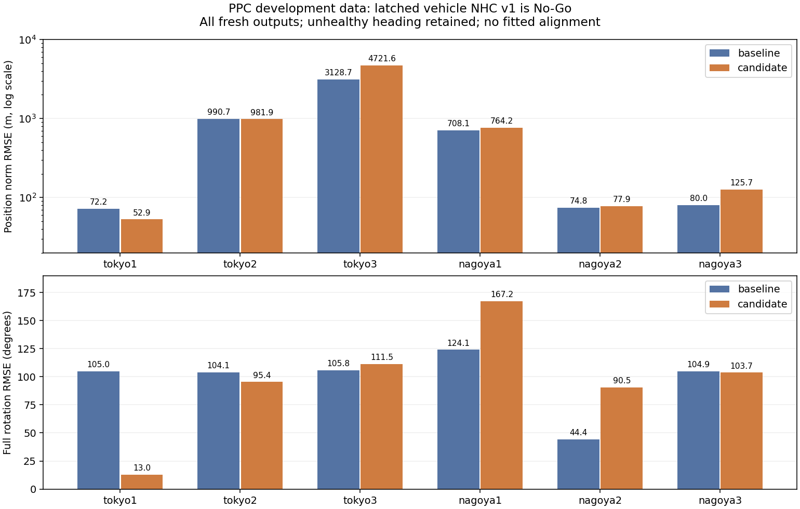

# Online PVA development results

The evaluation package is usable without a receiver, but the measured online
estimator is not yet accurate enough to recommend for navigation. The frozen
`vehicle_nhc_latched_v1` experiment is **No-Go**. Production defaults remain
unchanged; the experiment stays an explicit opt-in for reproducibility.

## Frozen comparison

Six existing PPC development runs were replayed in full for the control and
candidate, both normally and with GNSS outage at 60–70 s and IMU gap at 60–64 s.
That is 36 replays and 351,804 output epochs. All six normal runs matched every
output timestamp to truth. These are development/regression data, not holdouts.
Truth was used only for scoring and scenario labels; no mounting, heading or
time-offset fit was performed.

The table reports full-run primary RMSE, control → candidate. Position is fused
antenna position norm, velocity is fused antenna velocity norm, and rotation
is the full SO(3) error after the first heading latch, including unhealthy
outputs. The candidate applies fixed vehicle constraints after that latch.

| Run | Position (m) | Velocity (m/s) | Rotation (degrees) |
| --- | ---: | ---: | ---: |
| Tokyo 1 | 72.223 → 52.902 | 6.905 → 2.900 | 104.966 → 12.981 |
| Tokyo 2 | 990.686 → 981.873 | 7.765 → 10.071 | 104.103 → 95.406 |
| Tokyo 3 | 3128.721 → 4721.615 | 14.817 → 112.794 | 105.848 → 111.533 |
| Nagoya 1 | 708.135 → 764.234 | 43.134 → 78.183 | 124.086 → 167.182 |
| Nagoya 2 | 74.755 → 77.884 | 3.998 → 4.851 | 44.406 → 90.488 |
| Nagoya 3 | 79.980 → 125.712 | 6.664 → 7.092 | 104.938 → 103.676 |

The [frozen decision](online_pva_decision_v1.json) records all 18 run/scenario
pairs, all-output and common-valid cohorts, coverage, initialization/recovery,
runtime and exact pre-latch parity. There are 134 failed accuracy gates (67
per cohort). All 18 pre-latch parity gates and coverage, delay and runtime
gates pass. A strong Tokyo 1 improvement does not satisfy the multi-run
non-regression contract. No second candidate was tuned after this result.

## Scenario diagnostics

The [provenance record](online_pva_provenance_v1.json) contains the 36 original
manifests, input/executable/output hashes and 24 additional drift diagnostics.
Recomputing these diagnostics verified that every frozen primary metric is
unchanged. Drift means the change in position error from the last fresh
pre-event output, transported to that anchor's ENU frame. It is a diagnostic
of displacement error, not an alignment fitted into estimation or scoring.

Control end-of-GNSS-outage drift is 114.114, 57.866 and 78.740 m for Tokyo
1–3, and 39.285, 7.646 and 193.471 m for Nagoya 1–3. IMU gap diagnostics must
be read alongside missing-output counts: the omitted samples cause stale
attitude and reset, so a few available samples do not measure a complete
four-second bridge. Heading recovery after the gap is 19.4 s in Tokyo 1,
13.0 s in Tokyo 2 and 2.4 s in the other four runs. Censored recovery is null.

Stop, low-speed, turn and reverse populations and per-scene errors are retained
in each score. Nagoya 1 has 115 reverse labels, 96 with a latched heading, and
heading RMSE 115.469 degrees (P95 177.165). Nagoya 2 has 13 reverse labels
and heading RMSE 2.052 degrees; the other four runs have no reverse population.
Absence of such a scene is not evidence of robustness in it.

A fixed loose-only ablation improves the first 600 Tokyo 1 position outputs
but retains roughly 100-degree rotation RMSE. Recorded bias diagnostics show
large estimated gyro bias despite small observed angular rate. These support
weak observability/spurious bias learning as an investigation target; they do
not establish a single cause. The next estimator change needs a new contract.

## Validation and distribution scope

The online API unit lane passes all 11 cases; PVA scoring and comparison tests
cover coordinate transport, quaternion sign, unhealthy 180-degree error,
missing data, censored recovery, drift and tampered provenance. A 600-epoch
production replay also passes prefix invariance and a 300-epoch common prefix;
default candidate-none outputs match the frozen control exactly in all 55
common CSV fields except wall-clock processing time.

The broader Windows checks pass 158 CLI tests (65 skips), 180 benchmark tests
(one skip), four binding tests (eight skips), and installed packaging smoke
checks. The main C++ suite passes 1,274 cases (65 fixture skips). Full CTest
passes 130 of 139 lanes; the same nine pre-existing failures involve paused
smartphone records with Windows newline hashes, POSIX-only resource APIs or
an absent external artifact. They were not rewritten to make the run green.
ROS2 execution is unverified because its node binary/dependencies are absent.

Use the [PVA guide](online_pva.md) for Docker, Windows ZIP and Linux TGZ/DEB
commands. Synthetic fixtures check the scoring workflow; public PPC data are
external and not bundled. Each locally produced artifact has its own checksum
and platform smoke evidence. Published v0.2.0 artifacts do not contain this
development branch. No new release, PR or merge is implied by these results.
