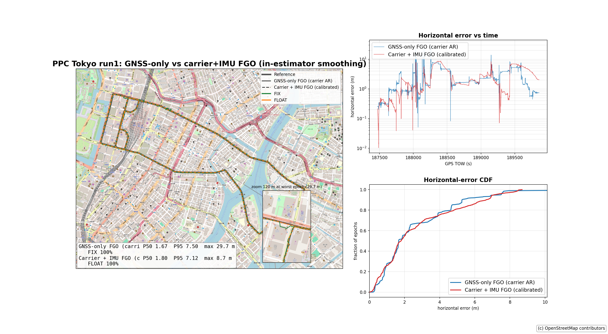
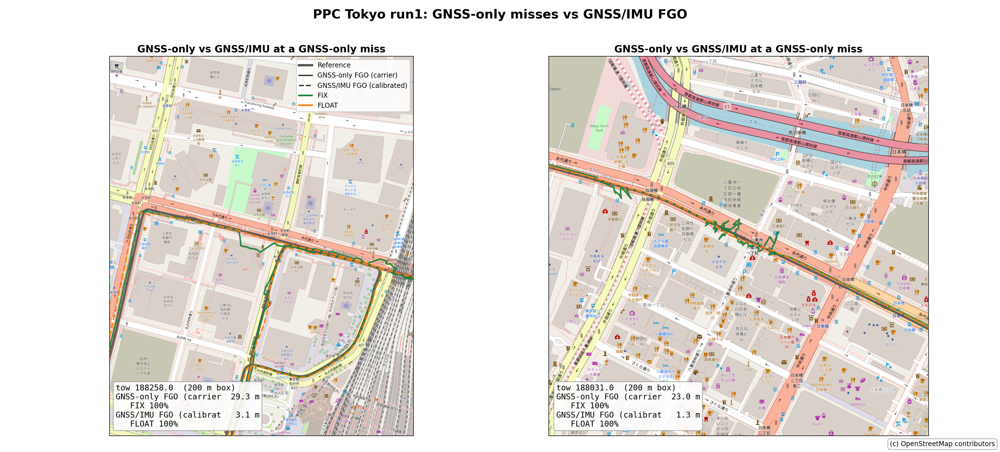

# PPC: RTK only vs RTK + tightly-coupled GNSS/IMU


The trajectory is coloured by per-epoch status (green = FIX, orange =
FLOAT, red = SPP) with solid = RTK only and dashed = fused, and the legend
prints each arm's FIX/FLOAT/SPP composition (RTK only FIX 71% / FLOAT 23% /
SPP 6%; fused FIX 78% / FLOAT 17% / SPP 5%).

OpenStreetMap overlay: left is the full route, right zooms on the worst
RTK-only epoch (near Tokyo Station), where RTK-only cuts across the building
block while the fused track follows the road.


Comparison on the public **PPC 2024 Tokyo run1** dataset (11,845 matched
epochs). The two arms use the same command base; the fused arm adds the
validated `--navi776-tc` tight-coupling preset and the in-KF heavy-tail
(Student-t) robust front-end. Scoring uses the shared PPC helpers, so the
numbers agree with `apps/gnss.py ppc-coverage-matrix` and the README tables.
Per the published navi776 sign-off protocol the compared stream is the RTK
solution (`--rtk-pos-out`), which the tight loop refines.

FIX integrity is reported after the deployable **sigma-demote** policy from
`configs/benchmarks/ppc_sigma_demote_nis2_ratio4.toml` (demote a FIXED epoch
to FLOAT when `ratio <= 4.0` or `NIS/obs > 2.0`), applied identically to both
arms via `scripts/plot_ppc_rtk_vs_imu_fusion.py --demote-max-ratio 4
--demote-nis-per-obs 2`.

| metric | RTK only | RTK + GNSS/IMU (tight, robust) | delta |
|---|---:|---:|---:|
| Correct FIX (3D < 0.5 m) | 64.95 % | **73.88 %** | **+8.93 pp** |
| Wrong FIX / FIX | 8.66 % | **5.53 %** | −3.13 pp |
| FIX rate (post-demote) | 71.10 % | **78.20 %** | +7.10 pp |
| Official PPC score | 70.46 % | **77.71 %** | **+7.25 pp** |
| P50 horizontal | 0.031 m | **0.026 m** | −0.005 m |
| P95 horizontal | 6.869 m | **5.696 m** | −1.17 m |
| 3D < 0.5 m (all epochs) | 72.33 % | **78.40 %** | +6.07 pp |
| Worst epoch | 124 m | **93 m** | −31 m |

## Ablation

`+TC` is `--navi776-tc` alone; `+robust` adds the Student-t front-end
(`--integrity-student-t-all-measurements
--integrity-student-t-degrees-of-freedom 3
--integrity-heavy-tail-activation-sigma 2.0`). All rows are scored with the
same sigma-demote policy.

| arm | FIX % | Correct FIX % | Wrong FIX % | Official % | P95 m |
|---|---:|---:|---:|---:|---:|
| RTK only | 71.10 | 64.95 | 8.66 | 70.46 | 6.869 |
| + TC | 71.38 | 68.42 | **4.15** | 74.76 | 6.859 |
| + TC + robust | **78.20** | **73.88** | 5.53 | **77.71** | **5.696** |

Tight coupling alone cuts the wrong-fix rate; the robust front-end then
converts the recovered epochs into correct fixes, raising coverage and the
official score.

## Three-run check (Tokyo run1/2/3)

Same command base, only `--navi776-tc` + Student-t changes. In-sample; not a
held-out claim.

| run | arm | Correct FIX % | Wrong FIX % | Official % | P95 m |
|---|---|---:|---:|---:|---:|
| tokyo1 | RTK | 64.95 | 8.66 | 70.46 | 6.869 |
| tokyo1 | fusion | **73.88** | **5.53** | **77.71** | **5.696** |
| tokyo2 | RTK | 68.19 | **1.74** | 83.38 | 3.398 |
| tokyo2 | fusion | **78.96** | 2.21 | **84.10** | 3.474 |
| tokyo3 | RTK | 69.18 | 3.02 | **78.21** | 8.545 |
| tokyo3 | fusion | **75.55** | **0.99** | 76.16 | **5.950** |
| **macro** | RTK | 67.44 | 4.47 | 77.35 | 6.271 |
| **macro** | fusion | **76.13** | **2.91** | **79.32** | **5.040** |

The stack raises correct-FIX on all three runs (+8.7 pp macro) and lowers
wrong-FIX and P95, but is not uniformly better per run (tokyo3 official and
tokyo2 wrong-FIX/P95 regress slightly).

## In-KF component: heavy-tail front-end

`--integrity-student-t-*` (IRLS Student-t / Huber / Laplacian) weights the RTK
measurement rows. It was previously assigned only inside the
`--library-fix-integrity-gate` block, so it was a silent no-op on this lane
(byte-identical output); it now applies to the primary RTK config whenever
selected. Default behaviour is unchanged.

## Rejected: turn-aware SPP stabilizer

`--rtk-single-stabilizer` extends the fixed-anchor stabilizer to SPP fallback
output and reduces the Tokyo run1 worst epoch (93 → 65 m), but it is **not
promoted**: on Tokyo run2 it replaced a moderate SPP error with a bad
quadratic extrapolation and raised the worst epoch from 63 m to 210 m. It
stays default-off and opt-in for research.

## Rejected: FDE with exclusion on the global NIS gate

A row-exclusion FDE (when the global normalized-innovation gate would reject
the update, exclude the worst-normalized-innovation row and retry up to N
times) was implemented on top of the robust stack and reverted after it
degraded every run:

| run | arm | Official % | P95 m | Worst epoch m |
|---|---|---:|---:|---:|
| tokyo1 | robust | 77.71 | 5.70 | 93 |
| tokyo1 | + FDE | 64.08 | 14.03 | 93 |
| tokyo2 | robust | 84.10 | 3.47 | 63 |
| tokyo2 | + FDE | 63.02 | 4.06 | **146** |
| tokyo3 | robust | 76.16 | 5.95 | 251 |

The PPC RTK update routinely exceeds NIS/obs ≈ 3 without a fault, so the gate
fires on healthy epochs; excluding rows then destroys redundancy and degrades
the solution more than the fault it removes. A viable FDE needs a calibrated
fault-free innovation distribution (or a subset-consensus test) rather than a
fixed global threshold.

## Carrier-phase FGO vs IMU-aided FGO

`gnss_fgo` now accepts `--imu <imu.csv>` and builds a tightly-coupled
double-difference-carrier + IMU factor graph (GTSAM Pose3 fixed-lag). The
flag is opt-in: without `--imu` the output is byte-identical to before.
Related knobs: `--imu-lever-arm X Y Z`, `--imu-no-mounting`,
`--imu-fixed-lag <s>` (default 20, 0 = batch), `--imu-noise-scale <s>`
(multiplier, default 1), `--imu-no-noise-calibrate`.


Trajectory colour is the per-epoch status (green = FIX, orange = FLOAT,
grey = no status field in the submission CSV) and the line style is the
arm. The stats box prints each arm's composition: the DD-carrier arm is
FIX 100%, the calibrated carrier+IMU arm is FLOAT 100%, and the no-base
TDCP submission carries no status.

Carrier-phase ambiguity resolution dominates: on Tokyo run1 the code-only
no-base FGO (P50 3.62 m) is ~2x worse than the carrier FGO (P50 1.66 m),
and the no-base IMU TDCP FGO is 4.60 m. The pure GNSS carrier arm runs the
Eigen batch solver while the IMU arm runs the GTSAM fixed-lag smoother
(batch GTSAM is ~15 min for 1000 epochs), so the two arms differ by solver.

### Six-run check (Tokyo and Nagoya, run1/2/3)

carrier-only vs carrier + IMU (calibrated), horizontal error P50/P95/max
(m) and mean horizontal acceleration (in-estimator smoothness, m/s²):

| run | carrier-only P50/P95/max | carrier+IMU P50/P95/max | acc only -> IMU |
|---|---|---|---|
| tokyo1 | 1.66 / 7.49 / 29.3 | 2.29 / 10.39 / 14.1 | 5.13 -> 0.35 |
| tokyo2 | 0.39 / 2.91 / 40.3 | 0.47 / 2.47 / 15.9 | 5.22 -> 0.37 |
| tokyo3 | 0.61 / 10.95 / 45.7 | 0.50 / 10.17 / 30.7 | 6.16 -> 0.33 |
| nagoya1 | 0.37 / 7.59 / 158.8 | 0.61 / 20.85 / 61.9 | 7.23 -> 0.27 |
| nagoya2 | 1.58 / 16.56 / 92.7 | 3.05 / 11.61 / 21.5 | 3.77 -> 0.27 |
| nagoya3 | 3.60 / 10.78 / 22.3 | 3.68 / 16.65 / 22.5 | 3.93 -> 0.33 |

The smoothing is consistent across all six runs (~15-20x lower
acceleration), and the worst epoch improves in five of six (up to
158.8 -> 61.9 m on nagoya1). The median is mixed (slightly worse in
tokyo1/2 and nagoya1/2, better in tokyo3), so this is a robustness and
smoothness trade, not a uniform accuracy win.

### IMU noise calibration

Instead of a hand-tuned noise scale, `--imu` estimates the IMU noise from
the leading low-dynamics window (first 250 samples, the same window used
for leveling): the per-axis residual std converted to a continuous-time
density with the native 10 ms sample interval. PPC Tokyo run1 yields
accel `0.0055 m/s²/√Hz` and gyro `0.00022 rad/s/√Hz`, ~18x and ~45x below
the GTSAM defaults. This is truth-free (no reference used) and reproduces
the earlier hand-tuned "noise x0.1" result to within 0.01 m.

### In-estimator trajectory smoothing

With the calibrated IMU noise, the inuex35 reference DD sigmas
(`--dd-carrier-sigma 0.003 --dd-pseudorange-sigma 0.3`) and a 20 s
fixed-lag window the estimated trajectory is smoothed entirely inside the
estimator — no post-processing (filter, RTS or spline). On Tokyo run1 the
carrier+IMU arm reaches P50 1.80 / P95 7.12 / max 8.7 m (RMS 3.50) versus
the carrier-only P50 1.67 / P95 7.50 / max 29.7 m (RMS 3.61): the median is
within 0.13 m while the tail and worst epoch improve. The figure
auto-draws a 120 m zoom inset at the worst combined epoch.

### Ambiguity resolution in the fixed lag

The fixed-lag AR resolves integers too. With `--fixed-lag-partial-ar`
(ranked subset LAMBDA retry) Tokyo run1 fixes 2610/11866 epochs and the
FIXED epochs are accurate (horizontal P50 0.299 m, RMS 2.65) versus the
float epochs (P50 2.05, RMS 3.72) — consistent with the upstream inuex35
reference FixRMS 0.29 m. The full-set LAMBDA ratio sits near 1.0 because a
near-singular joint ambiguity mode degenerates the search (the ambiguity
estimates themselves are precise: median std 0.04 cyc, LAMBDA BSR 1.0); the
subset retry drops that mode. The remaining gap to the reference fix rate
(63%) needs the upstream graph composition (1 s fixed lag, SD Doppler,
NHC/ZUPT, held-integer conditioning), not a single parameter.



Two GNSS-only misses at 200 m OSM zoom (tow 188258: carrier-only 29.3 m
vs IMU 3.1 m; tow 188031: 23.0 m vs 1.3 m). The solid carrier-only track
leaves the road while the dashed calibrated IMU track follows it.



### Limitations

The carrier + IMU arm is limited by the GTSAM fixed-lag solver, not by the
IMU. On Tokyo run1 its worst epoch is a ~5 s sustained segment (tow
188360-188370) sitting at 14.1 m while the carrier-only arm is at 7.6 m;
the two arms also use different solvers (Eigen batch vs GTSAM fixed-lag),
so they are not a pure IMU ablation. Conversely the IMU arm caps the
carrier-only 29 m excursions.

Neither of the obvious ways to remove that 14 m segment works:

- **GTSAM batch + IMU** (fixed-lag 0) finishes with a DD carrier residual
  RMS of 13.2 m (unconverged), P95 20.5 m, max 155 m and ~111 m/s²
  position acceleration. Seeding it from the fixed-lag solution and raising
  the iteration cap to 20 give byte-identical broken output, so the batch
  path is not a usable operating point here.
- Lowering the IMU trust (noise x10/x30) raises P50/P95/max; enabling
  `--epoch-lambda-fixed-output` fixes only 853/11866 epochs and collapses
  the smoothness from 0.35 to 1.90 m/s².

Net: the calibrated IMU fixed-lag arm trades median/P95 for in-estimator
smoothness and gross-error robustness; it is not uniformly more accurate.

## Reproduce

```bash
export LD_LIBRARY_PATH=$HOME/.local/lib:${LD_LIBRARY_PATH:-}

# RTK only
build/apps/gnss_fuse \
  --data-dir data/PPC-Dataset/tokyo/run1 --lever-arm 0.31,0,-0.55 \
  --preset low-cost --ratio 2.4 --max-subset-ar-drop-steps 18 \
  --rtk-snr-weighting --no-arfilter \
  --rtk-pos-out output/ppc_rtk_vs_imu_fusion/tokyo1_canon/off_rtk.pos

# RTK + tightly-coupled GNSS/IMU + robust front-end
build/apps/gnss_fuse \
  --data-dir data/PPC-Dataset/tokyo/run1 --lever-arm 0.31,0,-0.55 \
  --preset low-cost --ratio 2.4 --max-subset-ar-drop-steps 18 \
  --rtk-snr-weighting --no-arfilter --navi776-tc \
  --integrity-student-t-all-measurements \
  --integrity-student-t-degrees-of-freedom 3 \
  --integrity-heavy-tail-activation-sigma 2.0 \
  --rtk-pos-out output/ppc_rtk_vs_imu_fusion/tokyo1_robust/student_t3.pos

# Figure
python3 scripts/plot_ppc_rtk_vs_imu_fusion.py \
  --reference data/PPC-Dataset/tokyo/run1/reference.csv \
  --rtk-pos   output/ppc_rtk_vs_imu_fusion/tokyo1_canon/off_rtk.pos \
  --fusion-pos output/ppc_rtk_vs_imu_fusion/tokyo1_robust/student_t3.pos \
  --output docs/ppc_rtk_vs_gnss_imu_fusion.png \
  --demote-max-ratio 4 --demote-nis-per-obs 2 \
  --title "PPC Tokyo run1 — RTK only vs RTK + tightly-coupled GNSS/IMU"

# Carrier-phase FGO arms (gnss_fgo)
P=data/PPC-Dataset/tokyo/run1
build/apps/gnss_fgo --obs $P/rover.obs --base $P/base.obs --nav $P/base.nav \
  --preset real-data-fixed --out output/ppc_fgo/tokyo1_carrier.pos
# --imu defaults to static-window noise calibration + 20 s fixed-lag
build/apps/gnss_fgo --obs $P/rover.obs --base $P/base.obs --nav $P/base.nav \
  --preset real-data-fixed --imu $P/imu.csv \
  --out output/ppc_fgo/tokyo1_carrier_imu.pos
build/apps/gnss_fgo_imu_no_base --obs $P/rover.obs --imu $P/imu.csv --nav $P/base.nav \
  --all-epochs --out output/ppc_fgo/tokyo1_no_base_imu.csv

# Carrier-phase vs IMU-aided FGO figure (3 arms)
python3 scripts/plot_ppc_gnss_vs_fgo.py \
  --reference $P/reference.csv \
  --gnss-pos  output/ppc_fgo/tokyo1_carrier.pos \
  --imu-csv   output/ppc_fgo/tokyo1_no_base_imu.csv \
  --extra-pos output/ppc_fgo/tokyo1_carrier_imu.pos \
  --output docs/ppc_fgo_carrier_vs_imu.png \
  --gnss-label "GNSS carrier FGO (DD, base)" \
  --imu-label "GNSS/IMU FGO (no-base TDCP)" \
  --extra-label "Carrier + IMU FGO (calibrated)" \
  --title "PPC Tokyo run1: carrier-phase vs IMU-aided FGO"

# In-estimator smoothing figure (carrier-only vs calibrated carrier+IMU)
python3 scripts/plot_ppc_gnss_vs_fgo.py \
  --reference $P/reference.csv \
  --gnss-pos  output/ppc_fgo/tokyo1_carrier.pos \
  --extra-pos output/ppc_fgo/tokyo1_carrier_imu.pos \
  --output docs/ppc_fgo_imu_smoothing.png \
  --gnss-label "GNSS-only FGO (carrier AR)" \
  --extra-label "Carrier + IMU FGO (calibrated)" \
  --title "PPC Tokyo run1: GNSS-only vs carrier+IMU FGO (in-estimator smoothing)"
```

## Scope

Development runs, in-sample, not a held-out or leaderboard claim. The
tight-coupling preset is validated for short-baseline urban runs and stays
opt-in.
