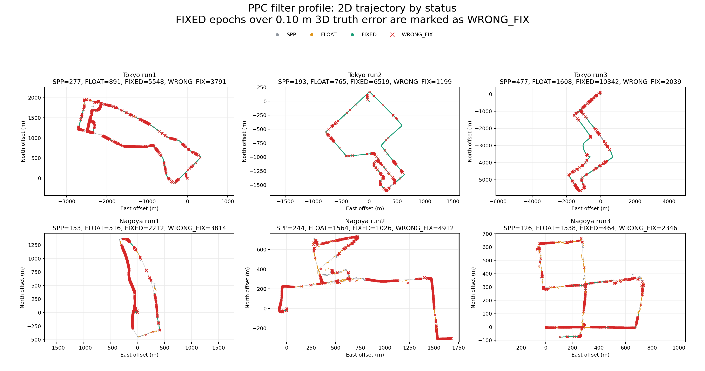
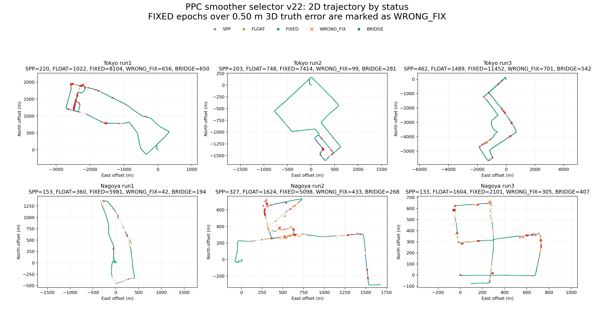
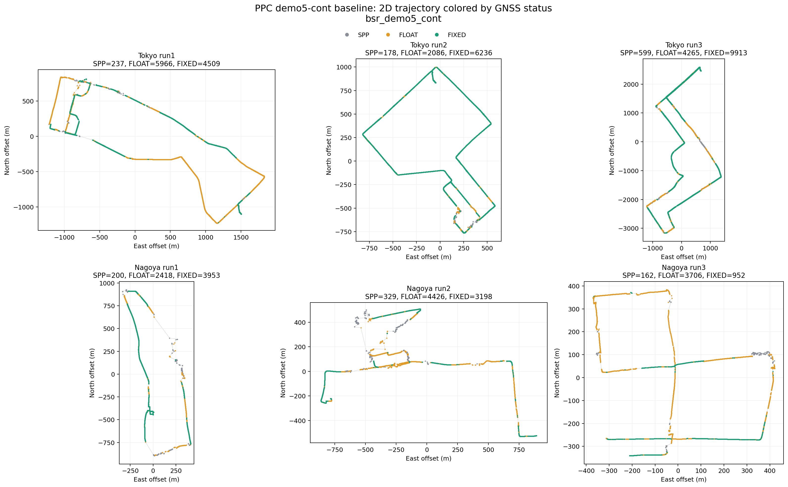

# PPC Deployable Smoother Sanity Report

This note records the 2026-05-05 PPC smoother-stack sanity checks. The
performance claim in this PR is reference-free at runtime: PPC `reference.csv`
is used for evaluation only, not for choosing a smoother candidate or segment.

## Reference-Free Claim

The deployable result to carry forward is the existing PPC coverage profile, not
the smoother oracle sweep. On the six public Tokyo/Nagoya PPC runs, that profile
uses fixed solver settings and no reference-driven segment selection at runtime:

| comparison vs RTKLIB `demo5` | result |
|---|---:|
| Positioning-rate lead | +17.0 pp |
| PPC official-score lead | +28.1 pp |
| P95 horizontal-error delta | -11.96 m |

The same stack also moves the truth-validation wrong-FIX ratio in the right
direction:

| metric | pre-stack default | post-stack default |
|---|---:|---:|
| `fix_wrong` / total fixes | 28.9% | 19.4% |
| `fix95%` | 0.81 m | 0.19 m |

That is the reference-free runtime performance story: keep the solver profile
ahead of demo5 while reducing mis-fix risk.

## Deployable Smoother Check

The selector tooling supports `--selection-mode priority_first`, which fixes
selection to candidate rules plus priority order. In this mode, the PPC
reference is still used to evaluate the final output, but it is not used to
choose the candidate for a segment, and the reference-scored non-regression gate
is skipped.

A fully internal smoother probe used:

- anchor: `status == FIXED`, `ratio >= 10`, post-suppression RMS `<= 0.05 m`,
  and at least 8 satellites
- loss: non-FIX or FIXED with `ratio < 6`

That deployable-only fixed smoother check produced no public-score gain over
its fixed baseline:

| check | aggregate |
|---|---:|
| deployable internal smoother fixed recipe | +0.000 m |

Because it does not add reference-free gain, it should stay diagnostic for now.
Do not present it as a performance improvement.

## Mis-Fix Policy

For PPC-facing changes, prefer gates that preserve or reduce wrong FIX instead
of chasing extra fixed epochs. In practice:

- Do not select smoother segments using reference-scored deltas.
- Do not enable a smoother/bridge path as a benchmark claim unless it improves
  deployable score without increasing wrong-FIX indicators.
- Keep `priority_first` as the deployable selector mode; keep `oracle_delta`
  only for research diagnostics.

## Diagnostic Images

The trajectory plots are useful for reviewing where bridges, gaps, and mis-fixes
appear, but they are not performance evidence by themselves. Red `WRONG_FIX`
points are `FIXED` solution epochs whose post-run 3D reference error exceeds
0.50 m.

Residual red points are broken down in
[PPC residual wrong-FIX analysis](ppc_wrong_fix_residual_analysis.md). In short,
the remaining wrong FIX is baseline-selected and does not match a smoother
selector rule, so the next deployable lever is a real-time fixed-update quality
gate rather than more reference-selected smoothing.

## Reference-Selected Sweeps

Full-reference smoother sweeps are kept only as diagnostics. Those runs use PPC
`reference.csv` to choose the best candidate per official scoring segment, so
they are not private-score-equivalent and are not part of the reference-free
performance claim.
