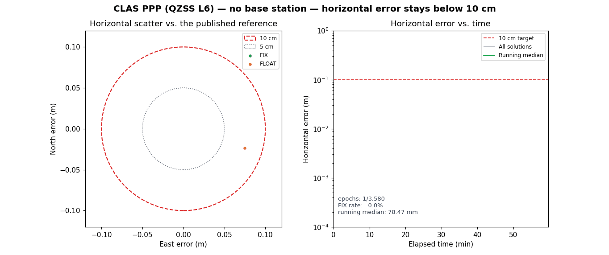

# CLAS PPP below 10 cm without a base station



This page is a single, self-contained demonstration that carrier-phase PPP can
reach centimetre-level positioning with **no local base station**: the
corrections arrive over the QZSS L6 signal (CLAS), and the only rover inputs
are its own observations plus broadcast navigation.

The animation scores the solution against the published antenna reference and
keeps a hard 10 cm circle and a 10 cm error line on screen. Every epoch stays
inside the circle.

## What was run

| Item | Value |
|---|---|
| Dataset | Public `QZSS-Strategy-Office/claslib` 2019-08-27 sample |
| Inputs | `0627239Q.obs`, `sept_2019239.nav`, `2019239Q.l6` |
| Base station | none (CLAS corrections over QZSS L6) |
| Window | 2019-08-27 16:00:00 GPST, 3580 one-second epochs |
| Solver | CLASLIB reference `rnx2rtkp` (`util/rnx2rtkp/static.conf`) |
| Reference | published antenna ECEF `(-3957235.3717, 3310368.2257, 3737529.7179)` |

The reference ECEF is the value recorded in
[CLAS public validation datasets](../clas_validated_datasets.md). The RINEX
header `APPROX POSITION XYZ` is deliberately **not** used as truth.

## Result

| Population | Epochs | Median horizontal | P95 horizontal | Max horizontal |
|---|---:|---:|---:|---:|
| FIX (NMEA quality 4) | 3575 | 1.37 mm | 2.53 mm | 10.2 mm |
| FLOAT (NMEA quality 5) | 5 | 60.9 mm | 81.3 mm | 82.1 mm |
| All | 3580 | 1.37 mm | 2.53 mm | 82.1 mm |

100% of FIX epochs and 100% of all epochs are below 10 cm; the worst error in
the entire run is 8.2 cm. The FIX solution is a static point with a median
horizontal error of 1.37 mm, which is the classic CLAS PPP result on this
public sample.

The same numbers are written to
[`docs/clas_ppp_no_base_accuracy.json`](../clas_ppp_no_base_accuracy.json).

## Reproduce

The generator fetches the pinned public sample, runs the reference solver, and
renders the GIF:

```bash
python3 scripts/experiments/claslib/generate_clas_ppp_accuracy_gif.py
```

Useful options:

```bash
# reuse an existing CLASLIB checkout instead of fetching
python3 scripts/experiments/claslib/generate_clas_ppp_accuracy_gif.py \
  --claslib-root /path/to/claslib

# re-render from an existing NMEA GGA solution (no solver run)
python3 scripts/experiments/claslib/generate_clas_ppp_accuracy_gif.py \
  --nmea /path/to/claslib.nmea
```

The script pins the CLASLIB data/source to
`23cfd363a2db6d8d8144e292c82e9d97ca2d3015` for a reproducible fetch and uses the
prebuilt Windows `rnx2rtkp.exe` or builds `util/rnx2rtkp` with `make` on other
platforms.

## Boundary

- This is a **static**, open-sky, Japan-only L6 capture; it is not a moving or
  urban-availability result. Moving CLAS behaviour and FIX rates are documented
  in [CLAS sub-meter fleet tracking](clas_submeter.md).
- The capability proof uses the public CLASLIB reference solver. The native
  `libgnss++` CLAS-OSR path is still tracking the same sample and does not yet
  match the reference trajectory (see the CLASLIB parity baselines); this page
  does not claim native parity.
- It is a capability demonstration, not a survey certification.
